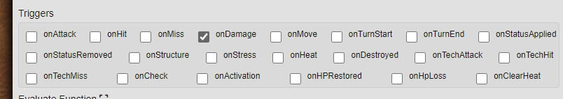
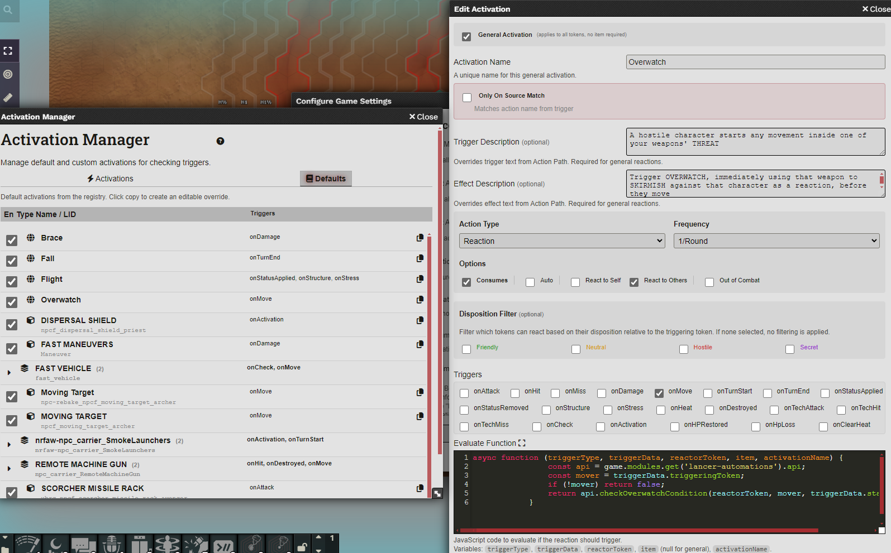
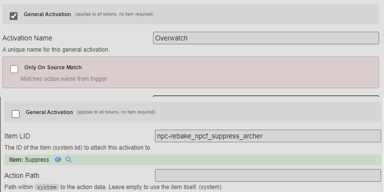
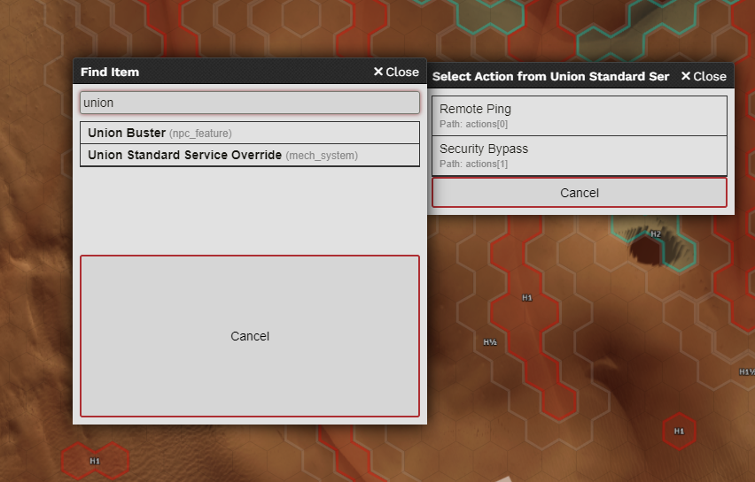
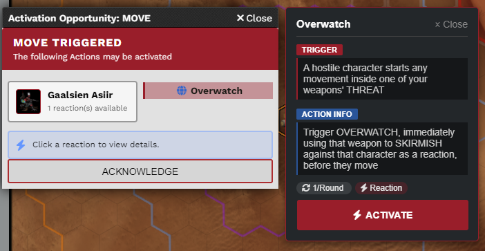
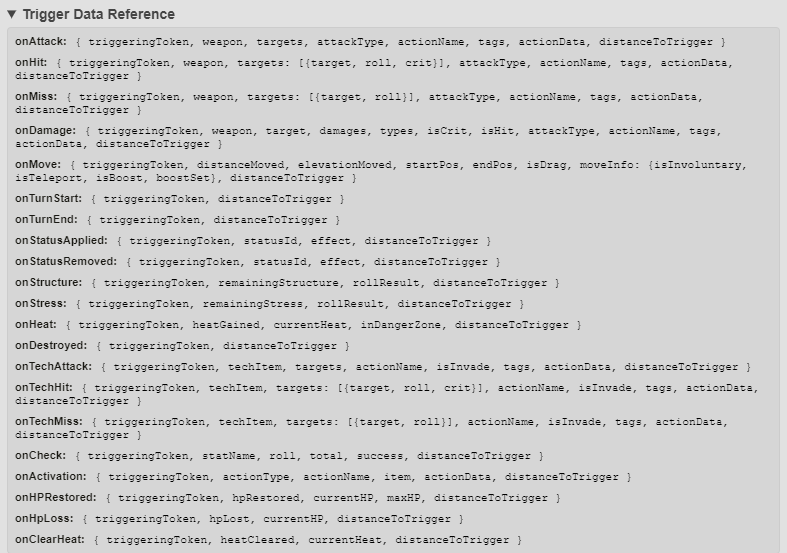
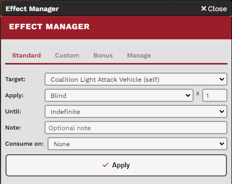
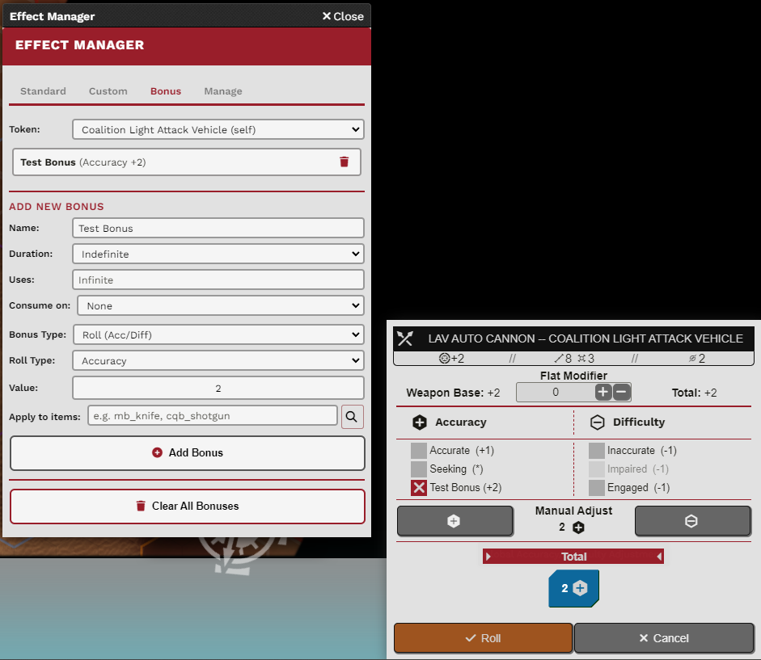

# Lancer Automations

I started by tweaking existing modules for the [Lancer system](https://foundryvtt.com/packages/lancer) in FoundryVTT, and it spiraled into something much bigger. This is inspired by [Lancer QoL](https://github.com/BoltsJ/lancer-weapon-fx) (and borrows some of its code).

So what is Lancer Automations? It's a framework to automate and script as many things as possible for Lancer. The system is designed to be scalable: you can add your own activations, effects, and bonuses without touching the module code. The end goal is to eventually replace Lancer QoL entirely. For now both modules work side by side, but some features do overlap.

## Installation

**Manifest URL:**
```
https://github.com/Agraael/lancer-automations/releases/latest/download/module.json
```

### Required

| Module | Description |
|--------|-------------|
| [Lancer System](https://foundryvtt.com/packages/lancer) | The Lancer RPG system for FoundryVTT |
| FoundryVTT v12 | Current version i'm working on |
| [Lancer Style Library](https://github.com/Agraael/lancer-style-library) | Shared UI components and styling |
| [Temporary Custom Statuses](https://github.com/Agraael/temporary-custom-statuses) | Custom status effects with stacking |

### Optional

| Module | Why |
|--------|-----|
| [CodeMirror](https://github.com/League-of-Foundry-Developers/codemirror-lib) | Gives you syntax highlighting in the evaluate/activation code editors |
| [TemplateMacro](https://github.com/Agraael/templatemacro) | Allow scripting on measurement templates, i have added tools for Dangerous Zone and Area of Effect |
| [Status Icon Counter](https://foundryvtt.com/packages/statuscounter) | Shows stack counts on effect icons so you can see remaining charges at a glance |
| [Elevation Ruler](https://foundryvtt.com/packages/elevationruler) | Required for the experimental boost detection feature (you can also try [my fork](https://github.com/Agraael/Lancer-elevationRuler-Fork)|
| [Token Factions](https://github.com/Agraael/token-factions) | My Fork of the original module containing a multi-team disposition filtering system |

## How It Works

Everything revolves around **gameplay triggers**. Triggers cover pretty much anything that happens during play: `onMove`, `onAttack`, `onHit`, `onDamage`, `onTurnStart`, and many more. Each trigger carries its own data payload describing what just happened.



Each time an actor does something that matches a trigger, it fires. Other tokens (including the actor itself) can then react through **Item activations**, **General activations**, **Bonuses**, or **Status effects**.

### Example: Overwatch

When any token moves (`onMove`), every other token checks if it should react. The Overwatch activation evaluates whether the mover started within one of the reactor's weapons' threat range. If so, the reactor can Skirmish as a reaction.



## Activations

These are activations. Let's break them down.

Fair warning: the system can be a bit overwhelming at first. Don't hesitate to ask questions on the [Pilot NET Discord](https://discord.com/invite/lancer).

An activation fires when a trigger occurs. You decide who reacts: the actor itself, other tokens, or both. There are two types:

- **Item-based (LID):** Only tokens that possess the item (matched by Lancer Item ID) can react.
- **Name-based (General):** All tokens can react, no item required.

### Filters

**Only On Source Match** restricts when the activation is valid:
- For **Item-based** activations: only fires if the triggering token actually possesses the item.
- For **General** activations: only fires if the triggering action name matches the activation name.



**Item LID Finder** is a built-in tool to help you find Lancer Item IDs in your world.

**Action Path** lets you point to a specific action inside an item to associate with the activation. Useful for reactions that come from a weapon or a specific talent rank. Format: `system.actions.0` or `ranks[0].actions[0]`.



**Trigger / Effect Description** lets you override the text shown in the activation popup.

**Action Type** controls the formatting (Reaction, Free Action, Quick Action, Full Action, Protocol, Other).

**Other built-in filters** include disposition (friendly, hostile, neutral), distance checks, stat check type, and more. No coding needed for those.

### Evaluate, Activate & Init Functions

**Evaluate** is a code block (or macro) that validates the activation. It receives the trigger type, trigger data, reactor token, item, and activation name. Return `true` to proceed, `false` to skip.

**Activation popup (manual mode):** Non-auto activations show up in a summary popup listing all triggered activations and which tokens can respond.



Click an entry to see its details, then click Activate. In settings you can let players who own the token see and interact with these popups too.

**Auto mode:** When checked, the code executes directly when the trigger fires. No popup, no confirmation.

By default, activating prints the item/action card to chat and then runs your activation code. You can change the activation mode to run code **instead of** the default flow (skipping the chat card).

**onInit Code** runs when a token is created in the scene. Handy for setting up initial state or effects.

For the full reference of what data each trigger provides, check the [API Reference](API_REFERENCE.md).



### Boost Detection (Experimental)

When enabled (requires [Elevation Ruler](https://foundryvtt.com/packages/elevationruler)), the module tracks cumulative drag movement for each token during a turn. When movement exceeds the token's base speed, a boost is detected. The `onMove` trigger data then includes:

- `moveInfo.isBoost` - `true` if this move crossed a boost threshold
- `moveInfo.boostSet` - Array of boost numbers crossed (e.g., `[1]` for first boost)

Cumulative movement resets automatically at the start of each token's turn. You can also manually reset it: `api.clearMoveData(tokenDocumentId)`.

This is still experimental.

### Built-in Activations

The module ships with these defaults:

- **Overwatch** - Reacts to `onMove` when a hostile enters your weapon threat range
- **Brace** - Reacts to `onDamage` when damage would kill you or deal half your HP
- **Flight** - Reacts to `onStatusApplied` / `onStructure` / `onStress` to handle flying immunity and fall saves
- **Fall** - Reacts to `onTurnEnd` to check if an airborne token should fall

### Stat Roll Targeting

Go to **Module Settings > Lancer Automations > Enable Stat Roll Target Selection** to enable this feature.

When enabled, any Stat Roll (HULL, AGI, SYS, ENG) will prompt you for an optional target.

-   **Difficulty**: The roll will automatically use the target's Save (for NPCs) or the same Stat (for Mechs) as the difficulty.
-   **Automation**: The target token is passed into the flow data, allowing other automations (like macros or modifications) to use it.
-   **Self-Targeting**: You can select yourself if needed.

### Export / Import

In the module settings, you can export and import your activations as JSON. Makes it easy to share setups with other GMs or just back things up.

### Tips

In code editor blocks, you can write a full function signature like `async function(triggerType, triggerData, reactorToken, item, activationName) { ... }` instead of just the function body. The module strips the wrapper automatically. Looks much nicer with CodeMirror highlighting.

You can also register default activations by code. See the [API Reference](API_REFERENCE.md#how-to-register-default-activations-by-code) for how.

## Effect Manager

Combined with [Temporary Custom Statuses](https://github.com/Agraael/temporary-custom-statuses) and code originally from Lancer QoL, the Effect Manager gives you extended status effects with turn-based duration and stack consumption.



- Effects can have a **duration** (start/end of turn countdown) AND **consumable stacks**
- Stack consumption is tied to automation triggers (e.g., Soft Cover consumes a stack when the token boosts)
- Works with custom statuses: create temporary statuses on the fly, or save them for reuse
- Supports evaluation lambdas for consumption conditions, same syntax as activation evaluate functions

## Bonuses

The Effect Manager also lets you create **Bonuses and Maluses** tied to custom effects.

Four types:
- **Accuracy** - Adds accuracy dice to rolls
- **Difficulty** - Adds difficulty dice to rolls
- **Damage** - Adds bonus damage (by type)
- **Stat** - Modifies actor stats directly (HP, Heat Cap, Speed, Evasion, etc.)

Each bonus can have duration and stack consumption, just like effects. By code, you can add evaluation lambdas for fine-grained control over when stacks are consumed.



### NPC Implementation Examples

Here are some real examples

**Dispersal Shield (Priest):**

All-resistance for the next 1d3 attacks

```javascript
"npcf_dispersal_shield_priest": {
    itemType: "npc_feature",
    reactions: [{
        triggers: ["onActivation"],
        triggerSelf: true,
        triggerOther: false,
        outOfCombat: true,
        actionType: "Quick Action",
        frequency: "Unlimited",
        onlyOnSourceMatch: true,
        autoActivate: true,
        activationType: "code",
        activationMode: "instead",
        activationCode: async function (triggerType, triggerData, reactorToken, item, activationName) {
            const lancerAutomations = game.modules.get('lancer-automations');
            const api = lancerAutomations?.api;

            if (!api?.applyFlaggedEffectToTokens) {
                ui.notifications.error("lancer-automations module required");
                return;
            }

            const targets = await api.chooseToken(reactorToken, {
                count: 1,
                range: reactorToken.actor.system.sensor_range,
                includeSelf: true,
                filter: (t) => api.isFriendly(reactorToken, t)
            });
            const target = targets?.[0] || reactorToken;
            const roll = await new Roll("1d3").evaluate();
            await roll.toMessage({
                speaker: ChatMessage.getSpeaker({ token: reactorToken.document }),
                flavor: `${activationName} - Resistance charges`
            });
            const charges = roll.total;
            const resistances = [
                "lancer.statusIconsNames.resistance_heat",
                "lancer.statusIconsNames.resistance_kinetic",
                "lancer.statusIconsNames.resistance_explosive",
                "lancer.statusIconsNames.resistance_burn",
                "lancer.statusIconsNames.resistance_energy"
            ];

            await api.applyFlaggedEffectToTokens({
                tokens: [target],
                effectNames: resistances,
                note: `Dispersal Shield (${charges} charges)`,
                duration: { label: 'indefinite', turns: null, rounds: null },
                useTokenAsOrigin: false,
                customOriginId: reactorToken.id
            }, {
                stack: charges,
                consumption: {
                    trigger: "onDamage",
                    originId: target.id,
                    grouped: true
                }
            });
        }
    }]
}
```

**Sapper Kit - Smoke Launcher (Strider):**

Places a smoke zone that last until the end of next turn.

```javascript
"nrfaw-npc_carrier_SmokeLaunchers": {
    itemType: "npc_feature",
    reactions: [{
        triggers: ["onActivation"],
        triggerSelf: true,
        triggerOther: false,
        outOfCombat: true,
        actionType: "Quick Action",
        usesPerRound: 1,
        onlyOnSourceMatch: true,
        autoActivate: true,
        activationType: "code",
        activationMode: "instead",
        activationCode: async function (triggerType, triggerData, reactorToken, item, activationName) {
            const api = game.modules.get('lancer-automations')?.api;
            if (!api?.placeZone) {
                ui.notifications.warn("lancer-automations module required for smoke placement");
                return;
            }
            const result = await api.placeZone(reactorToken, {
                range: 5,
                size: 2,
                type: "Blast",
                fillColor: "#808080",
                borderColor: "#ffffff",
                statusEffects: ["cover_soft"]
            }, 2);

            if (result?.template) {
                const existing = reactorToken.actor.getFlag("lancer-automations", "smokeTemplates") || [];
                existing.push(result.template.id);
                await reactorToken.actor.setFlag("lancer-automations", "smokeTemplates", existing);
            }
        }
    }, {
        triggers: ["onTurnStart"],
        triggerSelf: true,
        triggerOther: false,
        autoActivate: true,
        activationType: "code",
        activationMode: "instead",
        activationCode: async function (triggerType, triggerData, reactorToken, item, activationName) {
            const templates = reactorToken.actor.getFlag("lancer-automations", "smokeTemplates") || [];
            if (!templates.length)
                return;

            for (const id of templates) {
                const template = canvas.scene.templates.get(id);
                if (template)
                    await template.delete();
            }

            await reactorToken.actor.unsetFlag("lancer-automations", "smokeTemplates");
        }
    }]
}
```

## Useful Tools & API

There are many utility functions exposed for scripting. Two notable ones for macros are:

-   `api.chooseToken(token, options)`: Interactive token picker. Range highlights, disposition filters, and multi-select support.
-   `api.placeZone(token, options)`: Interactive zone placement (Blast, Cone, Line, etc.) with preview.
-   `api.placeToken(options)`: Interactive token placement with visual preview and spawn effects.
-   `api.startChoiceCard(options)`: Interactive choice card. Supports "OR" (pick one) and "AND" (pick all) modes.
-   `api.knockBackToken(tokens, distance, options)`: Interactive tool to push/pull tokens on the grid.
-   `api.deployWeaponToken(weapon, actor, token, options)`: Deploy a weapon as a ground token (for Thrown weapons).
-   `api.pickupWeaponToken(ownerToken)`: Pick up a thrown weapon token from the scene.
-   `api.beginThrowWeaponFlow(weapon)`: Start a weapon attack flow with throw pre-set.
-   `api.placeDeployable(options)`: Place a deployable token with interactive placement, use consumption, and compendium support.
-   `api.beginDeploymentCard(options)`: Show a deployment card for an item's deployables with per-deployable options.
-   `api.openDeployableMenu(actor)`: Open a dialog listing all of an actor's deployables for deployment.
-   `api.recallDeployable(ownerToken)`: Recall a deployed token from the scene.
-   `api.openThrowMenu(actor)`: Opens a dialog listing all of an actor's throwable weapons for attack.
-   `api.executeStatRoll(actor, stat, ...)`: Perform a stat roll (HULL, AGI, SYS, ENG, GRIT) with optional target selection.
-   `api.executeDamageRoll(attacker, targets, ...)`: Perform a damage roll with full Lancer flow support.
-   `api.executeBasicAttack(actor, ...)` / `api.executeTechAttack(actor, ...)`: Programmatically trigger core attack flows.
-   `api.executeSimpleActivation(actor, ...)`: Post a flavored action card and trigger related onActivation events.

For the full list with signatures, trigger data schemas, and code examples, see the [API Reference](API_REFERENCE.md).

```javascript
const api = game.modules.get('lancer-automations').api;
```

## Support

For help or questions, ask on the [Pilot NET Discord](https://discord.com/invite/lancer).
