# Lancer Automations

[](https://github.com/Agraael/lancer-automations/releases/latest)

<br/>
[)](https://github.com/Agraael/lancer-automations/releases/latest)
[)](https://github.com/Agraael/lancer-automations/releases/latest)

[](#)
[](#)


<details>
<summary>patreon...</summary>

Well, project became bigger, now there's more people. So the Patreon is starting to get real. If you wanna support my late nights, that's here.

In any case, my stuff would always be free, and if I stop working on it, I'll just close that thing. [Patreon](https://www.patreon.com/cw/LaSossis)

</details>

Check out my other modules and tools: [List of stuff](https://www.patreon.com/posts/list-of-stuff-149377511)

---

Welcome to Lancer Automations. What began as a tiny Lancer QoL tweak for my own games grew into something much bigger: a way to play Lancer on Foundry VTT with a deep layer of automation, UI, and quality-of-life on top.

At its heart is a powerful automation engine that can automate almost any item from any LCP, plus a large toolbox for picking tokens, spawning tokens, handling network messages, asking players for choices, and much more.

A lot of it weaves right into the interface, so if you aren't deep in the Lancer Foundry ecosystem you might assume some of these features are vanilla. They aren't, they just feel like they were always part of Lancer.

### ⚠️ Please read before you install

> This is a very dense, heavy module with hundreds of features. Think of it as a game-system extension, not a simple add-on: it overlaps with, and in many ways replaces, two of the most-used Lancer modules (Token Action HUD and Lancer QoL), and some of its changes reach as deep as GPU performance. You'll meet options and tweaks in every corner, so it helps to already know Foundry VTT and the Lancer system well. If you're new to Foundry, hold off and get comfortable with the platform first, or you risk losing a lot of time.
>
> **The default setup is more than enough for most Lancer GMs.** The engine underneath is extremely powerful but genuinely complex, and writing your own custom activations and effects takes real coding know-how. If you want to go there and get stuck, ask me on Discord, I'm happy to help.
>
> **It does not (yet) provide full item and NPC automation.** Some items and simple NPC automations are built in, but that's the extent of it for now. The optional personal activation set is a separate thing: it's literally my own automations for my own games (my NPCs, my items), shared as-is. Do not treat that list as part of the core module, and don't install expecting your NPCs to be automated out of the box. People keep assuming otherwise.
>
> **Docs are split in two:** feature guides (this README links to each) explain what a feature does and how to reach it, and the `doc/API_*.md` files cover the code side. Writing docs takes time, so for the very latest additions, the blog posts on my [Patreon](https://www.patreon.com/cw/LaSossis) are still the fastest way to keep up (with illustrations).
>
> **Before asking questions** about Lancer Automations or any of my other modules, please inform yourself, explore, try stuff. It's a lot easier on me if I don't have to answer the same obvious questions all the time. That can also mean I haven't properly informed you yet, so be curious and explore before asking. Thanks.

## Where to reach me

The most common spot is [my channel on the Lancer Discord](https://discord.com/channels/426286410496999425/1436087781666455642).

## 📘 [Read the full API reference →](doc/API_REFERENCE.md)

Trigger schemas, function signatures, every option. Split across `doc/API_*.md` (Combat, Effects, Interactive, HowTo). Start there if you're writing activation code, macros, or hooking the engine from another module.

---

## Documentation

This README is the hub. The detailed guides live under `doc/`.

**Feature guides** (what each system does and how to use it). These are being written; links go live as each lands:

| Guide | Covers |
|-------|--------|
| [`doc/feature/AUTOMATION_ENGINE.md`](doc/feature/AUTOMATION_ENGINE.md) | The Activation Manager, reaction config, how activations run, the popup, and startup scripts |
| [`doc/feature/EFFECTS_AND_BONUSES.md`](doc/feature/EFFECTS_AND_BONUSES.md) | Effect Manager, the bonus types, consumption, immunity |
| [`doc/feature/HUD.md`](doc/feature/HUD.md) | The Token Action HUD: panels, action menus, search, favorites, range previews |
| [`doc/feature/TOKEN_DISPLAY.md`](doc/feature/TOKEN_DISPLAY.md) | Custom token stat bars (Bar Brawl replacement), extra bars, and the token stat hint |
| [`doc/feature/MOVEMENT.md`](doc/feature/MOVEMENT.md) | The Lancer ruler, movement cost, elevation, movement types, the wheel, keybinds, history and revert |
| [`doc/feature/MOVEMENT_ADVANCED.md`](doc/feature/MOVEMENT_ADVANCED.md) | Advanced/beta: boost detection, the movement cap and offer cards, trigger-boundary splits, debug |
| [`doc/feature/ISOMETRIC.md`](doc/feature/ISOMETRIC.md) | Isometric compatibility: elevation animation and the `iso.*` display toggles |
| [`doc/feature/INTERACTIVE_TOOLS.md`](doc/feature/INTERACTIVE_TOOLS.md) | Choice and vote cards, the canvas tools, deployables, selectors |
| [`doc/feature/ATTACK_TARGETING.md`](doc/feature/ATTACK_TARGETING.md) | Target / AoE picking from the attack HUD: single target, blast/burst/cone/line, elevation, propagation |
| [`doc/feature/GAMEPLAY_AUTOMATION.md`](doc/feature/GAMEPLAY_AUTOMATION.md) | Built-in actions/reactions, overwatch, grapple, stabilize, action limits, usage tracking, alt structure, scan, rest, downtime, reserves |
| [`doc/feature/FX_AND_SOUNDS.md`](doc/feature/FX_AND_SOUNDS.md) | Status visual effects, action FX, the JB2A free-pack fallback, and the sound system |
| [`doc/feature/VISION.md`](doc/feature/VISION.md) | Vision from edge, token-blocks-LOS, the Lancer detection modes |
| [`doc/feature/WRECK.md`](doc/feature/WRECK.md) | The wreck system: spawning, per-category, per-token config, terrain, resurrect |
| [`doc/feature/SYSTEM_ADDITIONS.md`](doc/feature/SYSTEM_ADDITIONS.md) | Item disabled, ammo, extra status effects, permanent statuses, trackable attributes |
| [`doc/feature/SETUP_AND_TOOLS.md`](doc/feature/SETUP_AND_TOOLS.md) | Content packs, actor↔token sync, maintenance and repair, news, tours, scene-config tools |
| [`doc/feature/INFECTION.md`](doc/feature/INFECTION.md) | The Infection damage type: damage, the end-of-turn check, the sheet card |
| [`doc/feature/NPC_EXAMPLES.md`](doc/feature/NPC_EXAMPLES.md) | Worked NPC automation examples (Dispersal Shield, Smoke Launcher, and more) |
| [`doc/MACROS.md`](doc/MACROS.md) | The built-in `L.A -` macro compendium |

**API and engine reference** (for writing automation code):

| Doc | Covers |
|-----|--------|
| [`doc/AUTOMATION_SYSTEM.md`](doc/AUTOMATION_SYSTEM.md) | How the automation engine works end to end |
| [`doc/API_REFERENCE.md`](doc/API_REFERENCE.md) | API hub, fundamentals, trigger data schemas |
| [`doc/API_COMBAT.md`](doc/API_COMBAT.md) | Combat, attacks, structure, disposition helpers |
| [`doc/API_EFFECTS.md`](doc/API_EFFECTS.md) | Effects, bonuses, immunity, flow injection |
| [`doc/API_INTERACTIVE.md`](doc/API_INTERACTIVE.md) | Cards, tokens, zones, deployables, movement tracking |
| [`doc/API_HOWTO.md`](doc/API_HOWTO.md) | Recipes: registering activations, helpers, GAA wrapper |

---

## Installation

**Manifest URL:**
```
https://github.com/Agraael/lancer-automations/releases/latest/download/module.json
```

### Required

| Module | Description |
|--------|-------------|
| [Lancer System](https://foundryvtt.com/packages/lancer) | The Lancer RPG system for FoundryVTT, v3.0.0 or newer |
| FoundryVTT v13.351+ | The version I'm currently working on |
| [Lancer Style Library](https://github.com/Agraael/lancer-style-library) | Shared UI components and styling |
| [Temporary Custom Statuses](https://github.com/Agraael/temporary-custom-statuses) | Custom status effects with stacking |
| [lib-wrapper](https://github.com/foundryvtt/lib-wrapper) | Required for API hooks |
| [Socketlib](https://foundryvtt.com/packages/socketlib) | Required for API hooks |
| [Tokenmagic](https://foundryvtt.com/packages/tokenmagic) | Required for API hooks |
| [Sequencer](https://foundryvtt.com/packages/sequencer) | Required for API hooks |
| [JB2A - Patreon](https://www.patreon.com/JB2A) **or** [JB2A - Free](https://foundryvtt.com/packages/JB2A_DnD5e) | Source of most action FX visuals. Patreon is preferred since it has the full library. The free pack works too: missing assets are auto-swapped to free equivalents, sometimes recolored, so a few effects look a bit rougher. |

### Optional

| Module | Why you'd want it |
|--------|-------------------|
| [CodeMirror](https://github.com/League-of-Foundry-Developers/codemirror-lib) | Syntax highlighting in the evaluate/activation code editors |
| [TemplateMacro](https://github.com/Agraael/templatemacro) | Required for zone placement tools (effect zone, dangerous zone, difficult terrain) |
| [Status Icon Counter](https://foundryvtt.com/packages/statuscounter) | Shows stack counts on effect icons so you can see remaining charges at a glance |
| [Token Factions](https://github.com/p4535992/foundryvtt-token-factions) ([my fork](https://github.com/Agraael/foundryvtt-token-factions)) | Original module for token border coloring by disposition. My fork adds an advanced multi-team disposition matrix so you can have more than two sides |
| [Grid-Aware Auras](https://github.com/Wibble199/FoundryVTT-Grid-Aware-Auras) (or [my fork](https://github.com/Agraael/FoundryVTT-Grid-Aware-Auras)) | Required for the `createAura` and `deleteAuras` API functions |
| [Terrain Height Tools](https://github.com/Wibble199/FoundryVTT-Terrain-Height-Tools) (or [my fork](https://github.com/Agraael/FoundryVTT-Terrain-Height-Tools)) | 3D terrain height painting and line-of-sight calculation |
| [Lancer Weapon FX](https://github.com/BoltsJ/lancer-weapon-fx) | Visual/audio effects on attacks and built-in action animations (Boost, Hide, Shut Down, Fall, Overcharge, etc.) |
| [Wall Height](https://foundryvtt.com/packages/wall-height) | Required for elevation-aware Token Blocks Line of Sight (Bulwark / per-token blocker): walls inherit the token's height, letting same-height observers peek over. Without it, blocking is purely 2D. |
| [Force Client Settings](https://gitlab.com/kimitsu_desu/force-client-settings) | Push client-scoped settings to all your players, so your whole table shares one baseline config instead of each player setting their own. |

### Recommended

| Module | Description |
|--------|-------------|
| [Lancer NPC Import](https://github.com/Agraael/Lancer-vtt-NPC-import-Macro) | Bulk NPC import from LCP JSON, Comp/Con v3 cloud sync for pilots, pilot import with reserves/projects/organizations. |
| [Actor Browser (fork)](https://github.com/Agraael/vtt-actor-browser-fork) | Browse and search actors across folders and compendiums with filtering and drag-and-drop. |

---

## Settings

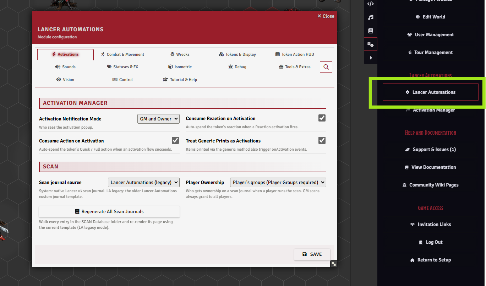

Almost everything in the module is configured from one place: **Game Settings > Configure Settings > Lancer Automations**. This is the hub the rest of the module hangs off of. Every feature has its toggles here, and a handful of buttons open dedicated tools: the Activation Manager, export and import, the guided tour, the news popup, and a full reset.

There are a lot of settings, so they aren't all listed here. Each feature guide explains the ones that matter for it, and every setting carries an inline hint in the config window itself.

> [!TIP]
> Go through the settings before your first session and set a baseline; the module is largely opt-in. Many settings are client-scoped (per player), so use Force Client Settings to apply your setup to the whole table.

### Export & Import

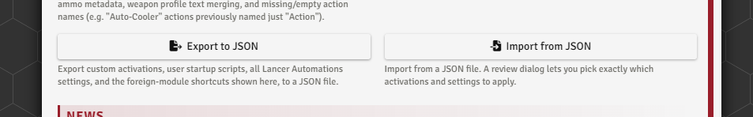

Export your whole setup (automations, startup scripts, settings, and keybindings) to a JSON file for a backup or to share a build, then import it back through a review dialog that lets you pick exactly what comes in. A full reset is here too, for starting clean.

<br clear="right"/>

---

## Feature guides

Short pitches below. Each links to its full guide (being written).

### Automation Engine

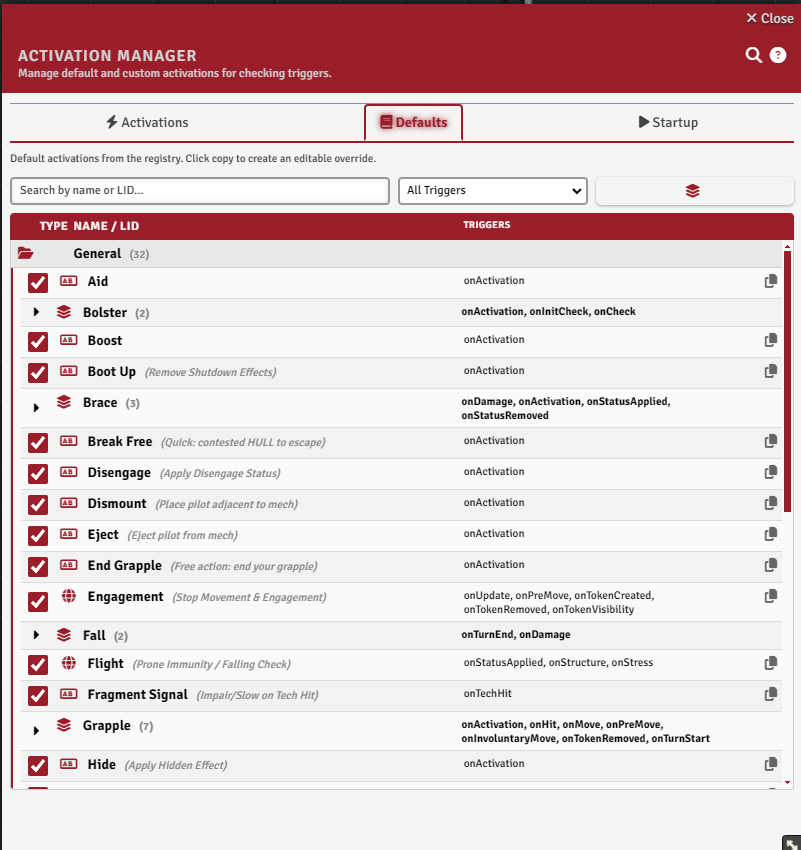

The core feature of Lancer Automations, and the hardest to grasp. The engine is a powerful framework for automating almost any item, effect, or event tied to Lancer gameplay. Many of Lancer's base actions, plus some items and simple NPC automations, are handled out of the box. I also ship my personal set of activations, but that's separate: just my own games' stuff shared as-is, not part of the core module, there for you to use, inspect, or modify to dip your toes into the engine.

→ Full guide: [`doc/feature/AUTOMATION_ENGINE.md`](doc/feature/AUTOMATION_ENGINE.md) ・ engine internals: [`doc/AUTOMATION_SYSTEM.md`](doc/AUTOMATION_SYSTEM.md)

<br clear="right"/>

### Effect Manager & Bonuses

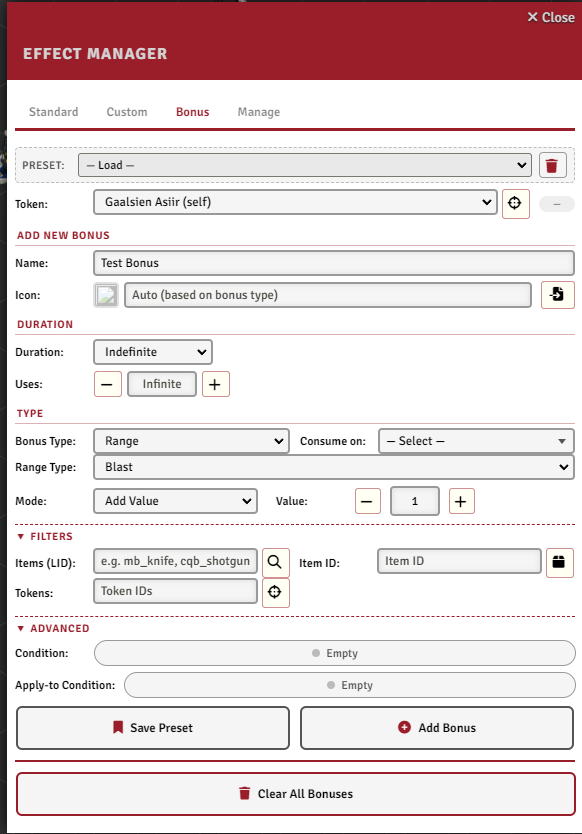

The Effect Manager can be driven from automation code through the API, but it's also fully available by hand during play. It manages effects, custom effects, and a wide variety of bonuses and status effects so you can apply almost anything you want: custom effects that grant charges, weapon range bonuses, a single reroll, and more.

→ Full guide: [`doc/feature/EFFECTS_AND_BONUSES.md`](doc/feature/EFFECTS_AND_BONUSES.md)

<br clear="right"/>

### Token Action HUD

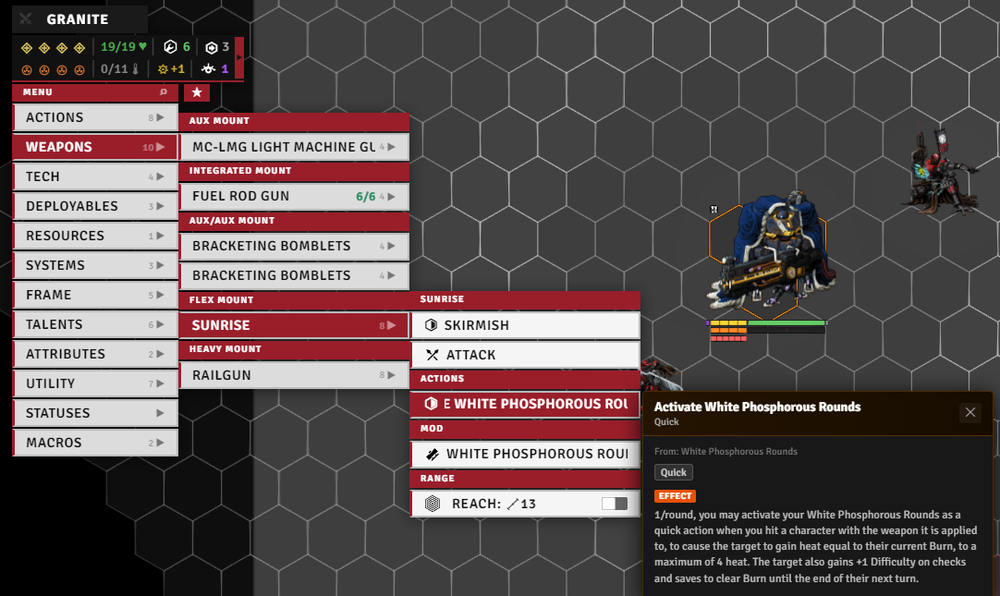

The TAH, or Token Action HUD, is a custom-built action menu that gives you everything you need and more, attached right to your token: your items, skills, stats, scans, history, favorites, a search tool, range preview, and more.

→ Full guide: [`doc/feature/HUD.md`](doc/feature/HUD.md)

<br clear="right"/>

### Custom Token Stat Bars

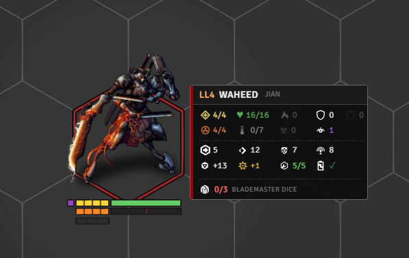

Lancer Automations draws its own token bars, tailored to Lancer and meant to replace Bar Brawl (turn Bar Brawl off on your tokens for these to show). They show the stats that matter, with per-token control over when they're visible (in combat, out of combat, hidden, GM only, owner only), icon scale, and row height. You can add extra custom bars per token, and talent counters can be injected automatically.

→ Full guide: [`doc/feature/TOKEN_DISPLAY.md`](doc/feature/TOKEN_DISPLAY.md)

<br clear="right"/>

### Movement & the Lancer Ruler

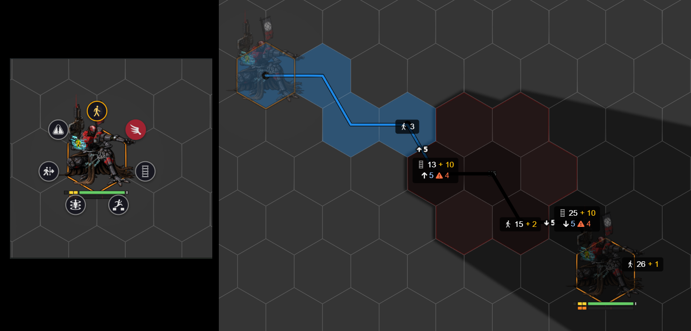

Lancer Automations ships its own Lancer ruler, built to be as detailed as possible. There's still more work to do, but if you want accurate, detailed information about movement in Lancer, this ruler is for you. The same system powers boost detection, cancelling movement through engagement, and more, all wired into the automation engine.

→ Full guide: [`doc/feature/MOVEMENT.md`](doc/feature/MOVEMENT.md) ・ advanced/beta: [`MOVEMENT_ADVANCED.md`](doc/feature/MOVEMENT_ADVANCED.md)

<br clear="right"/>

### Isometric handling

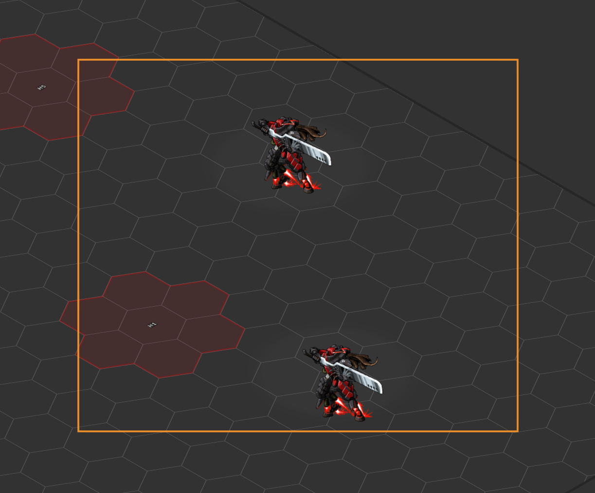

If you run an isometric game, Lancer Automations plays nicely with the isometric modules. It animates token elevation in iso view and adapts its own UI (stat bars, tactical distance labels, waypoint labels, the target reticle, click zones, the selection marquee, scrolling text, and more) so the module's additions line up correctly in an isometric scene. Each piece can be toggled from the Isometric settings tab.

→ Full guide: [`doc/feature/ISOMETRIC.md`](doc/feature/ISOMETRIC.md)

<br clear="right"/>

### Interactive Tools

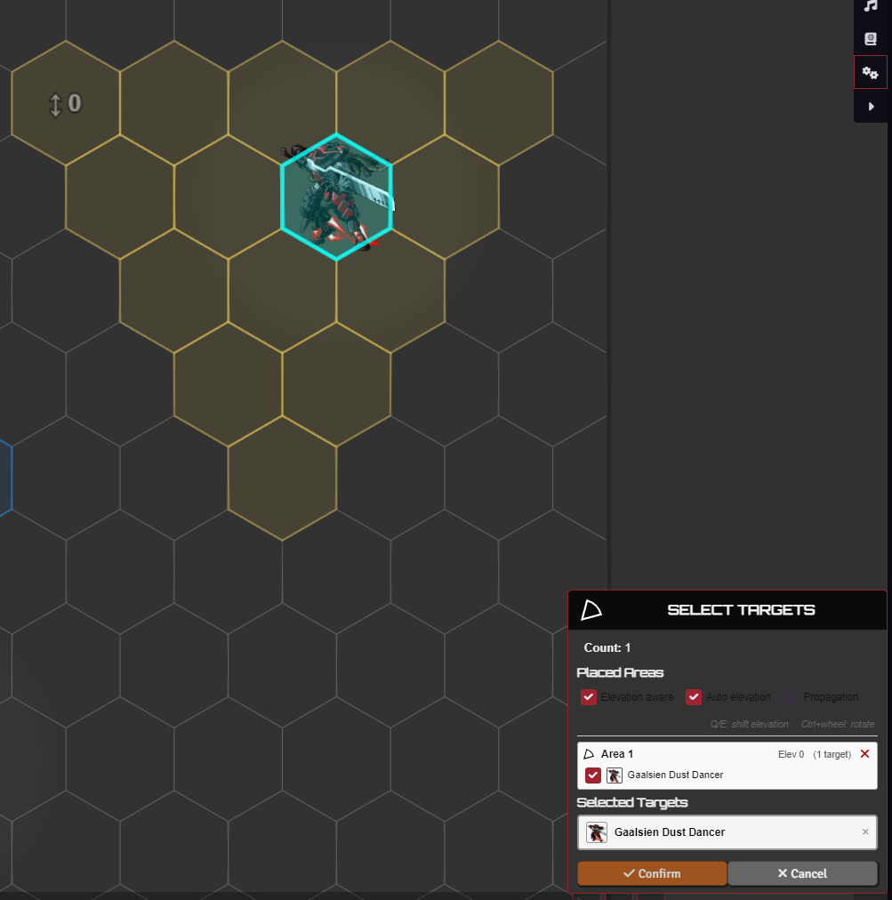

Interactive tools are meant to be used with the automation engine, and elsewhere too. Lancer Automations provides a wide variety of them to build multi-step actions: applying knockback, choosing targets, picking tokens within a defined range, spawning tokens, running votes, and more.

→ Full guide: [`doc/feature/INTERACTIVE_TOOLS.md`](doc/feature/INTERACTIVE_TOOLS.md)

<br clear="right"/>

### Attack Targeting

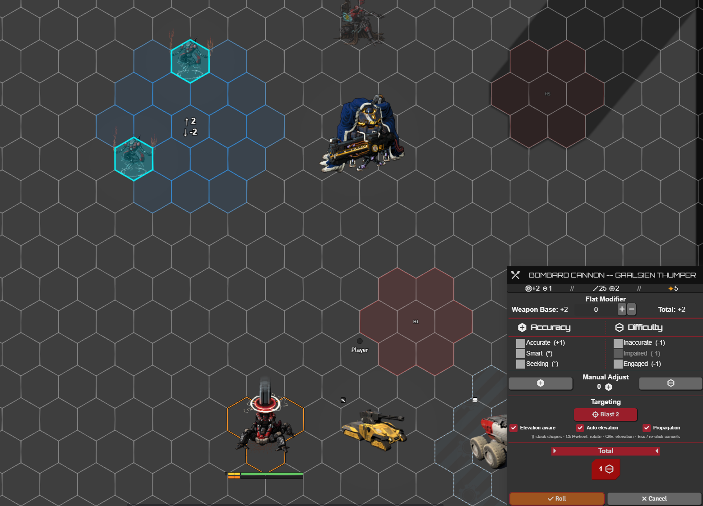

An upgrade to the Lancer system's targeting flow: choose your target or place a blast, cone, or line from the attack HUD, with 3D targeting, elevation and terrain blocking through Terrain Height Tools, adjustable line angles, and multi-targeting.

→ Full guide: [`doc/feature/ATTACK_TARGETING.md`](doc/feature/ATTACK_TARGETING.md)

<br clear="right"/>

### Gameplay Automation

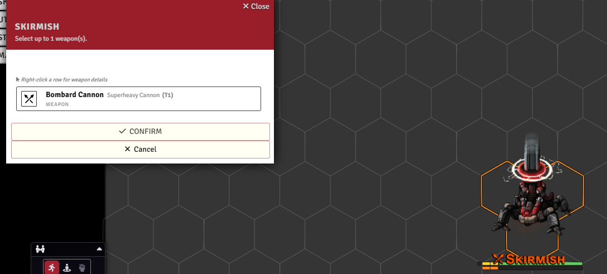

Through the automation engine and many tweaks to the Lancer system, Lancer Automations runs Lancer's actions and reactions for you, from combat to the out-of-combat flows: scanning, rest, downtime, and reserves. It also handles skill checks and contests, and tracks usage on a per-turn, per-round, or per-scene basis.

→ Full guide: [`doc/feature/GAMEPLAY_AUTOMATION.md`](doc/feature/GAMEPLAY_AUTOMATION.md)

<br clear="right"/>

### FX and Sounds

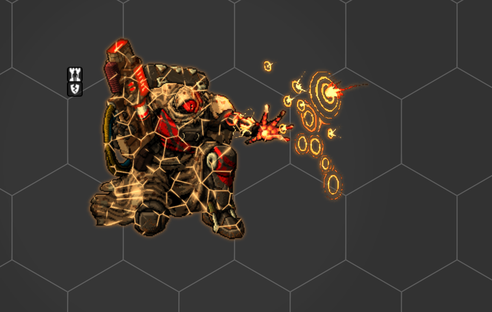

There's a lot more flavor in Lancer Automations than just JB2A and Lancer Weapon FX. You get many sounds and graphical effects throughout the module that feel good and break up the plain Foundry VTT experience. Almost all of them can be tweaked or disabled.

→ Full guide: [`doc/feature/FX_AND_SOUNDS.md`](doc/feature/FX_AND_SOUNDS.md)

<br clear="right"/>

### Vision

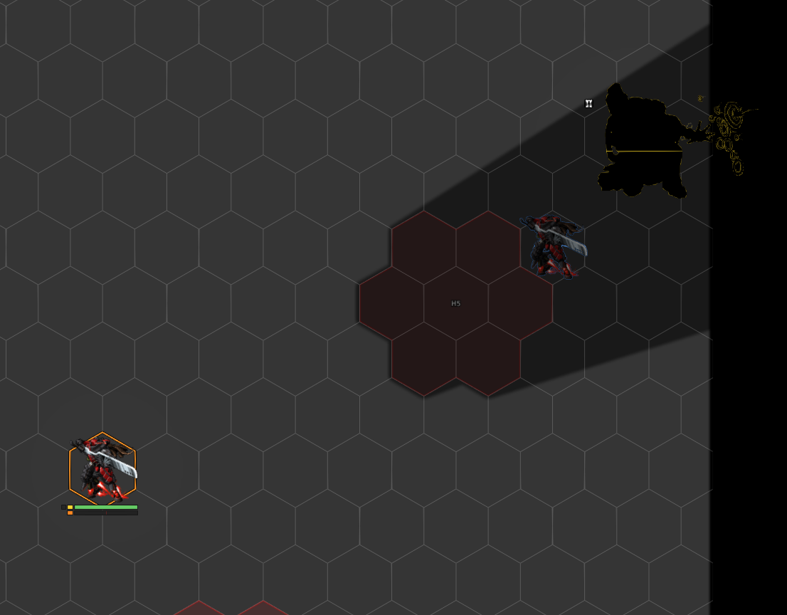

Lancer doesn't really have a concept of fog of war or vision, but personally, for immersion, I still like to play with light. To stay within the rules, Lancer Automations gives you a way to do that: two vision modes, one for units visible on sensors and one for units seen anywhere through Battlefield Awareness. A per-token "blocks line of sight" option (with Bulwark support, elevation-aware via Wall Height) lets units actually break sight. There are also performance tools for light and movement, and a system that emulates Lancer's true edge-of-token line of sight (visually only).

→ Full guide: [`doc/feature/VISION.md`](doc/feature/VISION.md)

<br clear="right"/>

### Wrecks

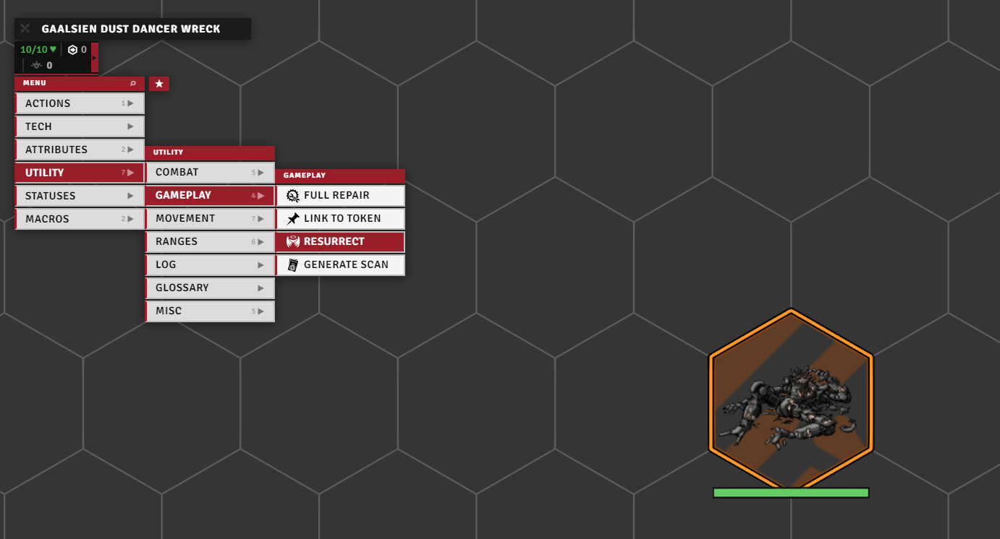

When a unit is destroyed, the module drops a dedicated wreck on the field, with per-category art, explosion, and sound, optional difficult terrain through Terrain Height Tools, and a resurrect button to bring the unit back. Art, FX, sound, and scale can be overridden per token.

→ Full guide: [`doc/feature/WRECK.md`](doc/feature/WRECK.md)

<br clear="right"/>

### System Additions

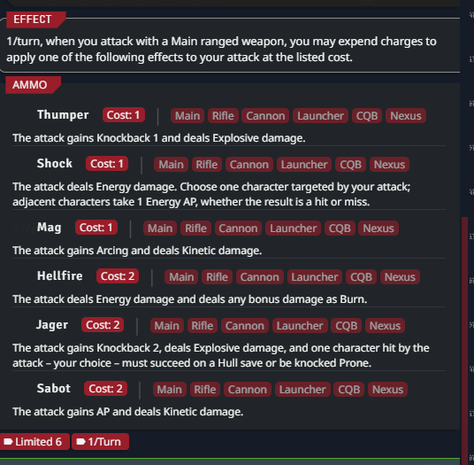

Some of the most useful things here aren't flashy, they're changes baked directly into the Lancer system and Foundry so your whole table benefits without installing anything extra: an item-disabled state for dropped or jammed gear, an ammo system for mech systems, extra status effects, and extra trackable attributes for token bars (Move, Reaction). The GM setup and maintenance tools have their own guide.

→ Full guide: [`doc/feature/SYSTEM_ADDITIONS.md`](doc/feature/SYSTEM_ADDITIONS.md) ・ setup & tools: [`doc/feature/SETUP_AND_TOOLS.md`](doc/feature/SETUP_AND_TOOLS.md)

<br clear="right"/>

### Infection damage type

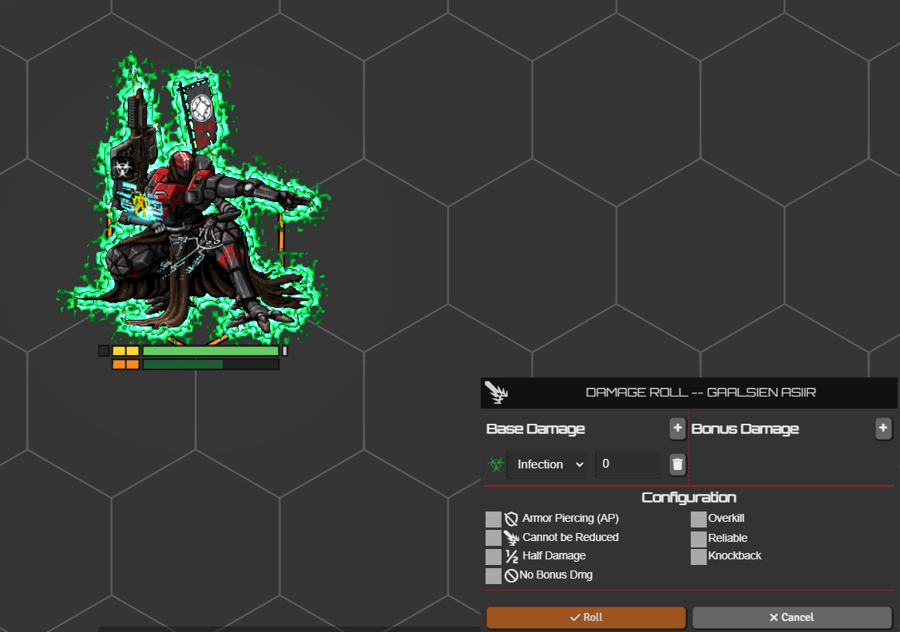

HORUS: Thy Hubris Manifest introduces an Infection damage type, and I liked it enough to wire it into Lancer properly. It works like Burn, but for Heat, and it asks for a Systems check instead of Engineering. You get the damage type itself, the turn-end check flow, an Infection card on the sheet, and the matching visual effects.

→ Full guide: [`doc/feature/INFECTION.md`](doc/feature/INFECTION.md)

<br clear="right"/>

---

## Optional integrations

Lancer Automations works on its own, but a few features unlock or improve when these optional modules are present. Install details are in the tables above.

| Feature | Needs |
|---------|-------|
| Range, threat, and custom auras (HUD hover previews, `createAura` API) | Grid-Aware Auras (or my fork) |
| Difficult terrain on wrecks, 3D terrain height and line of sight | Terrain Height Tools (or my fork) |
| Elevation-aware token-blocks-line-of-sight (peek over same-height tokens) | Wall Height |
| Built-in action animations (Boost, Hide, Shut Down, Fall, Overcharge, etc.) | Lancer Weapon FX |
| Multi-team disposition matrix in activation filters | Token Factions (my fork) |
| Zone placement tools (effect, dangerous, difficult-terrain zones) | TemplateMacro |
| Syntax highlighting in the code editors | CodeMirror |
| Stack counts shown on effect icons | Status Icon Counter |

---

## Support

For help or questions, drop by the [Pilot NET Discord](https://discord.com/invite/lancer).

---

## Acknowledgments

Inspiration, reference code, and ideas drawn from the work of:

- [Eranziel](https://github.com/Eranziel)
- [mandatoryhashtags](https://github.com/mandatoryhashtags)
- [caewok](https://github.com/caewok)
- [Wibble199](https://github.com/Wibble199)
- [csmcfarland](https://gitlab.com/csmcfarland)
