# Lancer Automations

[](https://github.com/Agraael/lancer-automations/releases/latest)

<br/>
[)](https://github.com/Agraael/lancer-automations/releases/latest)
[)](https://github.com/Agraael/lancer-automations/releases/latest)


<details>
<summary>patreon...</summary>

I'm a bit shy about that, but one day someone asked if they could give me money, feels good. Anyway, here's the thing.

In any case, my stuff would always be free, and if I stop working on it, I'll just close that thing. [Patreon](https://www.patreon.com/cw/LaSossis)
</details>

---

I started by tweaking existing modules for the [Lancer system](https://foundryvtt.com/packages/lancer) in FoundryVTT, and it spiraled into something much bigger. This is inspired by [Lancer QoL](https://github.com/BoltsJ/lancer-weapon-fx) and borrows some of its code.

At its core, this module is an event-driven automation engine. Almost anything that happens during a Lancer session can fire a trigger: movement, attacks, damage, status changes, turn transitions. On top of that engine sit tools for managing effects with duration, building complex bonuses, running interactive prompts during play (choose a target, knock a token back, place a zone), and more.

The end goal is to move everything I need for my campaign into this module, so it functions as a full extension of the Lancer system for FoundryVTT v12.

> Some features may overlap or not fully integrate with each other. This is a work in progress.

---

## Table of Contents

- [Installation](#installation)
- [Features Overview](#features-overview)
- [Effect Manager](#effect-manager)
- [Bonuses](#bonuses)
- [Interactive Tools](#interactive-tools)
- [TemplateMacro: Lancer Tools](#templatemacro-lancer-tools)
- [Item Flags & Injection](#item-flags--injection)
- [Extra Actions](#extra-actions)
- [Automation System](#automation-system)
- [Optional Features](#optional-features)
  - [Lancer Automations HUD (Beta)](#lancer-automations-hud-beta)
  - [Alternative Structure Automations](#alternative-structure-automations)
- [Built-in Macros](#built-in-macros)
- [API Reference](#api-reference)
- [NPC Implementation Examples](#npc-implementation-examples)
- [Lancer System Additions](#lancer-system-additions)
- [Planned Features](#planned-features)
- [Support](#support)

---

## Installation

**Manifest URL:**
```
https://github.com/Agraael/lancer-automations/releases/latest/download/module.json
```

### Required

| Module | Description |
|--------|-------------|
| [Lancer System](https://foundryvtt.com/packages/lancer) | The Lancer RPG system for FoundryVTT |
| FoundryVTT v12 | The version I'm currently working on |
| [Lancer Style Library](https://github.com/Agraael/lancer-style-library) | Shared UI components and styling |
| [Temporary Custom Statuses](https://github.com/Agraael/temporary-custom-statuses) | Custom status effects with stacking |
| [lib-wrapper](https://github.com/foundryvtt/lib-wrapper) | Required for API hooks |
| [Socketlib](https://foundryvtt.com/packages/socketlib) | Required for API hooks |
| [Tokenmagic](https://foundryvtt.com/packages/tokenmagic) | Required for API hooks |
| [Sequencer](https://foundryvtt.com/packages/sequencer) | Required for API hooks |

### Optional

| Module | Why you'd want it |
|--------|-------------------|
| [CodeMirror](https://github.com/League-of-Foundry-Developers/codemirror-lib) | Syntax highlighting in the evaluate/activation code editors |
| [TemplateMacro](https://github.com/Agraael/templatemacro) | Required for zone placement tools (effect zone, dangerous zone, difficult terrain) |
| [Status Icon Counter](https://foundryvtt.com/packages/statuscounter) | Shows stack counts on effect icons so you can see remaining charges at a glance |
| [Elevation Ruler](https://foundryvtt.com/packages/elevationruler) (or [my fork](https://github.com/Agraael/Lancer-elevationRuler-Fork)) | Required for boost detection, movement history accuracy, and difficult terrain penalty calculation |
| [Token Factions](https://github.com/p4535992/foundryvtt-token-factions) ([my fork](https://github.com/Agraael/foundryvtt-token-factions)) | Original module for token border coloring by disposition. My fork adds an advanced multi-team disposition matrix so you can have more than two sides |
| [Grid-Aware Auras](https://github.com/Wibble199/FoundryVTT-Grid-Aware-Auras) (or [my fork](https://github.com/Agraael/FoundryVTT-Grid-Aware-Auras)) | Required for the `createAura` and `deleteAuras` API functions |
| [Terrain Height Tools](https://github.com/Wibble199/FoundryVTT-Terrain-Height-Tools) (or [my fork](https://github.com/Agraael/FoundryVTT-Terrain-Height-Tools)) | 3D terrain height painting and line-of-sight calculation |

---

## Features Overview

- **Automation System**: event-driven engine that fires on gameplay triggers (`onMove`, `onHit`, `onDamage`, and ~25 more) and runs reactions tied to items or global rules
- **Effect Manager**: status effects with turn-based duration and consumable stacks
- **Bonus System**: accuracy, difficulty, damage, stat, immunity, and tag bonuses that attach to active effects
- **Interactive Tools**: knockback, token picker, zone placement, deploy/throw weapons, choice cards, movement history and revert
- **TemplateMacro Integration**: Lancer-specific zone tools: effect zones, dangerous zones, difficult terrain
- **Item Flags & Injection**: attach deployables to any item, add custom flags read by the automation system
- **Built-in Activations**: Overwatch, Brace, Flight, Fall, ready to use out of the box
- **Built-in Macros**: Ram, Grapple, Eject, Disengage, Knockback, Deploy, Throw Weapon, Scan, Reinforcement, and more

---

## Effect Manager

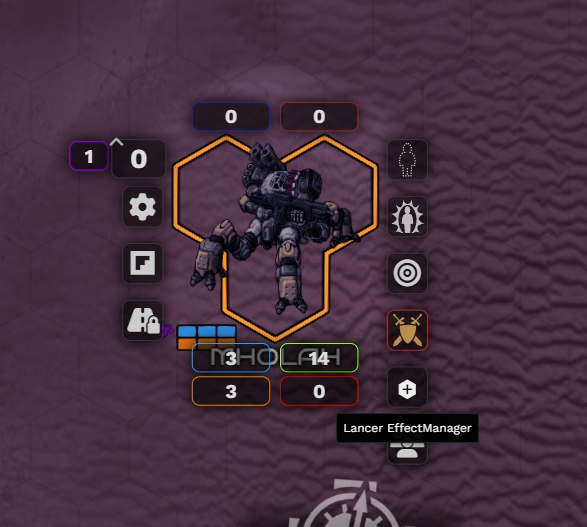

The Effect Manager is the main interface for creating and managing status effects on a token. You can open it directly from the token HUD. It's also fully accessible from automation code via the API.

<br clear="right"/>

---

### Standard Tab

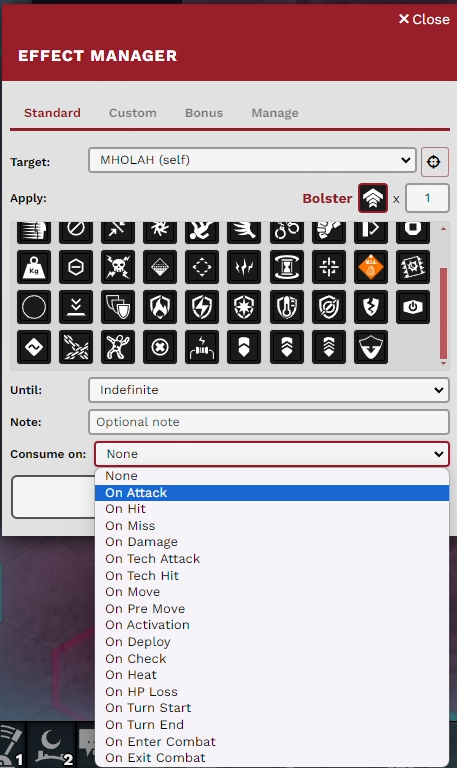

The standard tab works with the built-in FoundryVTT status icons plus any extras added by the Lancer system. From here you can:

- Apply an effect with a **duration**: the countdown starts at either the beginning or end of the token's turn, or you can set it to indefinite
- Set a **stack count** (number of charges)
- Set a **consumption trigger**: the event that burns one stack. On attack, on hit, on damage, on move, on activation, and more
- Add a **consumption filter**: for example, only consume when a specific item is used

When a stack reaches zero, the effect is removed automatically.

<br clear="right"/>

---

### Custom Tab

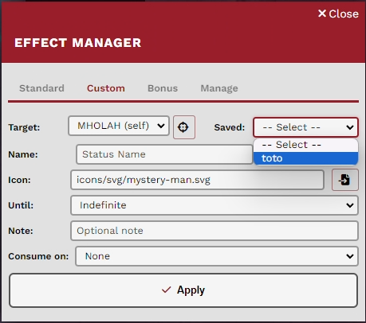

Available when [Temporary Custom Statuses](https://github.com/Agraael/temporary-custom-statuses) is installed.

The custom tab lets you create effects with any name and icon, not limited to the predefined status list. This is especially useful for automating specific items: markers, counters, item-specific state tracking. All the same duration and consumption options apply.

Custom effect templates can be saved in module settings and reused across sessions.

One thing to note: effects that share the same name but have different conditions are grouped under the same icon with a blue stack number. This is separate from the Status Icon Counter module's display. If an effect has both, the numbers may overlap.

<br clear="right"/>

---

### Bonuses Tab

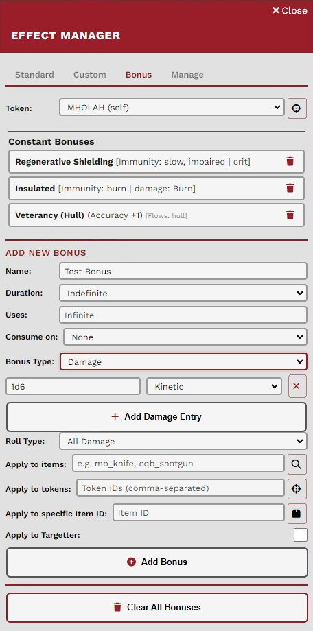

The Bonuses tab gives you access to general bonuses (accuracy, difficulty, damage, stat). These are documented in the next section.

## Bonuses

Bonuses let you attach mechanical effects to tokens that integrate directly into Lancer's roll flows. There are three persistence modes.

### General Bonuses

General bonuses behave like standard status effects: they're visible on the token, have optional duration and stack consumption, and integrate into rolls automatically.

**Types:**
- **Accuracy**: adds accuracy dice to the next matching roll
- **Difficulty**: adds difficulty dice
- **Damage**: adds bonus damage (by type, e.g. +2 Energy) applied on the next damage roll
- **Stat**: modifies an actor stat directly (HP, Heat Cap, Speed, Evasion, E-Defense, Save, etc.)
- **Tag**: injects or modifies tags on weapons (e.g. adding Armor Penetration, changing range)
- **Range**: increases or overrides a weapon's range value for a specific range category (Range, Threat, Line, Blast, Burst, Cone).
- **Immunity**: grants immunity to a damage type or effect category

<br clear="right"/>

---

<table>
<tr>
<td>

Accuracy and difficulty bonuses are injected into the Lancer roll HUD so you can see them before confirming.

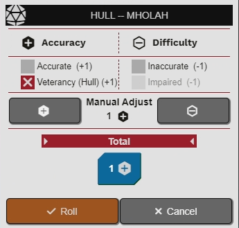

</td>
<td>

Damage bonuses appear in the damage roll output.

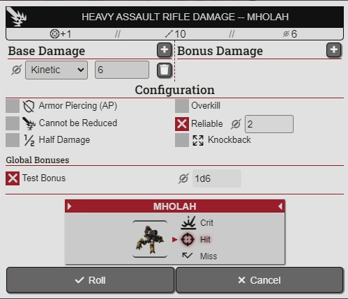

</td>
</tr>
</table>

### Flow Bonuses

Flow bonuses are short-lived by design. They can be injected into the current flow state using `triggerData.flowState.injectBonus(...)`. 
They will stay in the flow up to the very end, event roll damage. With help of the flow injection system,  for exemple things like  bonus damage even  if set in the AttackRoll  will live in the damageChat Card. cf Flow Data Injection.

### Constant Bonuses

Constant bonuses are invisible to the player and persist until manually removed. They are used for baseline stat modifications and immunities, things that need to always be active but shouldn't clutter the token's status display.

Use case: the Veterancy talent gives +1 accuracy on stat checks. Apply it with `api.addConstantBonus(...)` in the `onInit` code, and it silently adds to every stat roll without cluttering the token's status display.

### Immunity System

When an immunity bonus is active on a token, any incoming damage of that type triggers a **choice card** asking whether to apply the immunity.

<table>
<tr>
<td>

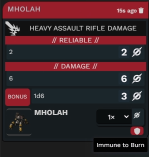

</td>
<td>

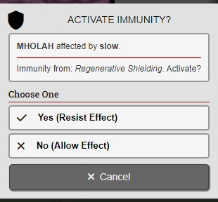

</td>
</tr>
</table>

### Tag Injection

Tag bonuses let you inject or modify tags on a weapon mid-flow. Useful for abilities that temporarily grant a property, for example adding the `Armor Penetration` tag before an attack. You can also remove existing tags.

### Flow Data Injection

Flow data injection is a system that allows you to inject data into the current flow state. This data will be available to all subsequent steps in the flow. It is a way to pass data between steps in a flow without having to store it in a variable. Two function are available to inject data into the flow state:

- `triggerData.flowState.injectBonus(...)`: injects a bonus into the flow state
- `triggerData.flowState.injectData(...)`: injects any data into the flow state

<br clear="right"/>

---

## Interactive Tools

These are the building blocks for complex automation flows. Most are available from macros and from activation code via the API.

### Knockback

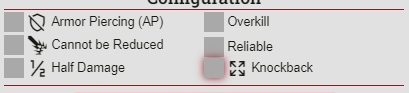

When the knockback feature is enabled, a **Knockback** checkbox appears in the damage roll dialog. If checked, the module reads the Knockback tag from the attacking item and automatically triggers the knockback interaction after damage resolves.

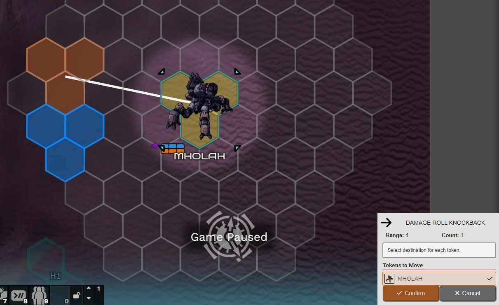

`api.knockBackToken(tokens, distance, options)`: you can also call this directly. It pushes or pulls a token along the grid, respecting obstacles.

### Choice Card

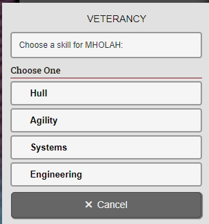

`api.startChoiceCard(options)`: displays a popup card with multiple options. Supports:
- **OR mode**: the player picks exactly one option
- **AND mode**: all options are shown and each can be confirmed or skipped individually

Multiple cards can be spawned simultaneously. The card system serializes them in a queue and shows a pending count so nothing gets lost.

<br clear="right"/>

---

### Choose Token

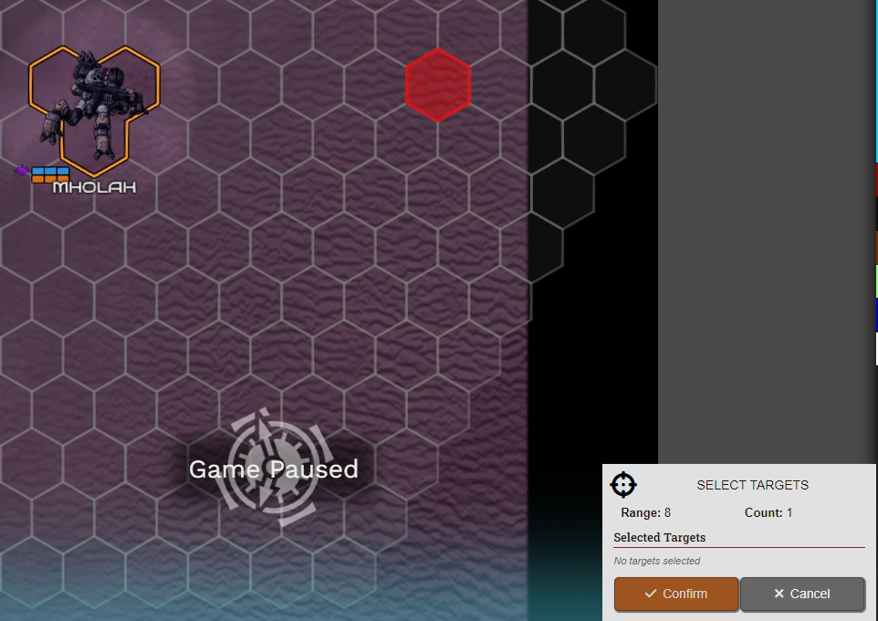

`api.chooseToken(token, options)`: highlights valid tokens in range and asks the user to select one or more. Options include:
- `count`: how many tokens to select
- `range`: maximum distance (highlights eligible tokens)
- `includeSelf`: whether the caster can target itself
- `filter`: a callback to restrict valid targets (e.g. `api.isFriendly(reactor, t)`)

### Place Zone

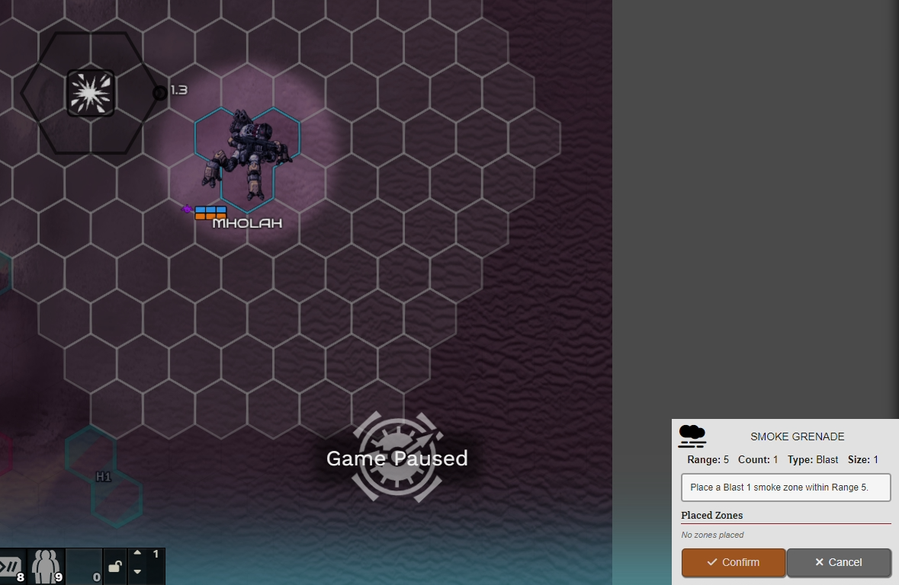

`api.placeZone(token, options, duration)`: interactive zone placement using the [TemplateMacro](https://github.com/Agraael/templatemacro) module. Supports Blast, Cone, Line, and other template types.

Zones can have `statusEffects` assigned so any token inside automatically gains those effects: soft cover, difficult terrain, damage zones, etc. See the [TemplateMacro section](#templatemacro-lancer-tools) for the full Lancer-specific zone tools.

### Deploy Token / Throw Weapon

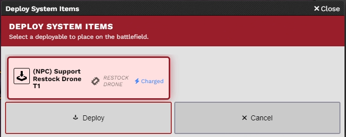

Several functions handle deploying tokens or weapons onto the scene:

- `api.placeDeployable(options)`: interactive placement of a deployable token (compendium lookup, use counter, visual preview)
- `api.beginDeploymentCard(options)`: shows a card for choosing which deployable to place from an item
- `api.openDeployableMenu(actor)`: dialog listing all of an actor's deployables
- `api.recallDeployable(ownerToken)`: removes a deployed token from the scene
- `api.deployWeaponToken(weapon, actor, token, options)`: places a thrown weapon as a token on the ground
- `api.pickupWeaponToken(ownerToken)`: retrieves a thrown weapon token
- `api.beginThrowWeaponFlow(weapon)`: starts a weapon attack flow pre-configured for throwing
- `api.openThrowMenu(actor)`: dialog listing all throwable weapons for an actor
- `api.delayedTokenAppearance()`: handles delayed token appearance in combat, using placeholders and automatic reveal on a target round

### Movement History & Revert

The module optionally tracks each token's movement path during their turn. This is most accurate when used with the [my Elevation Ruler fork](https://github.com/Agraael/Lancer-elevationRuler-Fork).

To open the movement history dialog, press **R** (default keybinding, configurable in FoundryVTT's keybinding settings) with a token selected, or right-click the revert button in the token HUD.

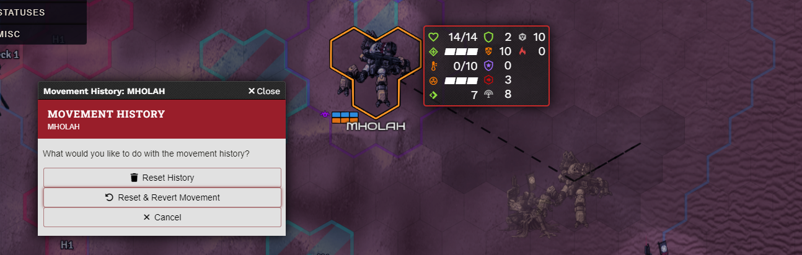

The dialog gives you two options:
- **Reset History**: wipes the stored path without moving the token
- **Reset & Revert Movement**: wipes the path and teleports the token back to where it started that turn

You can also call these directly:
- `api.revertMovement(token)`: moves the token back to its turn-start position
- `api.clearMovementHistory(token)`: clears the stored path

---

## TemplateMacro: Lancer Tools

[TemplateMacro](https://github.com/Agraael/templatemacro) is a fork of a dead module that I fixed for FoundryVTT v12. On top of the base template scripting functionality, I've added Lancer-specific zone tools.

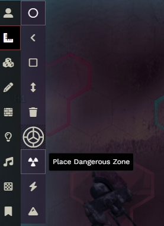

### Place Effect Zone

A measurement template that applies one or more status effects to any token inside it. When a token enters or the zone is placed, the effects are applied automatically. Effects are removed when the token leaves.

### Dangerous Zone

A zone that deals damage to tokens on entry or at specific trigger points (e.g. turn start). Configurable damage type and amount. Used for things like fire fields, electrical zones, or area denial.

### Difficult Terrain

A zone that imposes a movement penalty on tokens moving through it. When used with the [my Elevation Ruler fork](https://github.com/Agraael/Lancer-elevationRuler-Fork), the penalty is factored into the movement cost display in real time, so you can see exactly how much movement is consumed.

<br clear="right"/>

---

## Item Flags & Injection

Beyond the bonus system, you can attach custom data directly to items. The module reads certain flags by default and uses them in macros and automation flows.

### Built-in Flags

| Flag | Effect |
|------|--------|
| `deployRange` | Max range for placing a deployable from this item |
| `deployCount` | Number of uses before the deployable is exhausted |
| `activeState` | Marks the item as having an active/inactive toggle. When activated, the "End Activation" flow lets you pick this item to deactivate. You can also specify which action type is required (quick, full, free, etc.) |

### Extra Deployables

The module lets you attach additional deployables to any item, including NPC features. This is useful when an NPC ability should spawn something on the field but the base Lancer system doesn't natively support it on that item type.

These deployables are recognized and read by the deploy macro just like native ones.

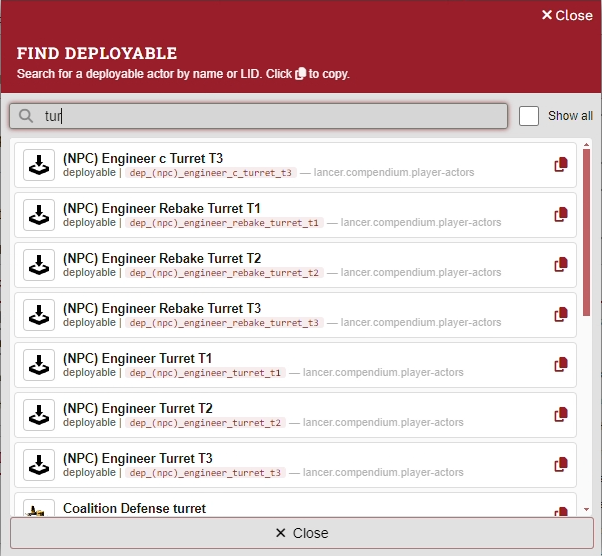

## Extra Actions

The Extra Actions system lets you attach additional action buttons to items, tokens, or actors at runtime. Actions added this way appear alongside an item's native `system.actions` and can be triggered from the chat card or sheet just like built-in actions. They survive across reloads (stored as flags) and can be removed or filtered later.

This is the mechanism behind features like NPC abilities that grant a temporary "Fall Prone" action, the Citadel Terraformer's print sub-actions, or any homebrew effect that needs to inject a one-off action onto a target.

**Storage**

- When the target is an **item**, actions are stored on the item's `extraActions` flag and merged with `system.actions` whenever the item is rendered.
- When the target is a **token or actor**, actions are stored on the actor and exposed via `getActorActions(target)`.

**API surface** (available on `game.modules.get('lancer-automations').api`):

| Function | Purpose |
|---|---|
| `addExtraActions(target, actions)` | Add one or more action objects to an item, token, or actor. |
| `getItemActions(item)` | Return the merged list of `system.actions` plus any extra actions stored on an item. |
| `getActorActions(tokenOrActor)` | Return the extra actions attached to an actor or token. |
| `removeExtraActions(target, filter?)` | Remove extra actions. `filter` may be a predicate, an action name, an array of names, or omitted to clear all. |

The Automation System exposes a matching `reactionPath` selector — for example `"extraActions.Fall Prone"` — so reactions can fire specifically when an extra action is activated. See [Trigger Reference](#trigger-reference) and the API docs in `doc/API_INTERACTIVE.md` for full details.

## Automation System

This is the core of the module. Everything else can plug into it.

### How It Works

**1. Event fanout and filtering**

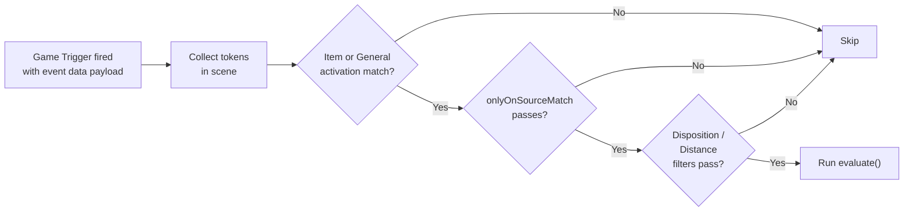
```mermaid
flowchart LR
    A["Game Trigger fired<br/>with event data payload"] --> C["Collect tokens<br/>in scene"]
    C --> D{"Item or General<br/>activation match?"}
    D -- No --> Skip
    D -- Yes --> E{"onlyOnSourceMatch<br/>passes?"}
    E -- No --> Skip
    E -- Yes --> F{"Disposition /<br/>Distance<br/>filters pass?"}
    F -- No --> Skip
    F -- Yes --> G["Run evaluate()"]
```

**2. Evaluate to execution**

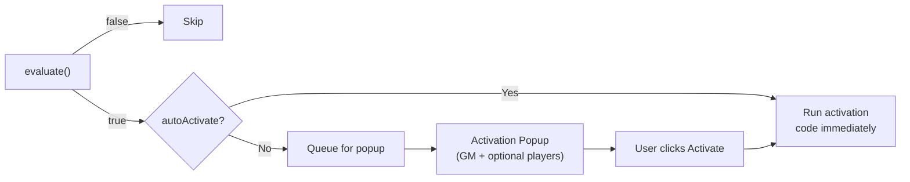
```mermaid
flowchart LR
    G["evaluate()"] -- false --> Skip
    G -- true --> H{"autoActivate?"}
    H -- Yes --> I["Run activation<br/>code immediately"]
    H -- No --> J["Queue for popup"]
    J --> K["Activation Popup<br/>(GM + optional players)"]
    K --> L["User clicks Activate"]
    L --> I
```


> **Client execution note:** `activationCode` does **not** always run on the GM's client.
> - **Auto activations** run on the client of the triggering token's owner — the player whose action fired the trigger (or the GM if that token has no online owner).
> - **Manual activations (popup)** run on whichever client clicks the Activate button. The popup is routed via socket to the reactor's token owner and/or GM depending on the `reactionNotificationMode` setting (`'owner'`, `'gm'`, or `'both'`).
>
> Because of this, `activationCode` may execute on a non-GM client. If your code needs GM-only permissions (creating tokens, modifying actors you don't own, etc.), you must delegate those operations via socket or use API helpers that already handle delegation internally.

### Trigger Reference

<details>
<summary>Expand trigger table</summary>

| Trigger | When it fires |
|---------|---------------|
| `onMove` | After a token finishes moving |
| `onPreMove` | Before movement executes, can cancel or redirect |
| `onAttack` | When an attack is initiated |
| `onInitAttack` | At the very start of an attack flow (before the HUD), can cancel |
| `onInitTechAttack` | At the very start of a tech attack flow, can cancel |
| `onHit` | After a hit is confirmed |
| `onMiss` | After a miss is confirmed |
| `onTechAttack` | When a tech attack is initiated |
| `onTechHit` | After a tech attack hits |
| `onTechMiss` | After a tech attack misses |
| `onDamage` | After damage is rolled |
| `onPreStructure` | Before structure roll, can cancel |
| `onStructure` | After a structure roll |
| `onPreStress` | Before overheat roll, can cancel |
| `onStress` | After an overheat roll |
| `onCheck` | After a stat check resolves (HULL, AGI, SYS, ENG) |
| `onInitCheck` | At the very start of a stat check flow, can cancel |
| `onInitActivation` | Before an item or action is activated, can cancel |
| `onActivation` | When an item or action is activated |
| `onTurnStart` | At the start of a token's turn |
| `onTurnEnd` | At the end of a token's turn |
| `onEnterCombat` | When a token joins combat |
| `onExitCombat` | When a token leaves combat |
| `onPreStatusApplied` | Before a status is applied, can cancel |
| `onPreStatusRemoved` | Before a status is removed, can cancel |
| `onStatusApplied` | When a status effect is applied to a token |
| `onStatusRemoved` | When a status effect is removed from a token |
| `onPreHpChange` | Before HP changes, can cancel or modify |
| `onPreHeatChange` | Before heat changes, can cancel or modify |
| `onHeatGain` | When a token gains heat |
| `onHeatLoss` | When a token's heat is cleared |
| `onHpGain` | When a token regains HP |
| `onHpLoss` | When a token loses HP |
| `onDestroyed` | When a token is destroyed |
| `onDeploy` | When a deployable is placed |

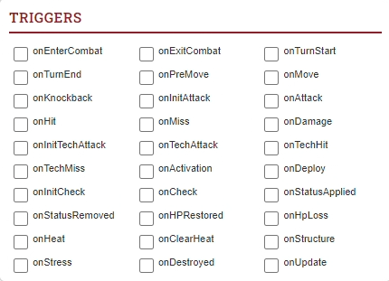

</details>

Each trigger carries a data payload. The full schema for each trigger is in the [API Reference](doc/API_REFERENCE.md).

### Activation Types

There are two ways to set up an activation:

- **Item-based (LID):** Tied to a specific Lancer item by its LID. Only tokens that own that item can react.
- **General:** Not tied to any item. Any token in the scene can react, filtered by the rules you set up.

### Filters

<table>
<tr>
<td>

**Only On Source Match**

For Item activations: the activation only fires if the token that triggered the event also owns the item.

For General activations: the activation only fires if the triggering action's name matches the activation name.

**Disposition Filter**

Restricts the reactor's valid relationship to the triggering token: Friendly, Hostile, Neutral, or any combination. Uses Token Factions if available for multi-team support.

**Distance Filter**

Only activates if the triggering event occurred within a set distance from the reactor.

**Action Path**

Points to a specific action inside an item. Useful when you want to associate the activation with one weapon reaction or a specific talent rank rather than the whole item.

Format: `system.actions.0` or `ranks[0].actions[0]`

**Action Type**

Controls how the activation is labeled in the popup (Reaction, Quick Action, Full Action, Protocol, etc.).

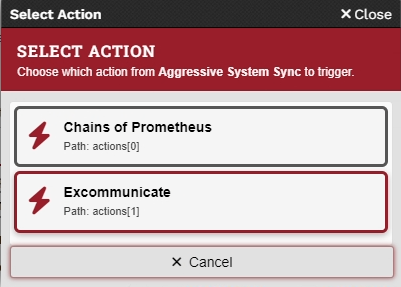

</td>
<td>

**Trigger / Effect Description**

Lets you override the description text shown in the activation popup.

**Frequency**

How often the activation can fire: Unlimited, 1/combat, or per-round via `usesPerRound`. For now, frequency tracking in the popup is only available for reactions, using the "consume reaction" option.

**Out of Combat**

By default, some triggers only fire during combat. Enable this flag to allow the activation to fire outside of combat too.

**Item LID Finder**

A built-in tool in the activation config that lets you browse your world's compendiums and copy an item's LID directly.

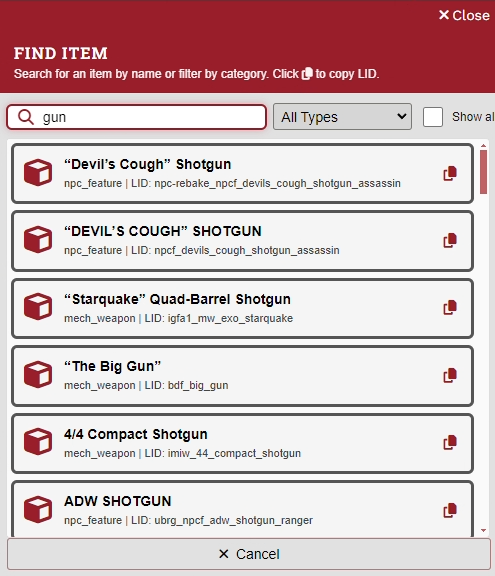

</td>
</tr>
</table>

### Evaluate, Activate & Init

**Evaluate function**

A code block that validates whether the activation should proceed. For timing-sensitive triggers, this should be synchronous (see Await Activation Completion below). Return `true` to allow, `false` to skip.

```javascript
function(triggerType, triggerData, reactorToken, item, activationName, api) {
    return triggerData.target?.id === reactorToken.id;
}
```

**Activation code**

Runs when the activation is confirmed, either automatically or after the user clicks Activate in the popup. Can be async. Has full access to the `api`.

**onInit code**

Runs once when a token is created in the scene. Useful for applying initial constant bonuses, creating auras, or setting up baseline state.

### Auto Mode vs Popup Mode

**Popup mode (default):** Non-auto activations are queued and displayed in a summary popup showing all triggered activations for the current event. Each entry shows which token can react and what the activation is.

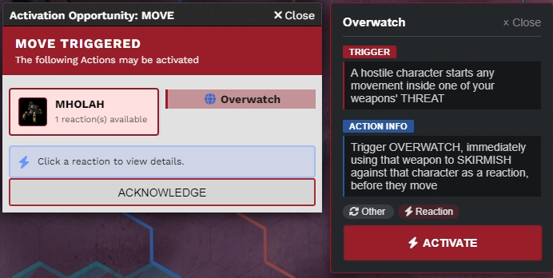

Click an entry to expand its details, then click Activate to run it. In module settings, you can allow players (not just the GM) to see and interact with popups for tokens they own.

**Auto mode:** When enabled, the activation code runs immediately when the trigger fires, with no popup or confirmation. Use this for things that should always happen automatically (applying a status on hit, for example).

By default, activating an LID-based activation prints the item card to chat and then runs your code. Setting the mode to **instead** skips the chat card entirely.

### Await Activation Completion

For `onPreMove`, `onInitAttack`, `onInitTechAttack`, `onInitCheck`, `onInitActivation`, `onPreStatusApplied`, and `onPreStatusRemoved` triggers: any code that calls `cancelTriggeredMove`, `changeTriggeredMove`, `cancelAttack`, `cancelTechAttack`, `cancelCheck`, `cancelAction`, `cancelChange`, or `triggerData.flowState.injectBonus` **must not be async**. If you write an async function without enabling the **Await Activation Completion** flag, the module will warn you and the timing-sensitive block will likely fail silently.

### Movement Cancel & Redirect (onPreMove)

`onPreMove` fires before movement is executed. From inside the evaluate or activation code, you can:

- `triggerData.cancelTriggeredMove()`: stop the movement entirely
- `triggerData.changeTriggeredMove(newPos)`: redirect the token to a different destination

For example, when a token tries to move away, check if it's within an enemy's engagement range and cancel or redirect the move.

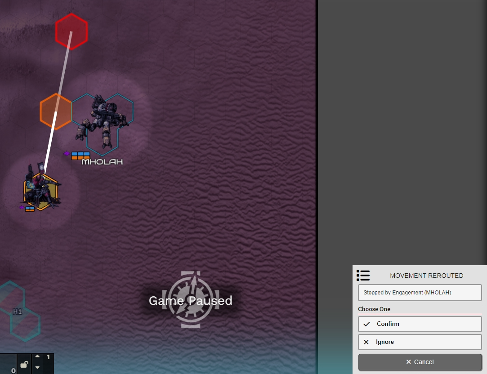

### Action & Status Cancellation (onInit / onPreStatus)

Several other triggers allow you to cancel an operation before it completes. Any code that uses these functions **must not be async** (use **Await Activation Completion**).

- `triggerData.cancelAction(...)`: stop an item activation in `onInitActivation`
- `triggerData.cancelAttack(...)`: stop an attack in `onInitAttack`
- `triggerData.cancelTechAttack(...)`: stop a tech attack in `onInitTechAttack`
- `triggerData.cancelCheck(...)`: stop a stat check in `onInitCheck`
- `triggerData.cancelChange(...)`: stop a status effect in `onPreStatusApplied` / `onPreStatusRemoved`
- `triggerData.cancelStructure(...)`: prevent structure roll in `onPreStructure`
- `triggerData.cancelStress(...)`: prevent overheat roll in `onPreStress`
- `triggerData.cancelHpChange(...)`: block HP change in `onPreHpChange`
- `triggerData.cancelHeatChange(...)`: block heat change in `onPreHeatChange`

All cancel functions accept `(reasonText?, title?, showCard?, userIdControl?)`.

### HP & Heat Modification (onPreHpChange / onPreHeatChange)

In addition to cancelling, you can modify the value being applied:

- `triggerData.modifyHpChange(newValue)`: change the HP value in `onPreHpChange`
- `triggerData.modifyHeatChange(newValue)`: change the heat value in `onPreHeatChange`

For example, reduce incoming damage by half, or cap heat gain at a certain threshold.

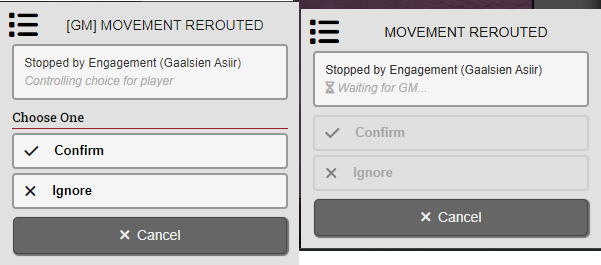

## Choice Cards

`api.startChoiceCard(options)` shows an interactive HUD card that pauses execution and waits for a user to pick. Cards queue automatically so multiple calls never overlap.

The `userIdControl` parameter routes the card to a specific user or a list of users. When an array is given, the **first to respond wins** and the card is dismissed for everyone else.

Three modes are available:
- **OR** — pick exactly one option, card closes immediately.
- **AND** — every option must be clicked before the card closes; each callback fires as soon as its button is clicked.
- **Vote / Hidden Vote** — the card is broadcast to all recipients simultaneously. The creator monitors a live tally and clicks **Confirm** to finalize. Ties are broken by the creator. In hidden mode, voters cannot see each other's choices until the vote is confirmed.

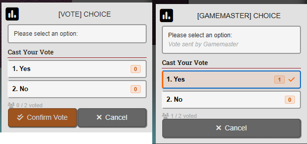

### openChoiceMenu

A built-in GM macro tool that opens a configuration dialog to build and send a choice card without writing any code. Set the title, description, mode, recipients, and options, then click **Send**.

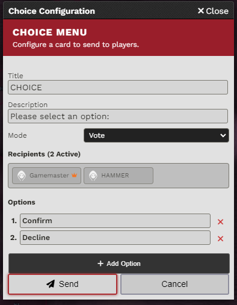


### Built-in Activations

| Name | Trigger | What it does |
|------|---------|--------------|
| **Overwatch** | `onMove` | A hostile starts movement inside your weapon THREAT, prompts a Skirmish reaction |
| **Brace** | `onDamage` | Damage would kill you or deal 50%+ of your current HP, prompts a Brace reaction |
| **Flight** | `onStatusApplied` / `onStructure` / `onStress` | Handles flying immunity and fall save logic |
| **Fall** | `onTurnEnd` | Checks if an airborne token should begin falling |

### Startups

Startups allow you to add code upon VTT Foundry initiation. This allows for mainly registering your own helper functions that you can use in your activations, or even outside in macros and stuff.

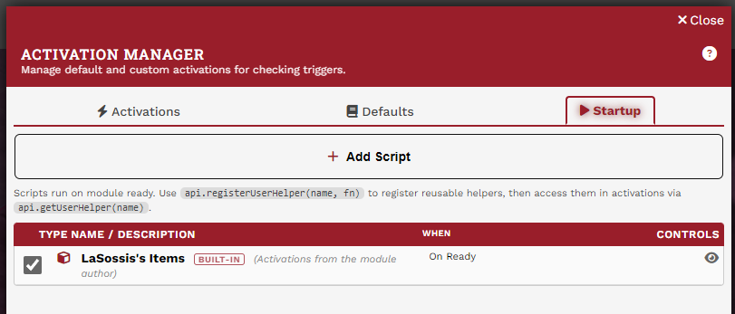

### Personal Activation Set

In the module configuration, there is an option to activate my personal set of item activations. These are the ones I use and make for my games; here's my way to share them. Not all items are included, in no particular order. This list will grow as I implement stuff I need.

### Export / Import

In **Module Settings > Lancer Automations**, you can export and import your full activation setup as JSON. Useful for sharing builds with other GMs or keeping backups.

### Code Editor Tips

In any code block (evaluate, activate, init), you can write a full function signature instead of just the body:

```javascript
async function(triggerType, triggerData, reactorToken, item, activationName, api) {
    // your code here
}
```

The module strips the wrapper automatically. Much more readable, especially with CodeMirror installed.

You can also register default activations by code instead of through the UI. See [API Reference: Registering Default Activations](doc/API_HOWTO.md#how-to-register-activations).

---

## Optional Features

### Boost Detection (Experimental)

Requires [Elevation Ruler](https://foundryvtt.com/packages/elevationruler) or [my fork](https://github.com/Agraael/Lancer-elevationRuler-Fork). Enable in module settings.

The module tracks cumulative drag movement for each token during their turn. When movement exceeds the token's base Speed, a boost is detected. The `onMove` trigger data gains:

- `moveInfo.isBoost`: `true` if this move crossed a boost threshold
- `moveInfo.boostSet`: array of boost numbers crossed (e.g. `[1]` for first boost)

Cumulative movement resets automatically at the start of each token's turn. You can also reset it manually: `api.clearMoveData(tokenDocumentId)`.

### Stat Roll Targeting

Enable in **Module Settings > Lancer Automations > Enable Stat Roll Target Selection**.

When enabled, any Stat Roll (HULL, AGI, SYS, ENG) prompts you to optionally pick a target before rolling:

- **Difficulty**: uses the target's Save (for NPCs) or the same stat (for Mechs) as the roll difficulty
- **Automation**: the target token is passed into the flow data for other automations to use
- **Self-targeting**: you can target yourself if needed

### Token Factions Integration

When [Token Factions (my fork)](https://github.com/Agraael/token-factions) is installed, the disposition filter in activations uses the full faction matrix instead of the standard three-way friendly/neutral/hostile. This lets you have multiple teams with custom disposition relationships between them.

### Grid-Aware Auras Integration

When [Grid-Aware Auras](https://github.com/Wibble199/FoundryVTT-Grid-Aware-Auras) (or [my fork](https://github.com/Agraael/FoundryVTT-Grid-Aware-Auras)) is installed, the following API functions are available:

- `api.createAura(owner, config)`: creates an aura on a token. Accepts lambda functions as macro callbacks, the module intercepts and routes them transparently with no need to create actual macro documents.
- `api.deleteAuras(owner)`: removes all auras from a token

### Lancer Automations HUD (Beta)

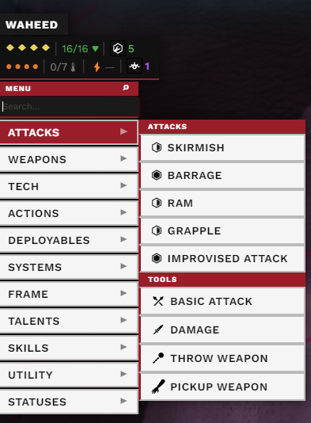

For a while I ran a heavily modified version of Token Action HUD for my own sessions. I've now rebuilt it directly into the module. It's still what I'd call a beta, but it's available.

The HUD gives you quick access to all your mech's actions, weapons, systems, frame abilities, talents, skills, and statuses from a single cascading menu attached to your token. If you have [Grid-Aware Auras](https://github.com/Wibble199/FoundryVTT-Grid-Aware-Auras) (or [my fork](https://github.com/Agraael/FoundryVTT-Grid-Aware-Auras)) installed, hovering weapon or skill entries will display their range or threat aura directly on the canvas.

It is available as an optional setting in Module Settings > Lancer Automations.

<br clear="right"/>

---

### Alternative Structure Automations

I use an alternative structure system in my games. The automation for it is built into the module and available as an optional setting.

Enable it in Module Settings > Lancer Automations.

---

### Drag Vision Mitigation

When configured in module settings, a token's vision radius is reduced during drag. This is useful to prevent accidentally revealing too much of the map while moving a token. The reduction is a multiplier you set. `1.0` means no change, lower values shrink the vision radius during the drag.

---

## Built-in Macros

The module ships with a compendium of macros for common Lancer actions (All macro starts with "L.A -"):

<details>
<summary>Expand macro list</summary>

| Macro | What it does |
|-------|-------------|
| **Skirmish** | Open a menu to select a weapon and execute a Skirmish action |
| **Barrage** | Open a menu to select weapons and execute a Barrage action |
| **Invade** | Open a menu to select an option and execute an Invade action |
| **Overwatch** | Declare Overwatch |
| **Brace** | Declare Brace |
| **Knockback** | Interactive knockback tool |
| **Ram** | Execute a Ram action |
| **Grapple** | Execute a Grapple action |
| **Disengage** | Execute a Disengage |
| **Eject** | Execute an Eject |
| **Lock On** | Apply Lock On to a target |
| **Reload One Weapon** | Reload a single weapon |
| **End Activation** | Open a menu to end an active item effect |
| **Throw Weapon** | Open the throw weapon menu for the selected token |
| **Deploy Item** | Open the deployable menu for the selected token |
| **Pickup Weapon** | Retrieve a thrown weapon from the scene |
| **Boot Up / Shut Down** | Handle mech boot and shutdown flows |
| **Scan** | Perform a System Scan on an NPC |
| **Reinforcement** | Delayed token appearance for combat. Hides selected tokens and places placeholders that countdown to appearance. Will use tokens named "Size X" (e.g., "Size 1", "Size 2") as placeholders if they exist in the actor directory. |
| **Aid / Bolster / Search / Handle / Interact / Squeeze / Hide / Dismount** | Standard pilot and mech actions |
| **Reactor Explosion / Meltdown** | NPC and scenario tools |
| **Downtime** | Downtime activity card |
| **Frag Signal** | Scenario-specific macro |
| **Suicide** | Instantly destroy a token (GM tool) |
| **openChoiceMenu** | Open a menu to trigger choice event, like votes |

</details>

---

## API Reference

All API functions are accessible at:

```javascript
const api = game.modules.get('lancer-automations').api;
```

For full function signatures, trigger data schemas, bonus types, and code examples, see the [API Reference](doc/API_REFERENCE.md).

---

## NPC Implementation Examples

These are real examples from active sessions.

### Dispersal Shield (Priest)

Grants all-damage resistance for the next `1d3` attacks to a friendly target in sensor range.

<details>
<summary>Expand code</summary>

```javascript
"npcf_dispersal_shield_priest": {
    itemType: "npc_feature",
    reactions: [{
        triggers: ["onActivation"],
        triggerSelf: true,
        triggerOther: false,
        outOfCombat: true,
        actionType: "Quick Action",
        frequency: "Unlimited",
        onlyOnSourceMatch: true,
        autoActivate: true,
        activationType: "code",
        activationMode: "instead",
        activationCode: async function (triggerType, triggerData, reactorToken, item, activationName, api) {
            const targets = await api.chooseToken(reactorToken, {
                count: 1,
                range: reactorToken.actor.system.sensor_range,
                includeSelf: true,
                filter: (t) => api.isFriendly(reactorToken, t)
            });
            const target = targets?.[0] || reactorToken;
            const roll = await new Roll("1d3").evaluate();
            await roll.toMessage({
                speaker: ChatMessage.getSpeaker({ token: reactorToken.document }),
                flavor: `${activationName} - Resistance charges`
            });
            const charges = roll.total;
            const resistances = [
                "lancer.statusIconsNames.resistance_heat",
                "lancer.statusIconsNames.resistance_kinetic",
                "lancer.statusIconsNames.resistance_explosive",
                "lancer.statusIconsNames.resistance_burn",
                "lancer.statusIconsNames.resistance_energy"
            ];
            await api.applyFlaggedEffectToTokens({
                tokens: [target],
                effectNames: resistances,
                note: `Dispersal Shield (${charges} charges)`,
                duration: { label: 'indefinite', turns: null, rounds: null, overrideTurnOriginId: reactorToken.id },
            }, {
                stack: charges,
                consumption: {
                    trigger: "onDamage",
                    originId: target.id,
                    grouped: true
                }
            });
        }
    }]
}
```

</details>

### Sapper Kit: Smoke Launcher (Strider)

Places a smoke zone (soft cover) that persists until the start of the Strider's next turn.

<details>
<summary>Expand code</summary>

```javascript
"nrfaw-npc_carrier_SmokeLaunchers": {
    itemType: "npc_feature",
    reactions: [{
        triggers: ["onActivation"],
        triggerSelf: true,
        triggerOther: false,
        outOfCombat: true,
        actionType: "Quick Action",
        usesPerRound: 1,
        onlyOnSourceMatch: true,
        autoActivate: true,
        activationType: "code",
        activationMode: "instead",
        activationCode: async function (triggerType, triggerData, reactorToken, item, activationName, api) {
            const result = await api.placeZone(reactorToken, {
                range: 5,
                size: 2,
                type: "Blast",
                fillColor: "#808080",
                borderColor: "#ffffff",
                statusEffects: ["cover_soft"]
            }, 2);
            if (result?.template) {
                const existing = reactorToken.actor.getFlag("lancer-automations", "smokeTemplates") || [];
                existing.push(result.template.id);
                await reactorToken.actor.setFlag("lancer-automations", "smokeTemplates", existing);
            }
        }
    }, {
        triggers: ["onTurnStart"],
        triggerSelf: true,
        triggerOther: false,
        autoActivate: true,
        activationType: "code",
        activationMode: "instead",
        activationCode: async function (triggerType, triggerData, reactorToken, item, activationName) {
            const templates = reactorToken.actor.getFlag("lancer-automations", "smokeTemplates") || [];
            if (!templates.length) return;
            for (const id of templates) {
                const template = canvas.scene.templates.get(id);
                if (template) await template.delete();
            }
            await reactorToken.actor.unsetFlag("lancer-automations", "smokeTemplates");
        }
    }]
}
```

</details>

---

## Lancer System Additions

This module extends the Lancer system with several patches and new features that work externally, no system bundle editing required for other users.

### Melee Cover Fix

Melee attacks won't register cover by default, like in the core book. Using throw attack from Lancer Automations is considered a ranged attack.

### Item Disabled

Items can be marked as disabled. Works similarly to destroyed, but it is used for example for thrown weapons (they become disabled since they're on the ground).

### Trackable Attributes

Move and Reaction are trackable attributes. This can be used for token bar things, allowing you to see if a unit has its reaction or not.

### Token Tooltip Alt Config

A custom [Token Tooltip Alt](https://foundryvtt.com/packages/token-tooltip-alt) configuration is included at [`misc/lancer-automations-tta.json`](misc/lancer-automations-tta.json). It is based on eranziel's Lancer TTA config with Infection and Reaction added. Import it from the TTA settings.

### Custom Token Stat Bars

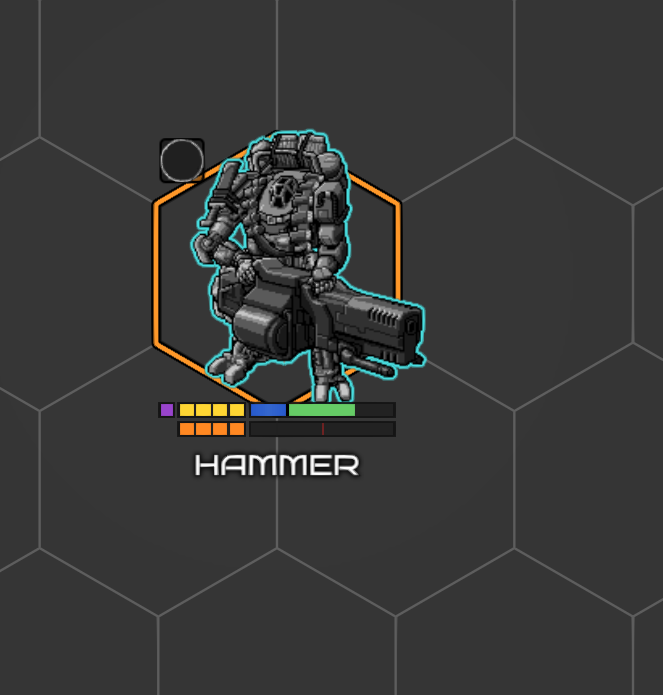

I made my own custom Bar Brawl, tailored to Lancer. You can toggle it from the module settings — you'll need to deactivate Bar Brawl for it to run.

### Wreck System

Unlike Lancer QoL's wreck system which swaps the token image, this one spawns a new deployable actor token on death. That wreck token can be resurrected from the TAH (Utility > Combat > Resurrect), which deletes the wreck and respawns the original unit.

Per-category wreck mode (Token or Tile) and terrain spawning can be configured independently for Mech, Human, Monstrosity, and Biological types. On each prototype token's L.A tab, you can override the wreck image, effect, and sound — if left empty, assets are resolved automatically from the wreck folder based on category and size, with a fallback chain (squad → human → biological).

You can point to your own custom wreck assets folder in the Wreck Automation settings. The expected directory structure is:

```
wrecks/
├── s1/                    # Size 1 wreck images
│   ├── human/             # Human-specific
│   └── monstrosity/       # Monstrosity-specific
├── s2/                    # Size 2 wreck images
│   └── squad/
├── s3/                    # Size 3 wreck images
├── effects/               # Explosion effects
│   └── biological/        # Biological-specific
└── audio/                 # Explosion sounds
    ├── biological/
    ├── human/
    └── monstrosity/
```

The built-in folder ships with more sounds and effects than the original Lancer QoL set.

### StatusFX

Lancer Automations handles StatusFX like Lancer QoL. They are almost the same for now, except some additions like Infection and Brace, and more to come. You can choose either of them.

### LCP Data Repair

Some fixes I personally made on the Lancer system cannot be shared easily, but now you have in the configuration a tool to fix LCP items with a few issues I found (for example ammos in Ammo Case).

### Ammo System

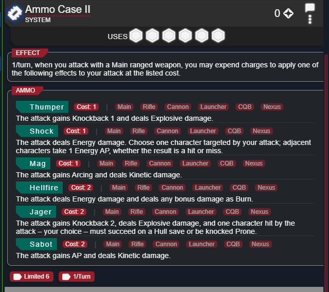

Ammo for things like Ammo Case are now listed in the sheet. The main Lancer sheet and Annoying's Lancer Alternative Sheets are both patched with injection.

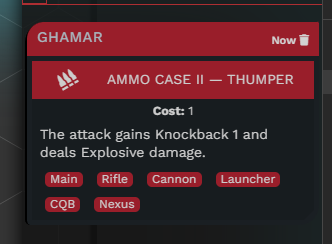

Ammo can be clicked to run the AmmoFlow and display a chat message with the details, it also consumes charges. Strangely some data gives ammo cost as nothing, so by default if there is no cost, it is 1.

### Infection Damage Type

Pretty tricky to do, I hope it works well.

So [HORUS: Thy Hubris Manifest](https://cornylius.itch.io/thy-hubris-manifest) introduces the Infection damage type, and I really like it, so I decided to try to integrate it fully into Lancer.

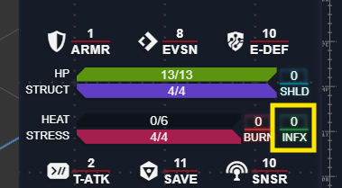

Basically it works like Burn damage but for Heat. Check out https://cornylius.itch.io/thy-hubris-manifest for more. It asks for a Systems check instead of Engineering.

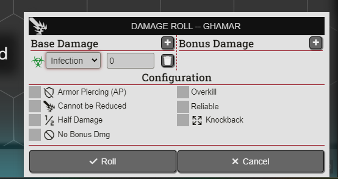
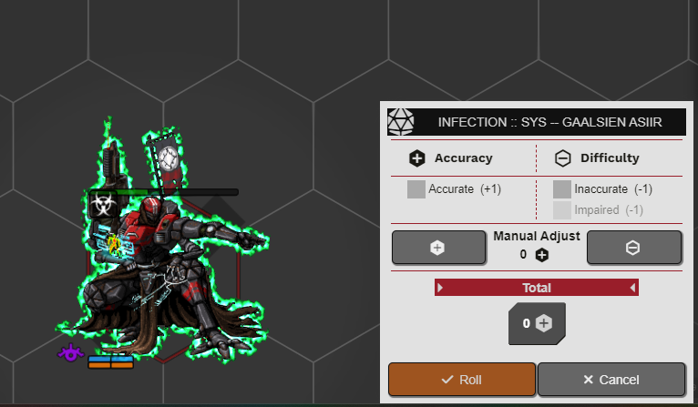

---

## Planned Features

- More built-in item activations for the personal activation set
- new custom token bar hud ?

---

## Support

For help or questions, drop by the [Pilot NET Discord](https://discord.com/invite/lancer).
