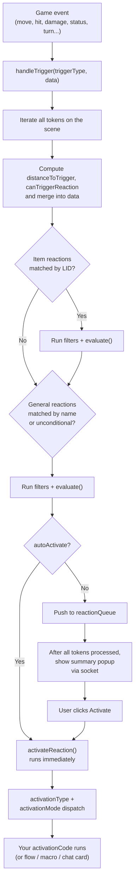

# Lancer Automations: How the Automation System Works

A guide for anyone writing activations, either in the Activation Manager UI or through the registration API. This covers what the engine actually does between a game event and your `activationCode` running.

For trigger payload schemas, see [API_REFERENCE.md](API_REFERENCE.md). For API surfaces (effects, bonuses, interactive tools), see the four sibling files.

---

## Table of Contents

- [1. Big Picture](#1-big-picture)
- [2. Lifecycle of a Trigger](#2-lifecycle-of-a-trigger)
- [3. Item vs General Activations](#3-item-vs-general-activations)
- [4. Filters, in Order](#4-filters-in-order)
- [5. The Four Callbacks: evaluate, activationCode, onInit, onMessage](#5-the-four-callbacks-evaluate-activationcode-oninit-onmessage)
- [6. Activation Type and Mode](#6-activation-type-and-mode)
- [7. Auto Mode vs Popup Mode](#7-auto-mode-vs-popup-mode)
- [8. Client Execution and Sockets](#8-client-execution-and-sockets)
- [9. Cancel and Modify (Timing-Sensitive Triggers)](#9-cancel-and-modify-timing-sensitive-triggers)
- [10. Reaction Economy and Frequency](#10-reaction-economy-and-frequency)
- [11. Flow Data Injection](#11-flow-data-injection)
- [12. Item Paths, Extra Actions, Activated Items](#12-item-paths-extra-actions-activated-items)
- [13. Registration Paths](#13-registration-paths)
- [14. Caches and Invalidation](#14-caches-and-invalidation)

---

## 1. Big Picture

The automation system is an event-driven dispatcher. Each game event (a move, an attack, a damage roll, a status applied, a turn change, etc.) becomes a **trigger** with a **data payload**. For each trigger, the engine asks: *which tokens on the scene want to react, and how?*

Two kinds of definitions can react:

- **Item activations**: tied to a Lancer item by its **LID**. Only tokens whose actor owns that item are candidate reactors.
- **General activations**: not tied to any item. Any token in the scene is a candidate, filtered by your rules.

Each definition can declare:

- One or more `triggers` it cares about.
- Filters (disposition, distance, self/other, in/out of combat).
- An `evaluate` function that returns `true`/`false` (one final synchronous check).
- An `activationCode` function (your effect) that runs when the activation fires.
- Optional `onInit` (runs once when a token enters the scene/combat) and `onMessage` (cross-client request).

The engine pumps every trigger through this pipeline for every reactor candidate.

---

## 2. Lifecycle of a Trigger

<details>
<summary><b>Flow diagram</b> (click to expand)</summary>



</details>

Step by step, what the engine actually does for one trigger:

1. **Trigger fan-out.** A flow step or hook calls `handleTrigger(triggerType, data)`. The engine wires `startRelatedFlow`, `startRelatedFlowToReactor` (launch the item's default flow, optionally on a specific user's client) and `sendMessageToReactor` (remote RPC to an `onMessage` handler) onto `data`.
2. **Reactor sweep.** Every token currently on the scene is treated as a potential reactor. Hidden tokens are skipped when the trigger came from someone else.
3. **Distance enrichment.** For each reactor, `distanceToTrigger` (reactor to triggering token) and `canTriggerReaction` (true if the trigger is allowed to trigger a reaction - false when the mover has `hidden`, `disengage`, the `provoke` immunity, or is `intangible` while the reactor is not also intangible) are computed once and merged into a per-reactor copy of the trigger data.
4. **Item reactions first.** For every item the reactor's actor owns whose LID matches a registered item activation, run the filter chain.
5. **General reactions second.** Walk the flat list of general activations that listen to this trigger; run the filter chain.
6. **Filter chain** (any failure = skip): `outOfCombat`, `triggerSelf` / `triggerOther`, `onlyOnSourceMatch`, reaction availability, `dispositionFilter`, `distanceFilter`. (Details in [section 4](#4-filters-in-order).)
7. **`evaluate()`** runs (synchronously, see [section 5](#5-the-four-callbacks-evaluate-activationcode-oninit-onmessage)). Exceptions are caught and logged; the activation is skipped on error.
8. **Branch** on `autoActivate`:
   - **true**: `activateReaction()` runs right away, on the local client.
   - **false**: the entry is pushed to `reactionQueue`.
9. After every token has been processed, if the queue is non-empty, the engine builds a **summary popup**, decides who should see it (per the `reactionNotificationMode` setting), and broadcasts it via socket.
10. When a recipient clicks **Activate** on a queued entry, *that* client runs `activateReaction()` for that single entry.

The key thing to internalize: filters and `evaluate` run for every reactor on the scene, every time a matching trigger fires. Keep them cheap.

---

## 3. Item vs General Activations

### Item activation

- Registered under a specific **item LID** (e.g. `"npcf_dispersal_shield_priest"`).
- Engine checks: *does this reactor's actor own an item whose `system.lid === <registered LID>`?* If yes, run filters.
- The matched item is passed to your callbacks as the `item` argument.
- `onlyOnSourceMatch: true` means: *the activation only fires if the item that triggered the event has the same LID as the activation's LID*. In practice this is what makes "react when **this** weapon is used" work. Without it, your activation would also try to fire when the user activates an unrelated item or moves.
- When a reactor owns several items sharing the triggering LID, only the exact triggering document fires (same-LID dedupe), so duplicate copies of the same item don't each react.

### General activation

- Registered under a **name** (e.g. `"Overwatch"`, `"Brace"`).
- Every token on the scene is a candidate. Use filters to narrow it down (disposition, distance, your own `evaluate`).
- The `item` argument to your callbacks is `null` (general activations are not tied to an item).
- `onlyOnSourceMatch: true` means: *the activation only fires if the triggering action's name matches the activation's registered name*. Useful for general activations attached to a named action like Overwatch.

### Deployable activation

- Registered under a **deployable LID**, the value of `actor.system.lid` on the deployable actor (e.g. `"dep_moonlight_drone"`). The engine matches any LID against the deployable's actor LID - there is no required prefix.
- The reactor is the deployable actor itself: any deployable on the scene whose `actor.system.lid === <registered LID>` is a candidate.
- The engine auto-resolves the **source item** (the item whose `system.deployables[]` contains the deployable's LID - for frames, also `core_system.deployables` and `traits[].deployables`) and surfaces it as `triggerData.item` so authors can read effect/tag context.
- `triggerData.deployable = { actor, lid }` is also set, providing the explicit deployable identity.
- `triggerData.actionData.action.name` is the action's name (e.g. `"Move"`, `"Combine"`); for the top-level deploy click it's the deployable actor's name. `triggerData.actionData.action.activation` is the activation type (`"Protocol"`, `"Quick"`).
- `onlyOnSourceMatch: true` means: *only fire when the activation source is the matching deployable* - i.e. one of this exact deployable's actions was the trigger.
- `reactionPath`: empty string matches the top-level deploy itself (`actor.system.activation`); `"actions.<name>"` matches a specific entry in `actor.system.actions[]` (mirrors the `extraActions.<name>` pattern). The deployable surrogate carries the deployable actor's `system.actions[]`, so these resolve by **name** (deployable actions often have empty LIDs).

#### Self-deployable: reacting to your own deploy

The `onDeploy` trigger fires when a deployable or a thrown weapon is placed. Its payload is `{ triggeringToken, item, deployedTokens, deployType }`: `triggeringToken` is the deploying token, `item` is the source system item, `deployedTokens` are the freshly placed tokens, and `deployType` is `"deployable"` or `"throw"`.

To react when *you* deploy something, register an **item** activation on the feature or system LID that grants the deployable, and set:

- `triggers: ["onDeploy"]`
- `triggerSelf: true` (the deploying token is the reactor, so it counts as self)
- `onlyOnSourceMatch: true` (only fire for this exact source item)

The Restock Drone NPC feature (`startups/itemActivations.js`) is the reference: on deploy it reads `triggerData.deployedTokens[0]` and drops an aura on it with `api.createAura(...)`. Note this is a normal **item** reaction firing on self, not the actor-UUID path below.

### Actor UUID activation

Alongside item LIDs and deployable LIDs, an activation can be registered against a single **Actor UUID** (e.g. `"Actor.qe5wEevLrMN6ki44"`, or a `"Compendium.<pack>.Actor.<id>"` path). The engine synthesizes an `actor_surrogate` for every actor, keyed by its `actor.uuid`, so a reaction keyed by a UUID matches **only that one actor instance**.

Use this when an item or deployable LID is too broad: a LID-keyed reaction fires for *every* actor that owns the item or *every* deployable of that type, while a UUID-keyed reaction is bound to exactly one actor. Typical case: a specific named deployable or NPC that should react only as itself.

- `onlyOnSourceMatch: true` also compares the triggering token's `actor.uuid` against the registered key (alongside item and deployable LIDs), so a UUID reaction with source-match only fires when that actor was the source of the event.
- In the Activation Manager, paste the Actor UUID into the LID field. The deployable browser can pick an actor and fill it in for you.

### Picking one

| If you want to... | Use |
|---|---|
| React when a specific weapon, system, or NPC feature is used | Item, with `onlyOnSourceMatch: true` |
| React when any hostile starts moving in your threat | General, no source match |
| Apply a passive effect at scene-load to anyone with a feature | Item, `onInit` only (no triggers) |
| Build a one-off rule that applies to all tokens | General |
| React on a specific deployable's action (or its deploy) | Deployable LID (`actor.system.lid`), with `onlyOnSourceMatch: true` |
| React only as one specific actor or deployable instance | Actor UUID (`actor.uuid`) in the LID field, with `onlyOnSourceMatch: true` |
| React when you deploy something yourself | Item LID that grants the deployable, `triggers: ["onDeploy"]`, `triggerSelf: true` |

---

## 4. Filters, in Order

Filters short-circuit. The order matters because earlier filters are cheaper:

| # | Filter | Behavior |
|---|---|---|
| 1 | `outOfCombat` | If combat is not active and `outOfCombat` is `false`, skip. *Unless* the trigger is inherently combat-related (`onTurnStart`, `onTurnEnd`, `onRoundStart`, `onEnterCombat`, `onExitCombat`). |
| 2 | `triggerSelf` / `triggerOther` | If the reactor *is* the triggering token: require `triggerSelf: true`. If it isn't: require `triggerOther: true`. (Default both `false`, you must opt in.) |
| 3 | `onlyOnSourceMatch` | See [section 3](#3-item-vs-general-activations) for the different meaning across item, general, deployable, and Actor-UUID reactions. The engine matches the triggering item LID, deployable LID, or triggering actor UUID against the registered key. |
| 4 | Reaction availability | If the reaction config consumes a reaction (`consumeReaction`/`consumesReaction`), skip if the reactor has no reaction left. |
| 5 | `dispositionFilter` | Array like `["hostile", "friendly"]`. Uses Token Factions multi-team data when installed; otherwise `CONST.TOKEN_DISPOSITIONS`. |
| 6 | `distanceFilter` | Compares the precomputed `distanceToTrigger` against the configured max range. |
| 7 | `requireCanProvoke` | If `true`, skip if `triggerData.canTriggerReaction` is `false`. |
| 8 | `evaluate()` | Your custom predicate. Last gate. |

Fail any: that activation is silently skipped for that reactor. No popup, no log entry.

---

## 5. The Four Callbacks: evaluate, activationCode, onInit, onMessage

All four receive `api` as the last argument. All four are wrapped in `try/catch`; uncaught exceptions are logged to the console, never thrown to the user.

### `evaluate(triggerType, triggerData, reactorToken, item, activationName, api) => boolean`

The final filter. Return `true` to allow the activation, `false` to skip it.

**Must be synchronous** for triggers that expose a cancel function (see [section 9](#9-cancel-and-modify-timing-sensitive-triggers)). The engine warns in the console if it detects a `Promise` returned from `evaluate` for one of those triggers.

### `activationCode(triggerType, triggerData, reactorToken, item, activationName, api) => Promise<void>`

Your effect. May be async. Has full access to `api`. Runs on:

- The local client (auto activations).
- Whichever client clicks **Activate** in the popup (manual activations).

See [section 8](#8-client-execution-and-sockets) for what that means for GM-only operations.

### `onInit(token, item, api) => Promise<void>`

Runs once when a token (or its item) enters the scene. Used for:

- Applying baseline constant bonuses (immunities, climber, regenerative shielding).
- Creating auras with `api.createAura(...)`.
- Adding extra actions with `api.addExtraActions(...)`.

**`onInit` is not a trigger.** Do not put `"onInit"` in the `triggers` array. The engine looks for the `onInit` *field* on the reaction config and calls it directly when:

- A token is created on the canvas (after a 100 ms delay so the canvas object exists), or
- An item is added to an actor that already has a token on the scene.

For reactions that only have an `onInit` and no triggers, set `triggers: []`, `triggerSelf: false`, `triggerOther: false`, `autoActivate: false`, `activationType: "none"`.

### `onMessage(triggerType, data, reactorToken, item, activationName, api) => Promise<any>`

Handler for cross-client requests. Invoked when another client calls `triggerData.sendMessageToReactor(data, userId, opts)`. Runs on the **target** client (the user named by `userId`).

If the caller passed `wait: true`, whatever you `return` (or `resolve(...)`) from `onMessage` is delivered back as the caller's return value. See [API_INTERACTIVE.md](API_INTERACTIVE.md) for the wait card / response pattern.

---

## 6. Activation Type and Mode

Two independent dimensions on each reaction config:

### `activationType`: *what* runs when the activation fires

| Value | Effect |
|---|---|
| `"code"` | Run your `activationCode` function. The most common choice. |
| `"flow"` | Launch the item's normal Lancer activation flow (System / Activation / WeaponAttack as appropriate). |
| `"macro"` | Execute a Foundry macro by name (`activationMacro` field). |
| `"none"` | Do nothing. Typically only used for `onInit`-only reactions. |

### `activationMode`: *how* it composes with the original flow

| Value | Effect |
|---|---|
| `"instead"` | Replace the original flow entirely. Your code is the only thing that runs. |
| `"before"` | Your code runs alongside the flow; conceptually first. |
| `"after"` | Your code runs alongside the flow; conceptually after. |

> Internally the engine schedules `"before"` and `"after"` via `Promise.all`, so they aren't strictly ordered relative to the underlying flow's async work. If you need strict ordering, use `"instead"` and call the flow yourself, or inject into the flow state with `injectBonus` / `injectData` (see [section 11](#11-flow-data-injection)).

For `activationType: "flow"`, picking `"instead"` is the equivalent of "skip the chat card": only the flow runs, not your code.

---

## 7. Auto Mode vs Popup Mode

### Auto (`autoActivate: true`)

The activation runs immediately, on the local client, with no UI. Use this for things that should always happen:

- Applying a status on hit.
- Adding/removing a constant bonus.
- A passive that should fire silently.

### Popup (`autoActivate: false`, the default)

The activation is queued. After every reactor has been checked, all queued entries for the trigger are bundled into a single **summary popup**. Each entry shows the reactor's name and the activation's label. Clicking an entry expands its details; clicking **Activate** runs that single entry's `activationCode`.

Multiple popups can be open at the same time: the system queues them and shows a "pending" badge so nothing is lost.

### Who sees the popup

Controlled by **Module Settings > Reaction Notification Mode**:

| Setting | Recipients |
|---|---|
| `"both"` (default) | The token's owner(s) **and** the active GM |
| `"owner"` | Only the token's owner(s) |
| `"gm"` | Only the active GM |

The popup is broadcast over the socket only to the recipients. Other clients see nothing.

---

## 8. Client Execution and Sockets

This trips people up. **`activationCode` does not always run on the GM's client.**

- **Auto activations** run on whichever client called `handleTrigger`. In practice that is the client of the player whose action fired the trigger (for example: the player who moved the token), or the GM if the triggering token has no online owner.
- **Manual activations** run on whichever client clicked **Activate**. Per the `reactionNotificationMode` setting, that may be the token owner, the GM, or either: first to click wins.

If your `activationCode` needs GM-only permissions (creating tokens, modifying actors the local user doesn't own, deleting templates owned by someone else, etc.), you must either:

1. Use an API helper that already delegates internally (most `applyEffectsToTokens`, `placeDeployable`, `placeZone`, `addGlobalBonus` calls do this).
2. Call `triggerData.sendMessageToReactor(data, gmUserId, { wait: true, ... })` to delegate to the GM and wait for the response. The receiving client runs the work; you wait for the answer.

A common shortcut: `api.getActiveGMId()` returns the user ID of the active GM, suitable for `sendMessageToReactor`.

---

## 9. Cancel and Modify (Timing-Sensitive Triggers)

A subset of triggers fire **before** the underlying action commits. From inside `evaluate` or `activationCode`, you can stop or modify the action.

### The synchronous rule

The cancel/modify functions only work **synchronously**. The engine continues past your callback as soon as it returns a non-`Promise`. If you write an async function and `await` something before calling `cancelAttack(...)`, the underlying flow has already moved on.

Two ways to handle this:

1. **Keep `evaluate` and `activationCode` synchronous.** Do all the work in pure synchronous code.
2. **Set `awaitActivationCompletion: true`** on the reaction config. The engine will then `await` your activation before continuing the flow, allowing you to do async work and still cancel. Without this flag, async work + a cancel call logs a warning and the cancel is silently ignored.

### Cancel functions

Signature: `(reasonText?, title?, allowConfirm?, userIdControl?, preConfirm?, postChoice?, opts?)`. A Cancel/Ignore card is shown by default. `cancelTriggeredMove` omits the `title` slot.

| Trigger | Cancel function | Effect |
|---|---|---|
| `onPreMove` | `cancelTriggeredMove` | Stops the move outright |
| `onPreMove` | `changeTriggeredMove(newPos, extraData?, reason?, allowConfirm?, ...)` | Redirects the move to a new destination |
| `onInitAttack` | `cancelAttack` | Aborts the attack flow |
| `onInitTechAttack` | `cancelTechAttack` | Aborts the tech attack flow |
| `onInitCheck` | `cancelCheck` | Aborts the stat check flow |
| `onInitActivation` | `cancelAction` | Aborts the activation flow |
| `onPreStatusApplied` / `onPreStatusRemoved` | `cancelChange` | Blocks the status change |
| `onPreStructure` | `cancelStructure` | Skips the structure roll |
| `onStructure` | `cancelStructureOutcome` | Stops the outcome step (after the roll) |
| `onPreStress` | `cancelStress` | Skips the overheat roll |
| `onStress` | `cancelStressOutcome` | Stops the outcome step (after the roll) |
| `onPreHpChange` | `cancelHpChange` | Blocks the HP change |
| `onPreHeatChange` | `cancelHeatChange` | Blocks the heat change |

### Modify functions

Same signature as cancels, with `newValue` prepended: `(newValue, reason?, allowConfirm?, userIdControl?, preConfirm?, postChoice?, opts?)`. They block the original update and commit the replacement value instead.

| Trigger | Function | Effect |
|---|---|---|
| `onPreHpChange` | `modifyHpChange(newValue, ...)` | Override the HP value being applied |
| `onPreHeatChange` | `modifyHeatChange(newValue, ...)` | Override the heat value being applied |
| `onStructure` / `onStress` | `modifyRoll(newTotal)` | Override the roll total before outcome steps |

`onStructure` / `onStress` also expose `triggerData.rollResult` (total) and `triggerData.rollDice` (raw die results, useful for detecting double-1s or doubles).

### Why `preConfirm` / `postChoice` exist

Foundry's `preUpdate*` hooks (move, actor update, etc.) are non-blocking: if your handler returns a Promise, Foundry does not wait for it. Anything after an `await` happens too late to stop the update.

So the pattern is:
1. Call the cancel/modify function **synchronously** (before any `await`). This preemptively blocks the update.
2. Afterwards, do your async work (choice cards, remote player decisions, etc.) to decide what happens next.

`preConfirm` and `postChoice` are the two async hooks that let you drive that "what happens next" phase without needing to pre-build the UI yourself.

### `allowConfirm`, `preConfirm`, `postChoice`

Shared across every cancel, change, modify, and reroll function.

**`allowConfirm: boolean`** (default `true`). Whether to show the secondary Confirm/Ignore card to `userIdControl`.
- `true`: show the card, user can override.
- `false`: skip the card, auto-pick the first choice (the "no override" outcome).

Does NOT gate `preConfirm`. `preConfirm` always runs if provided.

**`preConfirm: () => Promise<boolean>`**. Async gate that runs after the sync cancel has stuck, before the secondary card.
- Returns `true`: proceed to the secondary card (or auto-pick if `allowConfirm: false`).
- Returns `false`: re-apply the original outcome. `postChoice` does NOT fire.

Typical use: the reactor's player confirms Yes/No in a choice card here. Good place to call `triggerData.startRelatedFlowToReactor(...)` so the reactor's own flow fires once on commit.

**`postChoice: (chose: boolean) => Promise<void>`**. Callback after the secondary card resolves (or after auto-pick).
- `chose === true`: the replacement was committed.
- `chose === false`: the original was re-applied (user picked Ignore).

Typical use: fire a downstream effect that depends on whether the action went through.

### Timing
```
sync:  setFlag()       -> engine blocks the original update
async: preConfirm()    -> false: executeOriginal + return (no postChoice)
       allowConfirm?
         true  -> show card
                  Confirm: executeNew + postChoice(true)
                  Ignore:  executeOriginal + postChoice(false)
         false -> executeNew + postChoice(true)
```

### Example: True Grit (HP=1 instead of 0)
```js
const preConfirm = async () => {
    const result = await api.startChoiceCard({
        title: "TRUE GRIT",
        description: `<b>${ally.name}</b> would fall to 0 HP. Keep at 1 HP?`,
        userIdControl: api.getTokenOwnerUserId(reactorToken),
        choices: [
            { text: "Use",  icon: "fas fa-check", callback: async () => {} },
            { text: "Skip", icon: "fas fa-times", callback: async () => {} }
        ]
    });
    if (result?.choiceIdx === 0)
        triggerData.startRelatedFlowToReactor(result?.responderIds?.[0]);
    return result?.choiceIdx === 0;
};
triggerData.modifyHpChange(
    1,
    `${reactorToken.name} keeps ${ally.name} at 1 HP.`,
    true,
    api.getTokenOwnerUserId(ally),
    preConfirm,
    null
);
```

---

## 10. Reaction Economy and Frequency

The Lancer reaction economy (1 reaction per round) is enforced by the engine when the reaction config has `consumesReaction` (default `true`) and the world setting `consumeReaction` is enabled. A reactor with no remaining reactions is filtered out before `evaluate` runs.

Other frequency-related fields:

- `actionType`: labels the popup entry (`"Reaction"`, `"Quick Action"`, `"Full Action"`, `"Protocol"`, `"Free Action"`, `"Other"`). Display only.
- `frequency`: display string (`"1/Round"`, `"1/Combat"`). Currently display-only for non-reactions; the engine does not enforce per-combat counters automatically.
- `usesPerRound`: for reactions, enforced via the reaction tracker.
- `outOfCombat`: opt-in for triggers that wouldn't normally fire outside combat.

For activations that need their own per-round / per-target tracking (e.g. "1x per target per round"), maintain it yourself in actor flags. The Triangulation Ping NPC feature is the canonical example.

---

## 11. Flow Data Injection

Inside an `activationCode` whose trigger carries a `flowState` (most attack/damage/check/activation triggers), you can mutate the in-progress flow:

```js
// Inject a bonus visible to subsequent flow steps (and to the damage step,
// even if you injected it during AttackRoll).
triggerData.flowState.injectBonus({
    id: "my-bonus",
    name: "Marker Rifle Mark",
    type: "accuracy",
    val: 1
});

// Inject any other data into the flow state for later steps to read.
triggerData.flowState.injectData({ myFlag: true });
```

**Lifetime.** Injected values live on `flowState.la_extraData` for the rest of the flow. They're also serialized onto the resulting chat message, so a damage card produced later in the same flow can still read what was injected during the attack step.

Use this when you need a bonus to apply *exactly to this one roll/attack/damage card* without leaving a global bonus or a status effect on the actor.

---

## 12. Item Paths, Extra Actions, Activated Items

Three related mechanisms for binding reactions to sub-parts of an item and for tracking whether an item is currently "on".

### Action path

An activation config can target a specific sub-action of an item instead of the item as a whole. The field is stored as `reactionPath` on disk (legacy name from when the system only handled reactions). In the UI and in this doc it is called **action path**.

Common forms:

- `"system.actions.0"` - the first action on a regular item
- `"extraActions.Fall Prone"` - an extra action stored on the item via `addExtraActions`
- `"ranks[2]"` - rank-3 of a talent

At evaluation time the engine walks the path into `item.system` (or the `extraActions` flag), pulls the `name` off the action found there, and uses it as `activationName`. If `onlyOnSourceMatch` is set, the activation only fires when the triggering action's name matches the one at the path.

This is how one item can have multiple independent activations (different sub-actions, different talent ranks) without colliding.

**Finding the right path.** The item finder inside the Activation Manager lists every action on the selected item next to its action path, so there is no need to guess the index or dig through the item's schema.

### Extra actions

API: `addExtraActions`, `getItemActions`, `getActorActions`, `removeExtraActions` (all on `InteractiveAPI`).

Adds action objects (name, activation type, description, tags, etc.) onto an item, token, or actor via flags. Two storage locations:
- Passed an item: stored in the item's `extraActions` flag. Merged into the item's action list by `getItemActions`.
- Passed a token or actor: stored on the actor. Returned by `getActorActions`.

Typical uses: Sniper's Mark adds a "Fall Prone" action; Limitless adds "Overcharge (NPC)"; Defense Net adds "Collapse the Defense Net" while it's active.

`activation` field must use TAH's short form (`"Quick"`, `"Full"`, `"Protocol"`, `"Free"`, `"Reaction"`, `"Quick Tech"`, `"Full Tech"`). Not `"Quick Action"` etc. TAH filters by strict equality.

**Binding an activation to an extra action.** There are two ways, picked based on where the extra action was stored:

- **By general name** - when the extra action is injected onto a token or actor (not tied to a specific item), register a *general* activation whose name matches the action name. Source matching is done on the activation name directly.
- **By action path** - when the extra action is injected onto an item, register an *item* activation with `reactionPath: "extraActions.<Name>"`. The engine resolves the sub-action through the flag lookup the same way it walks `system.actions.N`.

**Access.** Extra actions are currently only surfaced through the Lancer Automations TAH. Other UIs (the native Lancer sheet, the native action bar, etc.) do not show them. If the TAH is disabled, extra actions are invisible to the user even though they still fire when triggered from code.

### Activated items lifecycle

For items that stay "on" after being activated (auras, persistent effects, stances), the engine tracks an activated state per token.

- `setItemAsActivated(item, token, endActivation, endActionDescription)` marks the item as active. Adds an extra action (the "end action") with the given activation type and description, e.g. `"Protocol"` and `"Collapse the Defense Net"`. That action shows up in the TAH so the user can click to end.
- `getActivatedItems(token)` returns the currently-active items on a token. Use in `evaluate` to gate other reactions behind "only while this item is on".
- `endItemActivation(item, token)` clears the state directly from code. Also removes the end-action.

### How the three combine

When the end action fires, it goes through the same activation flow as any action on the item. That means `onActivation` fires **again**, but this time with `triggerData.endActivation === true`. A single reaction can handle both setup and teardown by checking that flag:

```js
activationCode: async function (triggerType, triggerData, reactorToken, item, activationName, api) {
    if (triggerData.endActivation) {
        await teardownEffect(reactorToken, item, api);
        return;
    }
    // First activation: set everything up
    await setupEffect(reactorToken, item, api);
    await api.setItemAsActivated(item, reactorToken, "Protocol", "Collapse the Defense Net");
}
```

Other triggers on the same item can gate themselves by checking `getActivatedItems`:

```js
evaluate: function (triggerType, triggerData, reactorToken, item, activationName, api) {
    if (!api.getActivatedItems(reactorToken)?.some(i => i.id === item.id))
        return false;
    // item is on, proceed
    ...
}
```

Forced teardown from a separate trigger (e.g. the wearer gets stunned and the field collapses) calls `endItemActivation` directly, or calls the teardown helper and then `endItemActivation` to clean up the end-action row.

Defense Net in `startups/itemActivations.js` is the reference implementation (`onActivation` for setup + `endActivation` teardown, `onStatusApplied` with `getActivatedItems` to force-collapse when stunned/jammed, `onHeatGain` / `onTechMiss` reactions gated by `getActivatedItems`).

---

## 13. Registration Paths

There are four ways to register an activation. They all end up in the same dispatcher.

### A. The Activation Manager UI (most users)

**Module Settings > Activation Manager.** Create item or general activations through forms. Stored in `customReactions` / `generalReactions` world settings. Best for one-offs and homebrew.

### B. Module-time registration (other modules / world scripts)

```js
Hooks.on("lancer-automations.ready", (api) => {
    api.registerExternalItemReactions({
        "lid_of_the_item": {
            category: "Homebrew",
            itemType: "npc_feature",
            reactions: [{
                triggers: ["onActivation"],
                onlyOnSourceMatch: true,
                triggerSelf: true,
                triggerOther: false,
                autoActivate: true,
                activationType: "code",
                activationMode: "instead",
                activationCode: async function (triggerType, triggerData, reactorToken, item, activationName, api) {
                    // ...
                }
            }]
        }
    });

    api.registerExternalGeneralReactions({
        "My General Reaction": { reactions: [/* ... */] }
    });
});
```

External registrations are merged with **last-write-wins** semantics: re-registering the same key replaces the previous entry.

### C. Built-in defaults (this module's own personal set)

`registerDefaultItemReactions` / `registerDefaultGeneralReactions` are used by `startups/itemActivations.js` for the bundled NPC/feature automations. The result is the same as B; the distinction is just provenance.

### D. Startup scripts (UI-managed code)

**Module Settings > Activation Manager > Startups tab.** Arbitrary code blocks run once on `ready`. Useful for registering helper functions on the API (`api.registerUserHelper("myHelper", fn)`) so your activation code can call them by name.

### Override order

For a given key (LID or general name), the resolution order is roughly: **user UI definitions** override **external registrations** override **built-in defaults**. Re-registrations within the same path replace.

---

## 14. Caches and Invalidation

The engine caches:

- **Flat general reaction list.** Built once, used for every general-reaction sweep. Cleared when an item or actor changes (so a new general reaction registered through code becomes visible).
- **Per-actor item list.** Each actor's item set is cached for the LID lookup. Cleared on `updateActor`, `createItem`, `deleteItem`, `updateItem`.
- **Compiled function cache.** UI activations are stored as code strings; the engine compiles them on first use and caches the function. Cleared whenever the UI saves.

If you ever change a reaction in the UI and *don't* see it take effect, fire the manual cache clear:

```js
Hooks.callAll("lancer-automations.clearCaches");
```

This is what the UI does internally on save.
