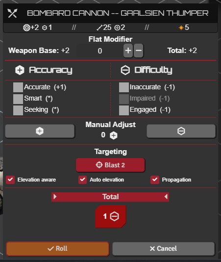
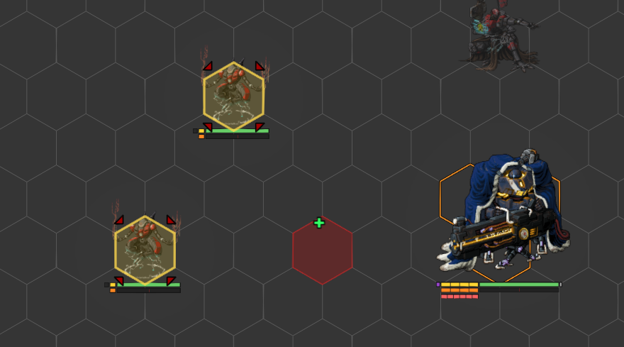
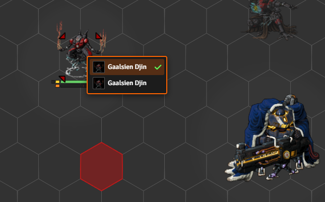
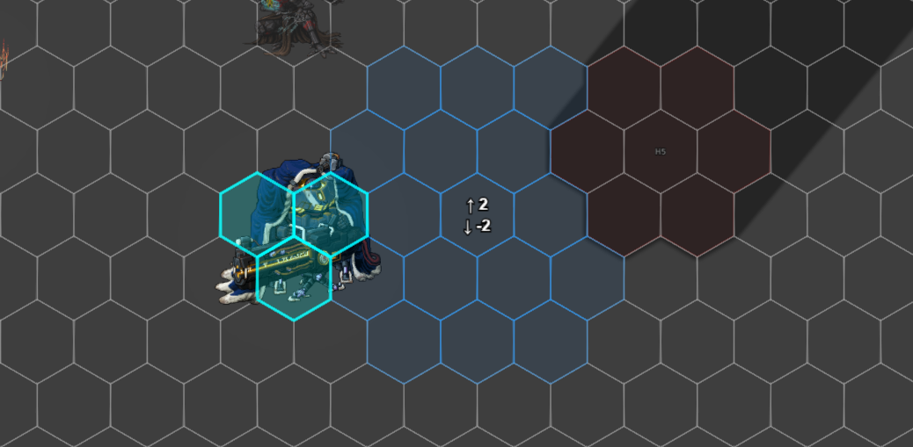
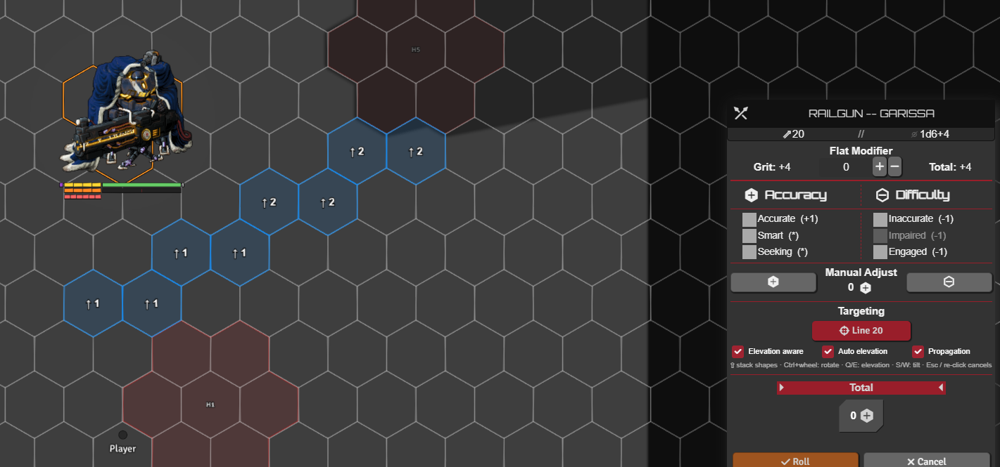

# Attack Targeting

[← Back to the README](../../README.md)

With **`enableAttackTargeting`** on, the attack HUD gains a picker for choosing your target or placing your area straight from the accuracy/difficulty dialog. Whatever you pick becomes a normal Foundry target the roll reads as usual, and it clears again once the attack resolves.

---

## Settings

**Combat & Movement → Combat Flows** (**`enableAttackTargeting`**; add **`autoStartTargetPicking`** to open the picker the moment an attack starts with no target set).

## The targeting buttons

When the attack HUD opens, a targeting button joins its range row. A simple-range weapon gets a **Range N** button, a tech attack gets **Sensors N**, and an AoE weapon gets one button per pattern, **Blast / Burst / Cone / Line**, in place of the system's template buttons, with an **Elevation aware / Auto elevation / Propagation** toggle row below them. Click a button to start picking, click it again (or Esc) to stop.

 

## Single-target picking

The cursor highlights what's under it: blue over a token, red over empty ground. Click a token to target it, and hold **Shift** to keep targeting more. Esc or a re-click ends it. There's no range gate, the button's range is just a label.

 

Where tokens overlap, a small picker lists them so you pick which one to target.

 

## Area templates

Placing a template catches every token inside it as a target. **Blast** drops a disk on the hovered cell, **Burst** centres on the token under the cursor, and **Cone** and **Line** aim from the cursor and rotate with **Ctrl + mouse-wheel** (a line also tilts into a slope). Hold **Shift** while placing to stack more shapes onto the same target set.

 

## Elevation, auto-elevation, propagation

The toggle row controls the 3-D side. **Elevation aware** catches tokens by vertical overlap and lets tall terrain block the shape; **Auto elevation** sits the area on the Terrain Height Tools ground beneath it; **Propagation** floods the area out from its origin so it can't reach over terrain into a pocket behind. With all three off, the area is flat.

 

## Keybinds

**E / Q** raise and lower the area's elevation, **W / S** tilt a line, and **Ctrl + wheel** rotates a cone or line. All are rebindable under Configure Controls → Lancer Automations.

## After the roll

Closing the HUD stops the picker and clears its shapes, and once the attack resolves your targets are released automatically. Your in-progress aiming can also be shown to other players, see [Share Interactive Tools](./INTERACTIVE_TOOLS.md).
