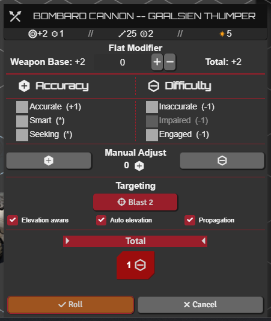
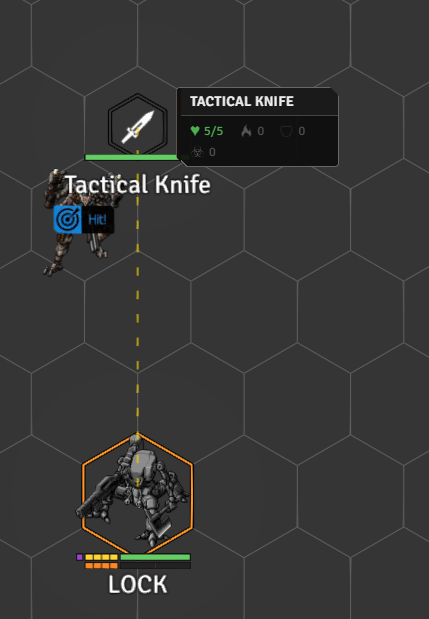
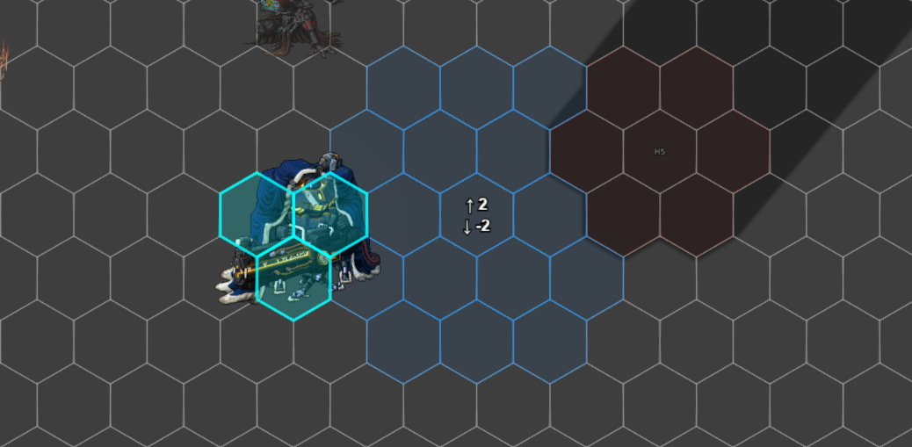
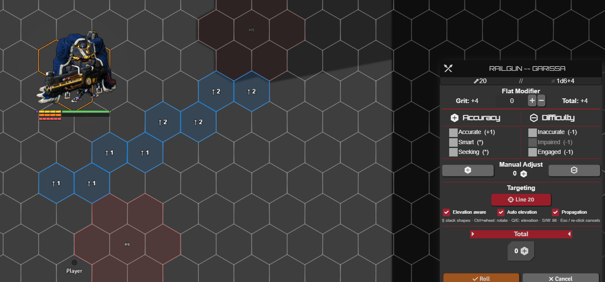

# Advanced Targeting and Measurement

[← Back to Home](../index.md)

With **LA Attack Targeting** (**`enableAttackTargeting`**) on, the attack HUD gains a picker for choosing your target or placing your area straight from the accuracy/difficulty dialog. Whatever you pick becomes a normal Foundry target the roll reads as usual, and it stays targeted after the roll unless **Clear Targets After Roll** (**`clearTargetsAfterRoll`**) is on, which it is not by default.

Separately, a standalone **measure toolbar** (**Shift+R**) puts the same shapes, marks, and range readouts on the canvas any time - see [Advanced Measure tool](#advanced-measure-tool) below.

---

## Settings

**Combat & Movement → Targeting** holds **LA Attack Targeting** (**`enableAttackTargeting`**), **Auto-Start Target Picking** (**`autoStartTargetPicking`**) to open the picker the moment an attack starts with no target set, and **Clear Targets After Roll** (**`clearTargetsAfterRoll`**, off by default). **LA Damage Targeting** (**`enableDamageTargeting`**) puts the same picker on the damage HUD, hold Shift for multiple.

**Combat & Movement → Advanced Measure** holds **Select Target cursor** (**`targetToolCursor`**) and **Measure cursor** (**`rulerToolCursor`**), which swap the cursor and play a sound while those tools are active.

---

## The targeting buttons

When the attack HUD opens, a targeting button joins its range row. A simple-range weapon gets a **Range N** button, a melee weapon gets **Threat N**, a tech attack gets **Sensors N**, and an area-of-effect (AoE) weapon gets one button per pattern, **Blast / Burst / Cone / Line**, in place of the system's template buttons, with an **Elevation aware / Auto elevation / Propagation** toggle row below them (plus **Line of sight** when [range pulse LOS](./VISION.md#range-pulse-line-of-sight) is on).

A weapon that has both a Range and a Threat, and whose two values differ, also gets a swap arrow beside the button to flip the label between them.

Click a button to start picking, click it again (or Esc) to stop.

 

---

## Single-target picking

**There is no range gate: the button's range is only a label.** The cursor highlights what's under it: blue over a token, red over empty ground. Click a token to target it, and hold **Shift** to keep targeting more. Esc or a re-click ends it.

 

Where tokens overlap, a small picker lists them to choose from.

 

---

## Hit chance and damage

Each targeted token gets a live **hit chance** and **damage range** label. **`targetInfoDisplay`** sets who sees them: **No**, **GM only** (default), or **GM and players**.

---

## Throwing

| Throwing | Landing |
|:---------|:--------|
| Tick a throwable weapon's **Thrown** box in the HUD and the button becomes **Throw N**, previewing the throw distance in place of the melee reach. Clear it to go back to the weapon's normal range. A weapon whose box is ticked but carries no Thrown tag keeps its normal range. | Rolling the attack then lands the weapon on the field as a token and disables it on the sheet until you [pick it back up](./INTERACTIVE_TOOLS.md). With **`enableThrowFlow`** on, attacking a throwable weapon first asks whether to attack with it or throw it. |
|  |  |

---

## Area templates

Placing a template catches every token inside it as a target. **Blast** drops a disk on the hovered cell, **Burst** centers on the token under the cursor, and **Cone** and **Line** aim from the cursor and rotate with **Ctrl + mouse-wheel** (a line also tilts into a slope). Hold **Shift** while placing to stack more shapes onto the same target set.

 

---

## Elevation, auto-elevation, propagation

The toggle row controls the 3-D side. **Elevation aware** catches tokens by vertical overlap and lets tall terrain block the shape. **Auto elevation** sits the area on the Terrain Height Tools ground beneath it. **Propagation** floods the area out from its origin so it can't reach over terrain into a pocket behind. With all three off, the area is flat.

 

---

## Keybinds

**E / Q** raise and lower the area's elevation, **W / S** tilt a line, and **Z** resets the elevation offset, rotation and tilt. **Ctrl + wheel** rotates a cone or line. The keys are rebindable under Configure Controls → Lancer Automations.

---

## After the roll

Closing the HUD stops the picker and clears its shapes. Your targets stay on after the roll unless **Clear Targets After Roll** (**`clearTargetsAfterRoll`**) is on, which it is not by default. Your in-progress aiming can also be shown to other players, see [Share Interactive Tools](./INTERACTIVE_TOOLS.md).

---

## Advanced Measure tool

Press **Shift+R** to toggle a standalone measure toolbar, docked above the macro hotbar. It's per-client and works outside any attack or flow. On it:

- **Blast / Burst / Cone / Line** - arm a shape at a chosen size. Click to drop, click (or right-click) again to remove. With no shape armed you move and drag tokens as usual.
- **Target** (the reticle) - click a token to target it.
- the **range source** selector - **Threat**, **Sensor**, **Max Reach**, **Weapon**, **Manual**, or **None**, pulsing that range around the reference token. The reference is whatever you have selected. [Range pulse LOS](./VISION.md#range-pulse-line-of-sight) clips it, with an eye toggle on the manual radius.
- **Movement reach** - the reference token's movement, in the ruler's speed tiers.
- **Tactical distance labels** - distances from the reference token.
- the **eye** - [line of sight](./VISION.md#lancer-line-of-sight) to your marks, or to your targets when nothing is marked.

**Shift+click** marks a token (which targets it) or a hex (which sets the Manual range).

**Clear** wipes the current placements. The **✕** (or Shift+R again) closes the toolbar. Closing hides the marks and toolbar but keeps them, so reopening picks up where you left off.

Hover the **?** for the full keybind list, including **T** to step through the range sources and **G** to clear everything.

Movement reach works for one token or a whole selection at once:

## Notable options

| Option | What it does |
|:--|:--|
| **HASE Chance Labels** | Live success % over the roller during stat rolls, saves, and contests. |
| **Range Preview on Attack/Damage HUD** | Pulse the attacker's weapon/tech range on the canvas when an attack card prints. |
