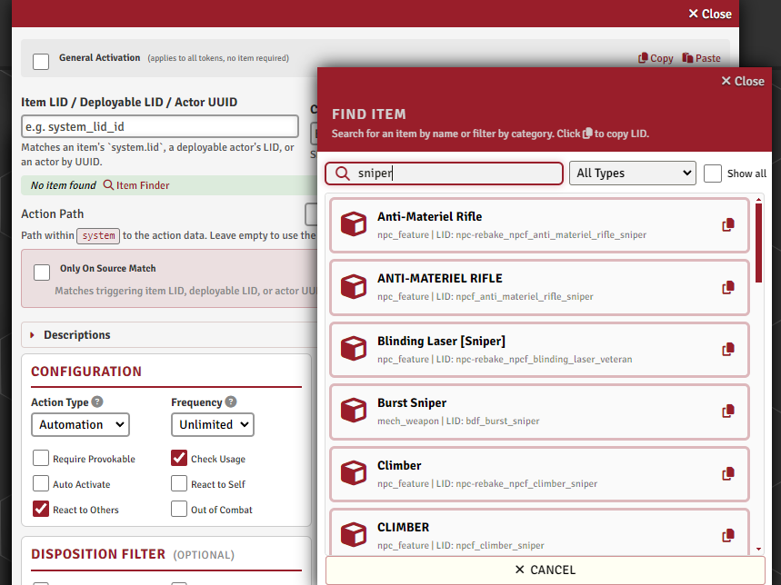
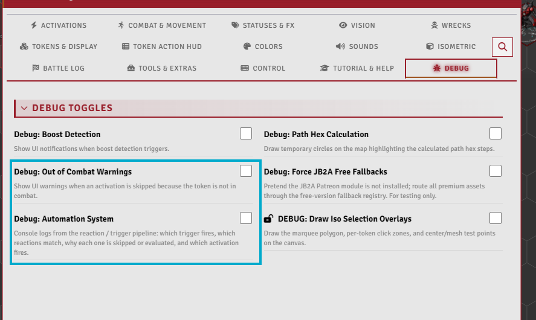
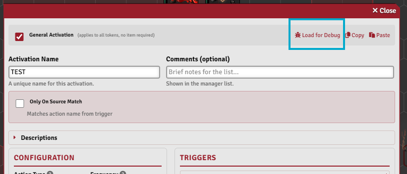
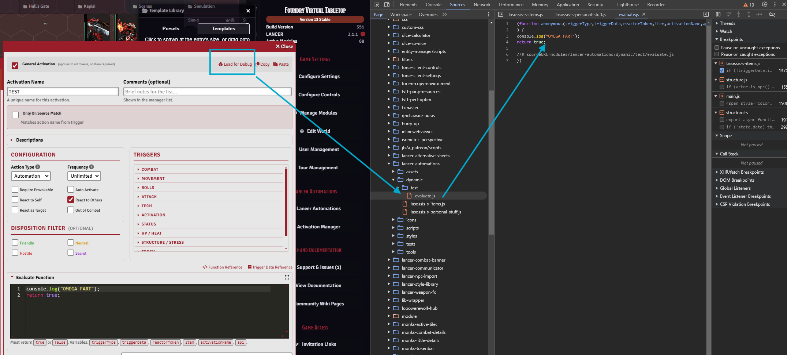
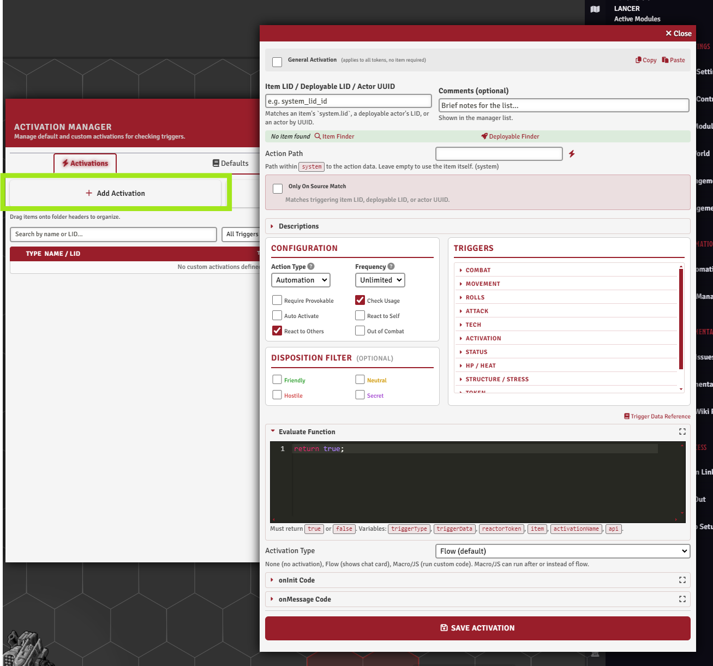
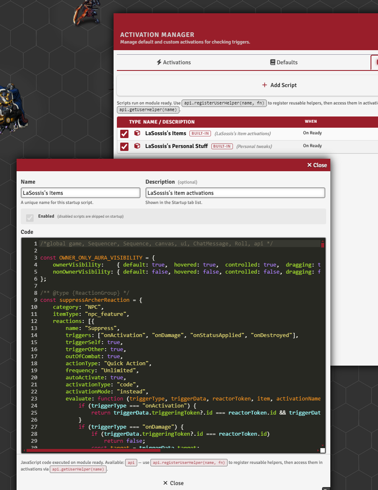

# Automation Engine

[← Back to Home](../index.md) · Engine internals: [Automation System](../AUTOMATION_SYSTEM.md) · API: [API Reference](../API_REFERENCE.md)


Turns game events into automations: a trigger fires, filters decide who reacts, and your code, a flow, or a macro runs.

Engine internals (full trigger list, evaluate / activation / onInit callbacks, cancel and modify, client and socket execution) are in **[Automation System](../AUTOMATION_SYSTEM.md)**.

---

## What's automated by default

Two things ship enabled, both listed on the **Defaults** tab of the Activation Manager.

**The base actions.** Overwatch, Brace, Engagement, Disengage, Ram, Boost, Overcharge, Lock On, Bolster, Stabilize, Eject, Reactor Meltdown, Hide, Scan, Mount and the rest of the general reactions.

**A short list of LID-keyed item automations.** Custom Paint Job, Limitless, Treads or Hover, Limited Melee Attacks (ships and vehicles), No Manipulators, Limited Handling, and Veterancy, each keyed to the item's LID and firing for any actor that owns it.

Beyond those, an item automation is yours to write, and the Activation Manager is where you do it. The larger [personal activation set](#the-personal-activation-set) is a separate opt-in.

---

## The Activation Manager


Register, modify, and copy automations. Open it from the Lancer Automations settings.

It has two kinds of entries:

- **Item-based** automations are tied to a Lancer item by its LID. Only tokens that own that item can react. You can also bind one to a deployable LID, or to a specific Actor UUID, so it reacts only as that one exact actor instead of every actor with the item.
- **General** automations aren't tied to any item. Any token in the scene can react, filtered by the rules you set.

Entries can be sorted into named **folders**. The four tabs are **Activations**, **Defaults**, **Startup** and **Workshop**.

Each activation has an **enable / disable** toggle. It works per sub-reaction on a multi-reaction item, and on the built-in and personal-set automations too (the toggle is saved as your own override, so disabling a built-in one sticks).

<br clear="right"/>

### Changing a built-in automation

You can't edit a built-in directly. Three ways around it:

| Want | Do |
|------|----|
| Turn it off | The **enable toggle**. Saved, so updates don't undo it. |
| Change it | **Edit** it. Your version is saved over the default. |
| Make a variant | **Copy to Custom** (copy icon on the row, Defaults tab only). Makes an editable copy and opens it. The original stays. |

To replace a built-in: copy it, edit the copy, disable the original.

All of this is saved in your world, not the module, so updates never overwrite it. **Export / Import** moves it to another world.

<br clear="right"/>

### Finding an item's LID



Item-based automations need the item's LID. Three finder buttons sit next to the LID field in the editor: **Item** browses your world and compendium items, **Deploy** lists deployable LIDs, **Actor** picks an Actor UUID. A separate **Find Action** button beside the Action Path field lists every action inside the selected item with the path to paste. A deployable can be set to react to its own deploy (the `onDeploy` trigger), covered in [Automation System](../AUTOMATION_SYSTEM.md).

<br clear="right"/>

---

## Configuring an activation


Each activation is a small form. The main fields:

| Group | What you set |
|-------|--------------|
| **Triggers** | Which game events fire it (`onMove`, `onHit`, `onActivation`, `onDeploy`, and many more). Full list in [Automation System](../AUTOMATION_SYSTEM.md). Custom names go in the **Custom** field, fired with `api.dispatchCustomTrigger(name, data)`. |
| **Mode** | How your code composes with the activation's **own** flow or card: **instead of** it, or **after** it. Never the flow that triggered you, which runs either way. Also whether it **auto-activates** silently (no popup). |
| **Filters** | Disposition (Friendly / Hostile / Neutral / Secret, plus Token Factions teams), trigger-self / trigger-other, only-on-source-match, require-can-provoke, out-of-combat, scene reactor (evaluate once as the active scene, alongside or instead of the per-token passes), and an optional scene the activation is limited to. |
| **Binding** | What the automation attaches to: an item LID, a deployable LID, or an Actor UUID, plus an action path to bind one sub-action, the action type (Automation / Reaction / Quick Action / Full Action / ...), and frequency. Note the long forms: it is `"Quick Action"` here, not the `"Quick"` short form the TAH extra actions use. |
| **Text** | Override the trigger and effect descriptions shown in the popup. |

### Example: react to your own activation

The smallest useful activation: run your own code when an item's action is used. Exported, a self-reacting `onActivation` looks like this, trimmed to the fields that matter (a real export carries every field in the form):

```json
{
  "isGeneral": false,
  "lid": "mf_balor_alt_hecatoncheires",
  "name": "",
  "reaction": {
    "triggers": ["onActivation"],
    "evaluate": "return true;",
    "actionType": "Quick Action",
    "frequency": "Unlimited",
    "autoActivate": true,
    "triggerSelf": true,
    "triggerOther": false,
    "outOfCombat": true,
    "onlyOnSourceMatch": false,
    "activationType": "code",
    "activationMode": "instead",
    "activationCode": "ui.notifications.info(\"The Action of this frame is activated\");",
    "reactionPath": "core_system.passive_actions[0]"
  }
}
```

What makes it self-react on use:

- **`triggers: ["onActivation"]`** - fires when the item's action runs.

- **`triggerSelf: true`** (with `triggerOther: false`) - the acting token is the reactor, so it reacts to its own action. There is also `triggerTarget: true` - the reactor is one of the event's targets (the one being attacked), usable with both others off for target-only reactions.

- **`autoActivate: true`** - runs silently, no popup.

- **`activationMode: "instead"`** - your code runs alone. `"after"` also fires the reaction's own flow/card alongside it. Neither touches the flow that triggered you.

- **`reactionPath: "core_system.passive_actions[0]"`** - binds to one specific action (here a frame's first core passive). Swap the `lid` and `reactionPath` for your own item and action. Drop `reactionPath` to bind the whole item.

---

## How an activation runs


When a trigger fires and the filters pass, three pieces decide the outcome.

**Activation type** sets *what* runs: your own **code**, the item's normal **flow**, a **macro**, or **none**.

**The evaluate function** runs first, as a final check. Return `true` to go ahead, `false` to skip. Use it for conditions the filters can't express, like "only if the target is below half HP".

**The activation code** is the effect itself, with access to the full `api` (apply effects, move tokens, place zones, show choice cards, etc.).

There's also an **onInit** block that runs once when a token is created, for passive setup like constant bonuses or auras.

You write these as plain function bodies, or full functions (the wrapper is stripped for you). The exact arguments each block receives, the order filters run in, and the synchronous rule for cancel and modify triggers are in [Automation System](../AUTOMATION_SYSTEM.md).

By default `onActivation` fires when an item runs through an activation. **`treatGenericPrintAsActivation`** also fires it for items printed via Lancer's generic print.

---

## Debugging an automation

Three tools, from quickest to most thorough.

### Console logging

`console.log` works anywhere in your code. For a full picture of what a trigger hands you, call **`triggerData.debugActivation()`** inside `evaluate` or `activationCode` to dump that call to the console:

- the trigger type, the reactor token, the item, the activation name
- every field on `triggerData`
- the helper functions available for that specific trigger

Pass a label (`debugActivation("before the check")`) to name the group when you have several.

It returns the same information as an object, and it's also on the api as `api.debugActivation(triggerType, triggerData, reactorToken, item, activationName, label)`.

### Debug mode

The **Debug: Automation System** toggle (module settings, Debug tab) logs the whole trigger pipeline: which trigger fires, which activations were candidates, why each one was skipped (out of combat, wrong disposition, no reaction left, evaluate returned false, ...), and which one ran. Turn it on when your automation doesn't fire at all and you want to know where it fell out.



### Breakpoints

The most useful tool for understanding what is going on inside an automation.

Your functions are compiled the first time they run, so they don't exist in the devtools until then. The **Load for Debug** button at the top of the activation editor compiles them immediately:



Then in devtools (F12), under **Sources**, your functions appear as files in `modules/lancer-automations/dynamic/`, one folder per activation with one file per function (`evaluate.js`, `activation.js`, `oninit.js`, `onmessage.js`). General activations are named by their activation name. Item activations nest two levels, `dynamic/<lid>/<index>/`, where the index is the sub-reaction's position, so a multi-reaction item gets one folder per reaction. Click a line number to set a breakpoint.



Breakpoints stay armed across triggers, so you can replay the situation as many times as you need.

You can also write `debugger;` directly in your code: with devtools open, execution pauses on that line without any setup.

---

## The activation popup



When a trigger fires reactions that aren't set to auto-activate, they're collected into a popup, grouped by token. Click an entry to expand its detail panel (trigger text, effect, action type badge, frequency), then click **Activate** to run it.

- Who sees the popup depends on the **`reactionNotificationMode`** setting: the token's owner, the GM, or both.
- **Right-click** a reaction to open its source item's sheet.
- Only one popup exists at a time. If a second trigger raises its own, the first is closed and its unclicked entries are gone. There is no queue and no pending badge, so anything that must not be missed belongs on auto-activate.

<br clear="right"/>

---

## Reaction economy

If **`consumeReaction`** is on, the token's reaction for the round is spent when an action whose activation resolves to **Reaction** runs through a flow. That covers a `"flow"` activation and any action whose `actionType` is Reaction. An auto-activating code automation that never launches a flow does not touch the counter. The popup shows the reaction as unavailable once it's spent.

---

## Startup scripts



The **Startup** tab in the Activation Manager holds code that runs once when Foundry is ready, before play starts. The main use is registering helper functions with `api.registerUserHelper`, callable from any activation or macro.

The registration patterns are in [API How-To](../API_HOWTO.md).

<br clear="right"/>

---

## Sharing automations

**Copy** / **Paste** in the activation editor moves one activation. **Export Pack** / **Import Pack** in the Activation Manager moves a bundle of activations and startup scripts as `la-pack-<name>.json`, with a summary to pick what applies.

The [Workshop](https://github.com/Agraael/Lancer-automations-workshop) is where people share those files. The **Workshop** tab in the Activation Manager browses and imports it directly. Re-importing a file updates your copy instead of duplicating it.


---

## The personal activation set

Module Settings has a toggle for my personal activation set (**`enableLaSossisItems`**): 30+ of my own item automations, with examples like Dispersal Shield, Marker Rifle, and Defense Net. Once enabled, they show in the Activation Manager under the **default** section. The toggle stays locked until **LaSossis Additional statuses and effects** (`additionalStatuses`) is on, since the set applies those statuses.

> [!NOTE]
> This is **my own stuff, not part of the core module**. It's literally the automations I built for my own games (my NPCs, my items), shared as-is. It isn't a complete or general library, and it won't automate your content. Treat it as a set of examples to learn from, not something to rely on.

The worked examples are walked through in [NPC Examples](./NPC_EXAMPLES.md), and the patterns for registering your own automations from code are in [API How-To](../API_HOWTO.md).

Some of these deployables aren't in any official LCP. If a personal activation spawns one that won't resolve, import the small companion pack that ships with the module: [`extra/LaSossis_Npc_Deployables.lcp`](../../extra/LaSossis_Npc_Deployables.lcp).


