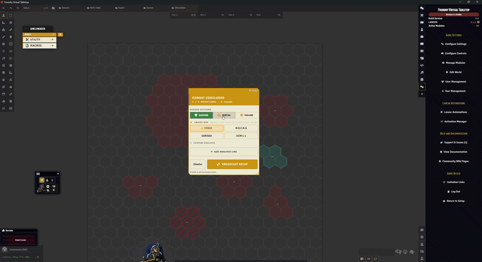
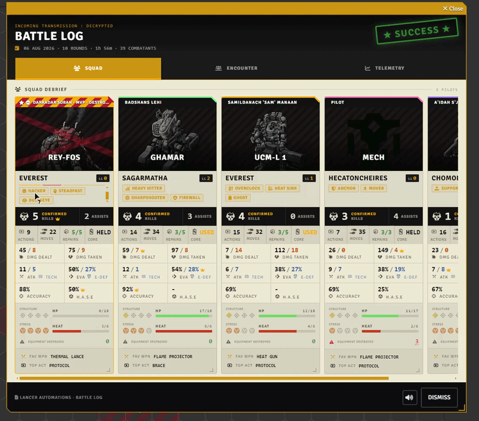
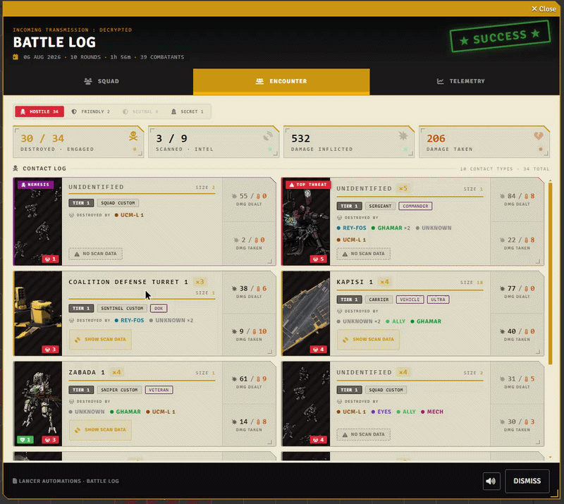
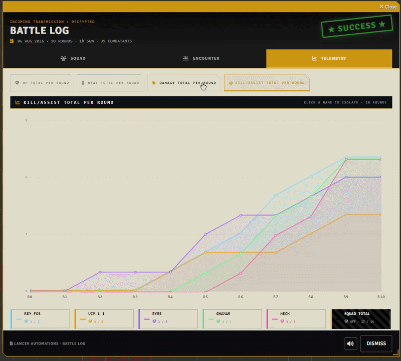

# Battle Log

[← Back to Home](../index.md)

This is the first patron-requested feature. Well, sort of. I extrapolated a lot, and maybe went a bit too hard with it. It grows bit by bit, so it is not perfect yet.

So what is it? It tries to track everything that happens during a combat and hand you back a cool-ass recap at the end, like an XCom game.

---

## Settings

The **Battle Log** tab: **Enable Battle Log**, **Disable awards**, and **Theme music** (a default, or one per outcome).

---

## Ending a combat

When a combat ends, the GM gets a card first. Pick the outcome, **SUCCESS**, **PARTIAL**, or **FAILURE**, add whatever detail lines you want, and set the **MVP** (leave it blank and it auto-picks from the awards). Hit broadcast and the sequence plays for everyone.

---

## A word on accuracy

Because of how Foundry works, I can't tell whether you fired something on purpose or by accident. So the more accurately you play, the more accurate the recap. For actions, the log counts an item the moment it hits the chat. That is what it reads as "used."

Past that it tracks kills, assists, accuracy, damage, movement, and saves, per token, so every grunt in a squad gets its own line. An assist is a hit or damage you landed on an enemy someone else finished off: the last blow is the kill and everyone else who hurt it gets the assist.

---

## Squad

One card per pilot. Each shows:

- the mech's HP and heat, structure and stress pips
- damage dealt and taken (physical/heat split in the tooltip)
- distance moved, kills and assists
- favorite weapon and most-used action
- save rates, repairs spent, core power used or held, and any gear lost

Accuracy has its own breakdown: ranged, melee, and tech hit rates, crits, and how much you dodged or blocked.

### Awards

Up top sit the awards, medals for how the fight went:

- most kills (**EXECUTIONER**)
- most physical damage (**HEAVY HITTER**)
- most assists (**SUPPORT**)
- best weapon hit rate, three shots minimum (**SHARPSHOOTER**)
- best tech hit rate (**HACKER**)
- most attacks dodged (**GHOST**), and more

Each has a threshold, so it only shows when someone earns it. Each is also worth 1 to 3 points depending on how hard it is, and the **MVP** is whoever ends up with the highest total, damage dealt breaking a tie. A GM pick overrides that. Not your thing? Flip **Disable awards**.

---

## Encounter

The enemy side. Each hostile gets a card: whether it died and on which round, who landed the kill and who assisted, and its tier, size, and frame. The nastiest ones pick up a **NEMESIS** or **TOP THREAT** badge.

---

## Telemetry

The nerd tab: per-round line charts for the squad, HP, heat, damage, and kills/assists, from R0 (the start of combat) to the last round. Click a name to isolate one pilot, or toggle the squad total.

## Notable options

| Option | What it does |
|:--|:--|
| **Friendly mechs count as squad** | Squad membership normally means owned by a player. This also counts FRIENDLY mechs that no player owns, so GM-run pilots and solo testing still show up in the log. |
| **Default theme** | Played for all outcomes unless a specific one is set below. |
| **Success theme** | Overrides the default when the mission outcome is SUCCESS. |
| **Failure theme** | Overrides the default when the mission outcome is FAILURE. |
| **Partial theme** | Overrides the default when the mission outcome is PARTIAL. |
