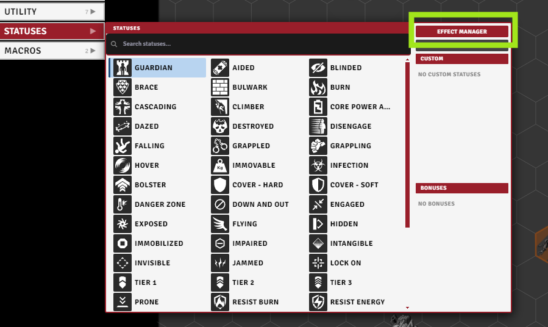
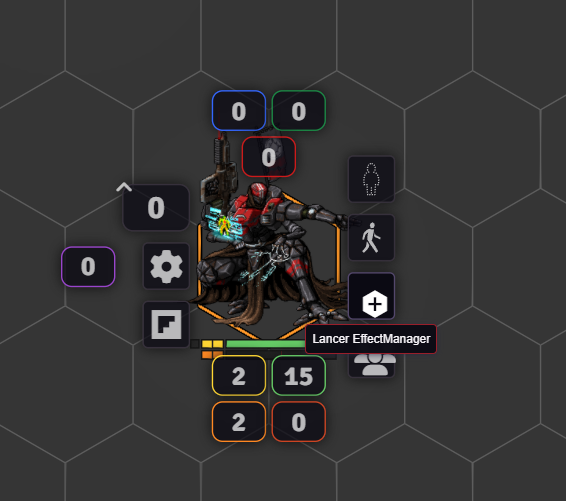
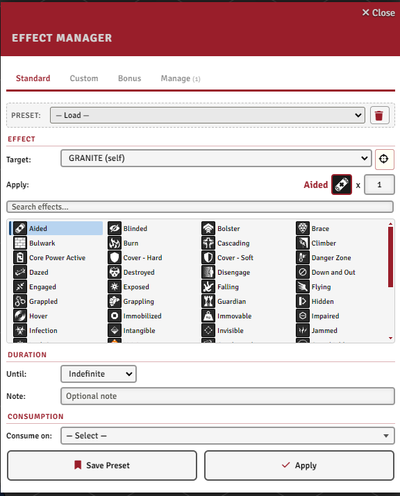
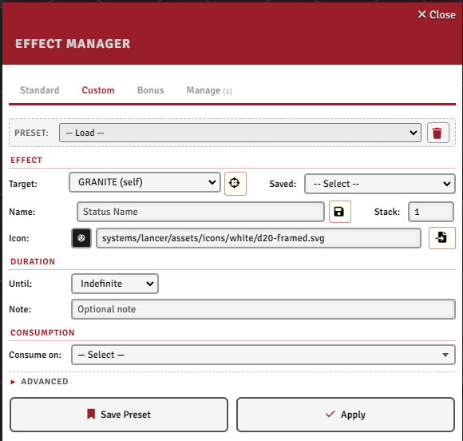
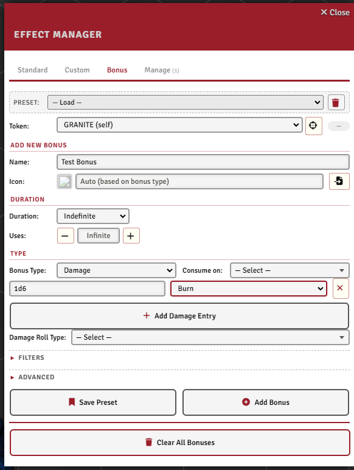
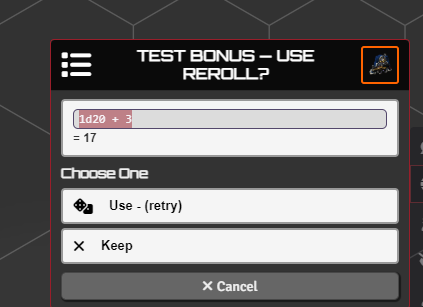
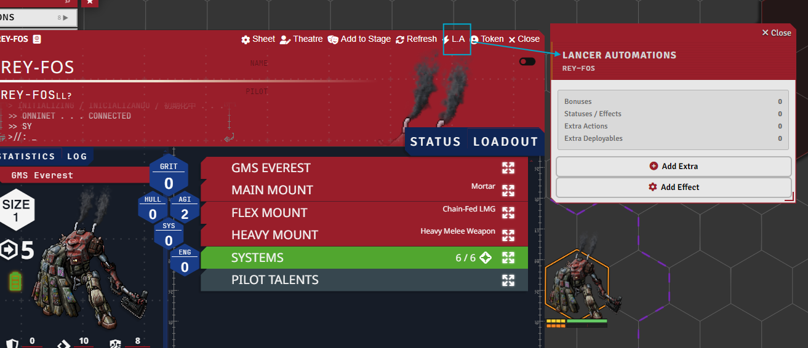
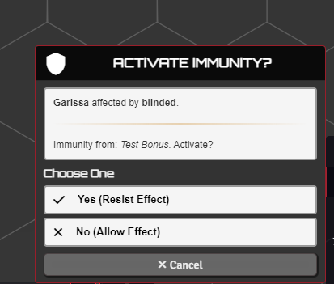
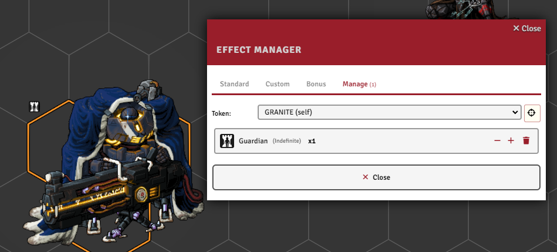

# Effect Manager & Bonuses

[← Back to Home](../index.md) · API: [Effects API](../API_EFFECTS.md)

The Effect Manager applies status effects and bonuses to a token. Drive it by hand from the HUD, or from automation code. Effects can carry a duration and consumable charges. Bonuses apply to Lancer's roll flows.

---

## The Effect Manager dialog

You can open it two ways: the **Effect Manager** button in the Token Action HUD (TAH), or a button on Foundry's own token HUD (toggled by the `showBonusHudButton` setting).

| From the TAH | From Foundry's token HUD |
|:---:|:---:|
|  |  |

Its tabs:

- **Standard** - apply built-in Lancer and Foundry status effects.
- **Custom** - make your own named effects (only with Temporary Custom Statuses).
- **Bonus** - build accuracy, damage, stat, and other bonuses.
- **Manage** - see and edit what's already on the token.

---

## Standard tab

Pick a status from the searchable grid and apply it with:

- a **duration** - end of turn, start of turn, indefinite, or permanent (survives a Full Repair) - plus an **origin token** for turn tracking (turn-based durations only count down while combat is running). The **Turns** count is per-origin-turn.
- **Turns** set to `0` means "next matching trigger": the end or start of the current turn if it is the origin's turn, otherwise the next one.
- a **stack count**.
- an optional **note** (e.g. "granted by X").
- optional **consumption** (see below).

Hover a status for its description. Save common setups as **presets** from the bar above the tab.

 

---

## Custom tab

This tab appears only when the **Temporary Custom Statuses** module is active, as the front-end for its custom statuses. Make an effect with any name, icon, stack count, duration, and active-effect changes (a JSON array of stat changes).

A **Save** button stores a custom status (name and icon) to a Saved dropdown you can reload in later sessions, and saved statuses also show up in the Standard tab's grid.

 

---

## Consuming effects

An effect with charges can burn one on its own when something happens, from a single stack up. Pick one or more **consumption triggers** (on attack, hit, damage, move, turn start, status applied, and more). The stack drops by one each time, and the effect clears itself at zero.

Most triggers offer **filters** so the charge only burns in the right situation (the available filters change with the trigger):

- by **item** - a weapon's LID, or a specific weapon instance on the token (item ID, via an inventory picker),
- by **action name** or **check type** (HULL / AGI / SYS / ENG),
- by **status** (a grid picker),
- **boost only** and a **min distance**, for move triggers,
- by role (**Consume as**: source, target, or either), for attack, damage, tech, and check triggers.

For anything the filters can't express, write a short **evaluate function** that decides whether a given event should consume a charge. It receives the trigger type, the trigger data, the effect's token, and the effect object.

---

## Bonuses

Bonuses apply mechanical changes to Lancer's roll flows. They persist in one of three ways:

- **General** - visible on the token. Give it a duration (end of turn, start of turn, indefinite, or permanent) and it shows an icon like a status, with optional charges.
- **Constant** - invisible and permanent. In the dialog this is the **Constant (no icon, always active)** duration. From code it's `addConstantBonus`, for baseline stats or immunities (see [Automation Engine](./AUTOMATION_ENGINE.md) and the Insulated example in [NPC Examples](./NPC_EXAMPLES.md)). It survives a reload.
- **Flow** - injected into the current flow only, via `triggerData.flowState.injectBonus(...)` from an activation.

Full API (every type, immunity queries, flow injection) is in [Effects API](../API_EFFECTS.md).

 

### Bonus types

| Type | What it does |
|------|--------------|
| **Roll (Acc/Diff)** | Add accuracy or difficulty dice to matching rolls (attacks, checks, saves). |
| **Damage** | Bonus (default): add extra rows in the Bonus Damage section, per-target or global. Add: append rows to the weapon's Base Damage. Replace: substitute the weapon's Base Damage with a new set. Change Type: remap damage types (per-type from -> to, or a catch-all "All -> X"). Add, Replace, and Change Type are actor-wide only. |
| **Stat** | Change an actor stat: HP, Heat, Armor, Speed, Evasion, etc. Modes: Add (delta) or Replace (set to `val`). |
| **Tag** | Add, increment, override, or remove a weapon tag (Accurate, Overkill, ...). |
| **Range** | Change a weapon's ranges (Range, Threat, Blast, Burst, Cone, Line). |
| **Immunity** | Immunity to a damage type, effect, crit, terrain, or engagement. Prompts a choice card on incoming damage (below). |
| **Target Modifier** | Tactical changes to the target: cover, invisibility, armor-piercing, half-damage, paracausal, or force a hit / crit / miss. |
| **Reroll** | Reroll a roll type (attack, tech attack, damage, skill, structure, stress). Modes: retry, highest, lowest, or choose. |
| **Movement Extra** | Extra spaces added to each move. Applies to Boost or Standard Move. |

Accuracy and difficulty bonuses show up in the roll HUD before you confirm. Damage bonuses appear in the damage output.

Subtype lists per type are in [`addGlobalBonus`](../API_EFFECTS.md#addGlobalBonus), immunity ones in [Immunity subtypes](../API_REFERENCE.md#immunity-subtypes).

### Tuning a bonus

- **Roll-type filters** - restrict to attacks (melee / ranged / tech), checks (HULL / AGI / SYS / ENG / grit), structure, overheat, or all flows.
- **Item / token filters** - scope to a weapon by **LID** (a type), or to a specific weapon instance on the token (**item ID**, via an inventory picker), and to one or more **target tokens**.
- **Targetter** - reverse it: the target applies the bonus to the attacker, for debuffs or reactive effects. Hidden for Range bonuses, which cannot use it. `applyToTargetter` in the [API fields](../API_EFFECTS.md#addGlobalBonus).
- **Uses** - a charge count. The bonus is removed when it hits zero.
- **Condition / Apply-to-condition functions** - short synchronous JS gates: whether the bonus applies at all, or whether it applies to one specific target.
- **Consumption** - the same trigger system as effects above, to deplete charges on events.

---

## Attach to items and prototype actors

Statuses, bonuses, and extras can be attached to an **item** or a **prototype actor** instead of a scene token. The **L.A** button on the item or actor sheet header opens a menu with a count of what is already attached, and its **Add Effect** entry opens the Effect Manager (the menu also holds **Add Extra**, and **Extra Config** on items).

Anything attached to an item follows the item: whoever carries it gets the effect, and it goes away if the item is destroyed or removed. Prototype actors work the same way, keyed on the actor: every token spawned from the prototype picks it up.

When the owner is a tiered NPC, an entry can be **tier-gated** so it only applies at a chosen tier (T1 / T2 / T3).

 

---

## Immunity and the choice card

When a token holds an immunity bonus and takes matching damage, a **choice card** prompts whether to apply the immunity.

---

## Manage tab

See every effect and bonus on the selected token, nudge stacks with the +/- buttons, or delete them. Bonuses show their full summary - type and effect (e.g. "Damage [2d6 Kinetic]"), remaining uses, item filters, and which flows they apply to - Constant ones included.

Duplicate module effects that share a name collapse into one icon with a count badge.

 

> The Infection damage type is built on this system but has its own guide: [Infection](./INFECTION.md).
