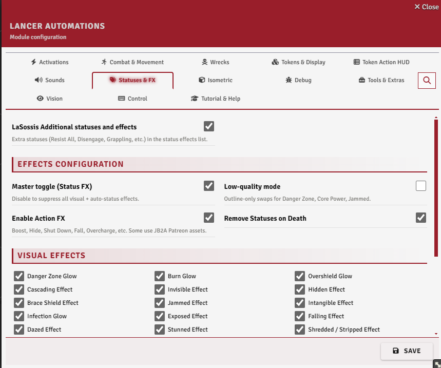
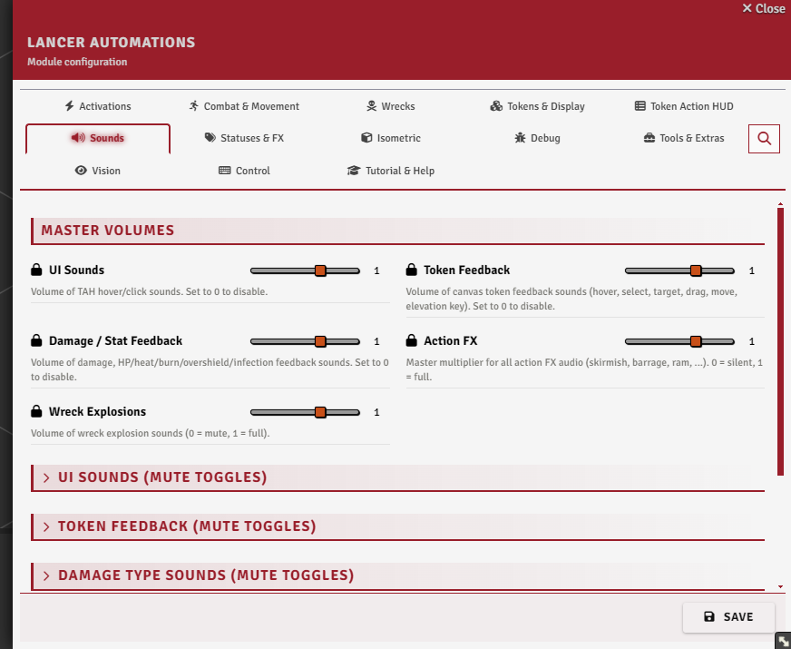
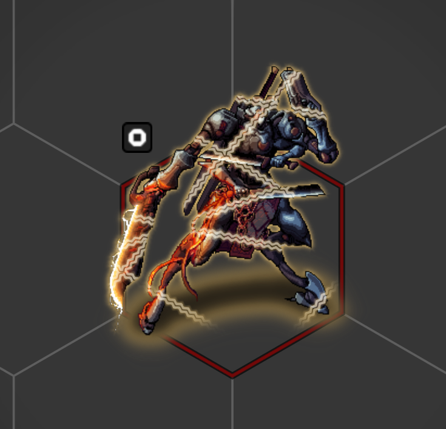
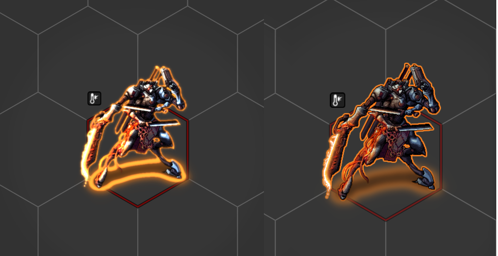
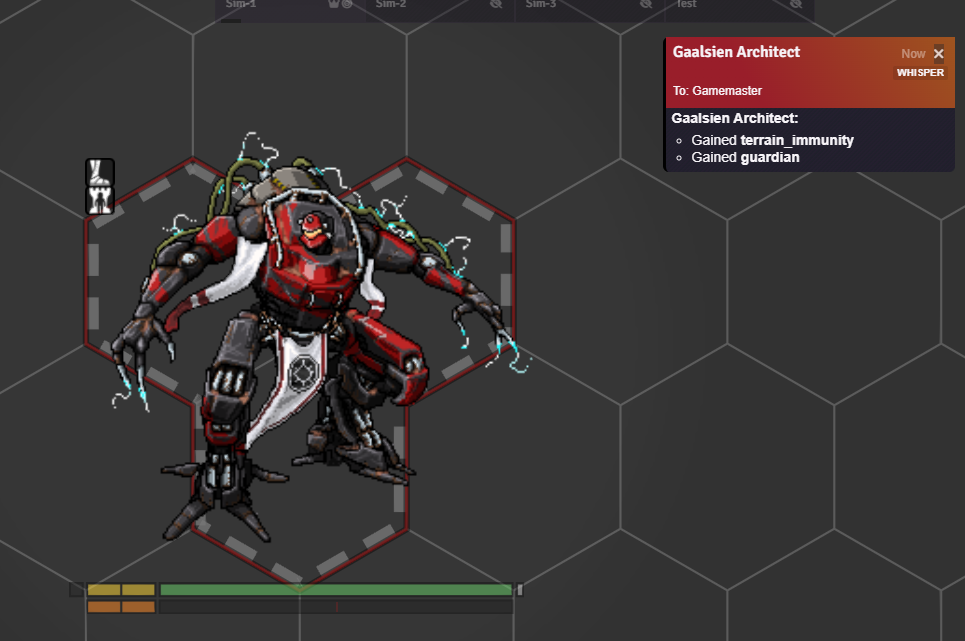
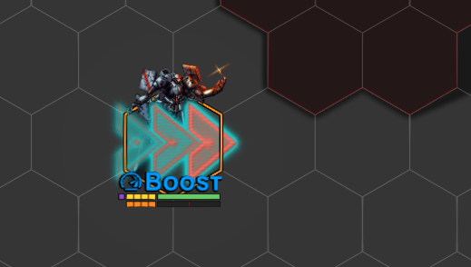
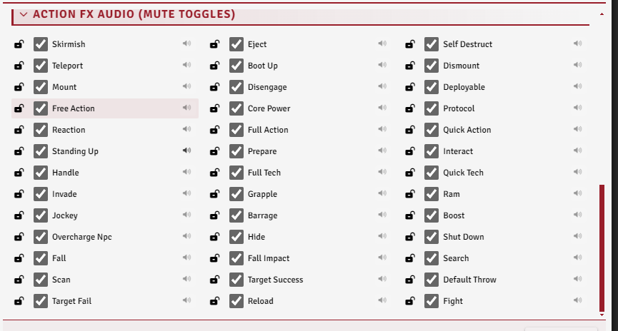

# FX and Sounds

[← Back to the README](../../README.md)

The cosmetic and feedback layer: visual effects on status effects, animations when actions fire, and sounds for most of what happens at the table. All optional, all tunable.

---

## Settings

  
  

The **Statuses & FX** tab for the visuals, and the **Sounds** tab for audio.

## Status effect visuals

Each status gets a Token Magic FX overlay (Token Magic FX must be installed), applied and cleared with the status itself: a danger-zone glow, a burn shimmer, an overshield outline, chains for immobilized, film grain for stunned, and so on. Every one has its own toggle under **Visual effects**, all under a single master switch.

 

**Low-quality mode** swaps the heaviest effects, Danger Zone, Core Power, and Jammed, for cheap outline versions; the glow and bloom filters they normally use are GPU-hungry. **Remove statuses on death** clears a token's statuses when its structure hits 0.

 

## Auto-status icons

Some statuses are applied straight from the actor's numbers: the danger-zone overlay at heat ≥ 50%, plus burn, overshield, infection, and cascading whenever those values rise above zero. Each has its own toggle under **Auto-status icons**.

## Guardian / Bulwark aura

A soft aura is drawn around tokens with **Guardian** or **Bulwark**. **`guardianBulwarkAuraMode`** sets it to always on, combat-only, or off; combat-only needs the GAA fork.

 

## Action FX

When an action runs, a matching animation plays through Sequencer: a slash on a skirmish, a downdraft on boost, an impact on ram, smoke on hide, and so on. Toggle the lot with **Enable Action FX**. They need both Sequencer and Lancer Weapon FX installed; without either, they're skipped.

 

## JB2A free-pack fallback

Many of the action animations use JB2A. If you only have the free pack, the module substitutes free-pack equivalents (tinting them to match) so the effects still play instead of erroring on a missing asset. **`debugForceJb2aFree`** forces that path even when the Patreon pack is installed.

## Sounds

Most things at the table make a sound: HUD clicks, token hover, select and target, damage by type, stat changes, action FX, and wreck explosions. Each family has a master volume, and every event inside it can be muted on its own, click a toggle to preview it.

 
