# Gameplay Automation

[← Back to the README](../../README.md) · Engine: [AUTOMATION_ENGINE.md](./AUTOMATION_ENGINE.md)

Lancer Automations runs the procedural parts of play for you: combat actions and reactions, plus Lancer's own out-of-combat flows for scanning, rest, and downtime. Most fire off triggers (a move, a hit, the start of a turn) and resolve the rules.

---

## Settings

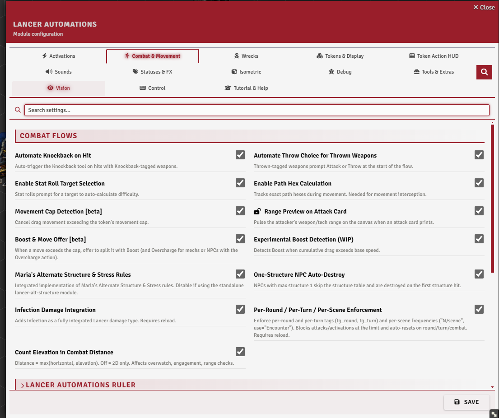

**Combat & Movement → Combat Flows**, and **Activations → Scan**.

 

## Built-in actions and reactions

Almost all of Lancer's actions and reactions are automated here. These aren't new rules, just Lancer's own actions run for you, and each one can be turned off or rewritten in the Activation Manager (see [Automation Engine](./AUTOMATION_ENGINE.md)). Stabilize and Scan already have a version in the Lancer system, which the module swaps for a richer one.

  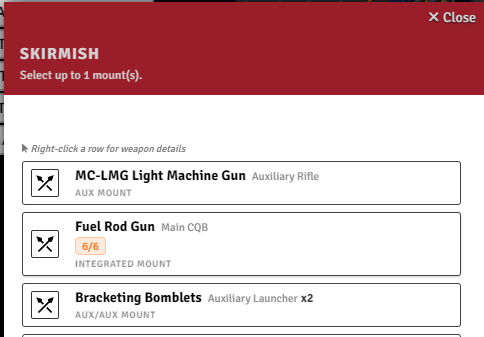
  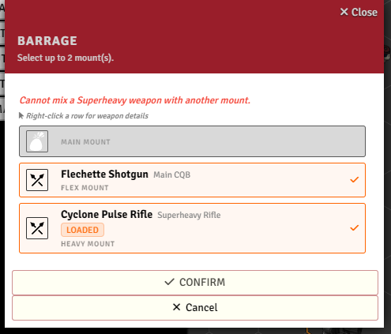
  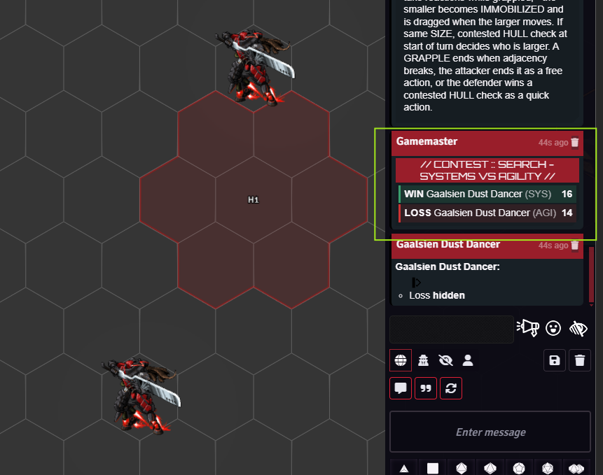
  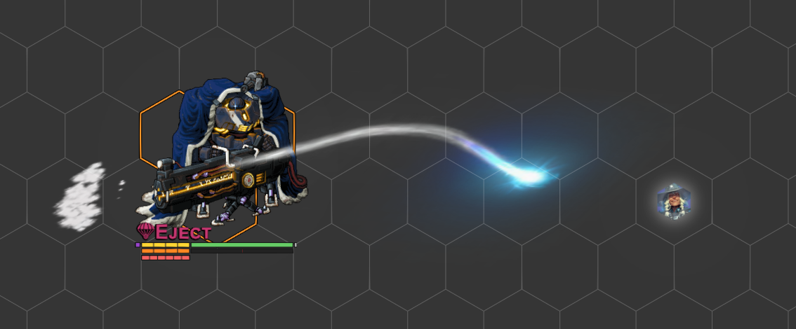

Search, Break Free, and Lancer's other opposed checks are rolled for you as **stat contests**, and you can trigger one from code with **`executeContestedCheck(tokenA, statA, tokenB, statB)`**, which returns the winner.

Auto-knockback (the damage dialog's **Knockback** checkbox, reading a weapon's Knockback tag) and throwing a weapon as a token are combat flows too, both covered in [Interactive Tools](./INTERACTIVE_TOOLS.md).

## Overwatch

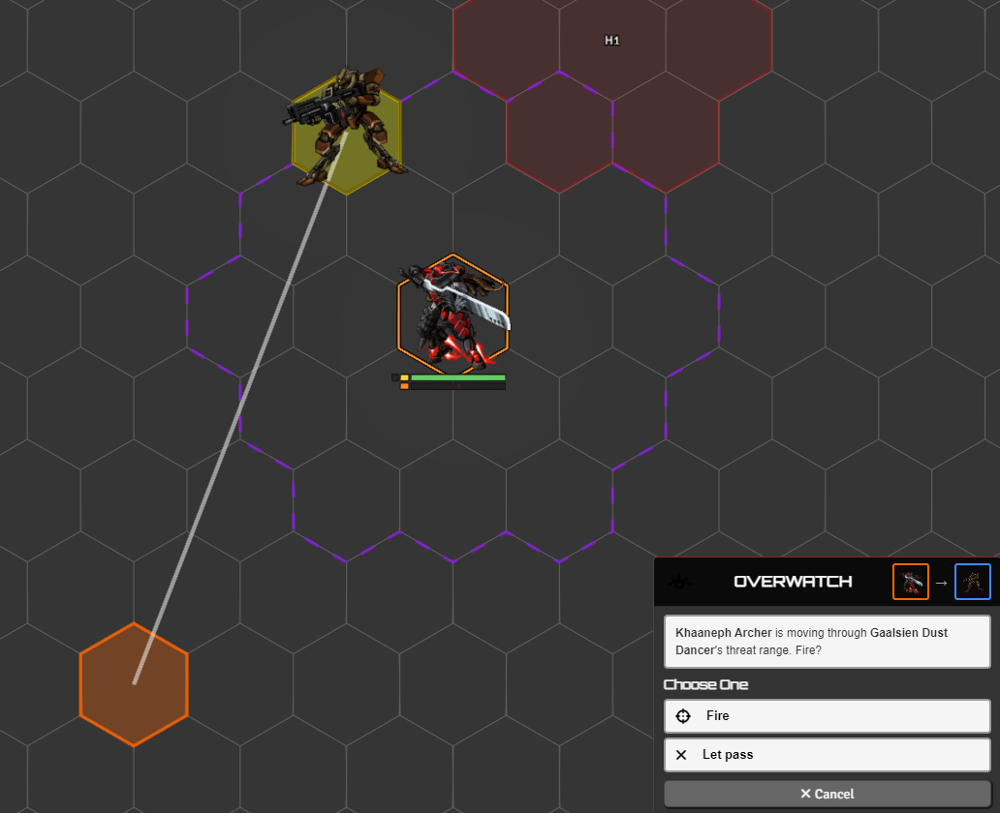

Overwatch is automated two ways; pick one in the Activation Manager.

- **Alert (default)** - when a hostile moves through your threat range, a prompt lists which of your tokens could react; click one to select and pan to it. It flags the chance but doesn't stop the move.
- **Interrupt (v2)** - pauses the move and asks the owner to **Fire** or **Let pass**, resolving the Skirmish before the move continues. Off by default; enable it and disable the alert in the Activation Manager.

Threat range reads from Grid-Aware-Auras threat auras when present, otherwise from the actor's weapon threat.

 

## Grapple

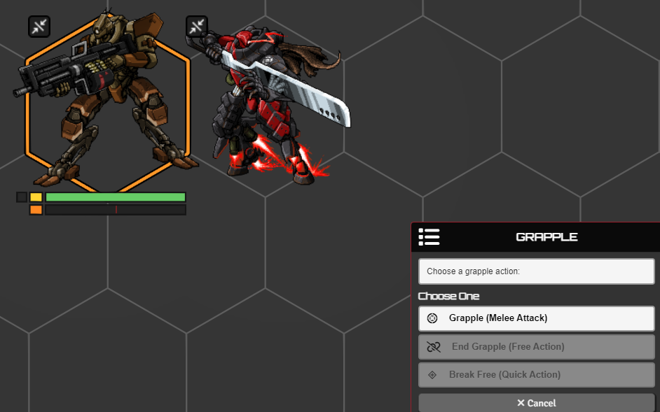

Grapple is automated: on a melee hit it applies **Grappled** and **Grappling**, and **Immobilizes** the smaller side by combined size, with equal sizes settled by a **HULL** contest at the start of each turn. The immobilized side is dragged along when the controlling side moves, and a knockback breaks the grapple. The Grapple card also offers **End Grapple** and **Break Free**. A target immune to Grappled is skipped, and there's a Grapple macro too.

 

## Action limits

**Brace**, **Dazed**, **Staggered**, and **Slow** grey out the actions they block in the HUD while the status is on.

## Stabilize

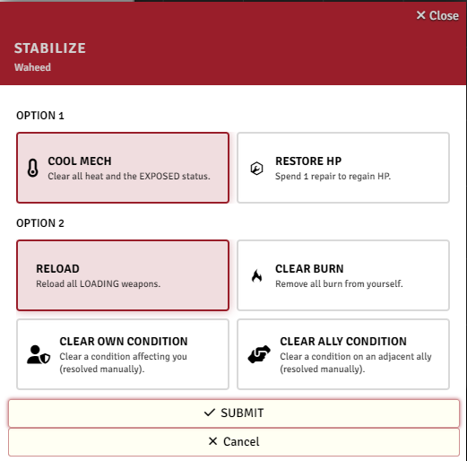

Stabilize gets a clearer dialog for its two choices; an NPC just cools and reloads. Whether it spends a Full action is set by **`consumeAction`** (Activation Manager tab), and with infection integration on, clearing burn also clears [infection](./INFECTION.md).

 

## Usage limits

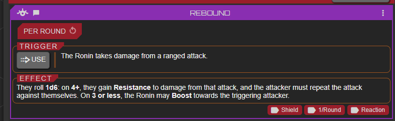

Beyond Lancer's own limited and recharge tracking, weapons and systems tagged **per round**, **per turn**, or **per scene** get their own pip counters injected straight onto their cards in the actor sheet. Spending the action ticks a pip, the action is blocked once they run out, and they reset at the matching boundary: the start of a round, your turn, or a new scene. Turn this on with **`enablePerRoundTurnTags`** (needs a reload).

 

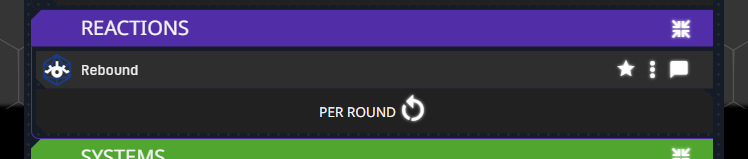

The counters are drawn to match whichever sheet you use, both the default Lancer sheet and the alternate sheet layout.

 

## Reinforcement

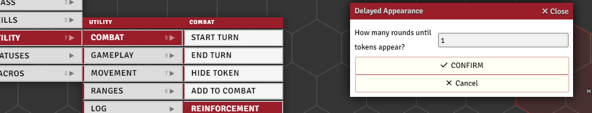

For units that arrive partway through a fight. Drag the new tokens onto the scene holding **Alt** to drop them hidden, then, in combat, select them, run the reinforcement tool, and set how many rounds until they land. They stay hidden until then.

In their place it drops a countdown marker, but only if it can find one. For each token it looks up a world actor named after that token's size, exactly **`Size 1`**, **`Size 2`**, **`Size 0.5`** and so on, and spawns that actor's token at the spot, renamed **`[N]`** and ticking down each round. You make those placeholder actors yourself, one per size you use; without a match the token just hides with no marker.

When the round arrives, an **NPCs Arriving** dialog lists the due tokens with a checkbox each so you pick who actually shows up. The chosen ones reappear with a burst effect (needs Sequencer and JB2A) and their marker is cleared; the rest are deleted along with their markers.

 

## Alt structure & stress

Off by default, **`enableAltStruct`** swaps Lancer's structure and overheat rolls for the alternative ruleset, my implementation of BadIdeasBureau and Kaffo's [LANCER Alternative Structure](https://github.com/BadIdeasBureau/lancer-alt-structure). Both are rolled on keep-lowest tables: structure outcomes run from a glancing blow up to a crushing hit, with **HULL** checks and a system-trauma dialog where you tear off a weapon or system; stress outcomes cover power failure, emergency shunt, and reactor meltdown, gated by **ENGINEERING** checks and a meltdown countdown.

**`enableOneStructNpc`** simplifies NPCs down to a single structure or stress: they're destroyed or Exposed outright instead of rolling.

## Scan

  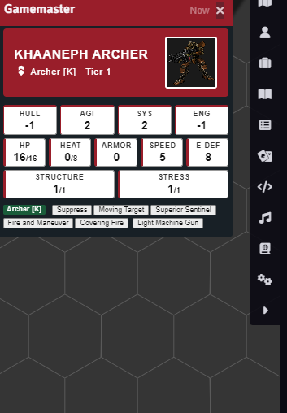
  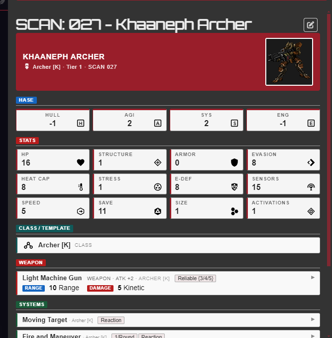

LA's scan runs on both the **legacy** scan and the **native** Lancer-system scan; **`scanJournalSource`** chooses which one produces the result. Routing it through LA is what makes a scan reusable: each one is recorded as **scan ownership**, granted to players by **`scanPlayerOwnershipMode`** (everyone, a player group, or just the scanner).

Other LA features read that ownership to tell whether a player may see a target's data, so an NPC's information stays hidden until it's scanned. The [token stat hint](./TOKEN_DISPLAY.md) reads **UNKNOWN** until then, the custom [stat bars](./TOKEN_DISPLAY.md) can be set to appear only once scanned, and the HUD glossary panel lists what you've scanned.

## Rest

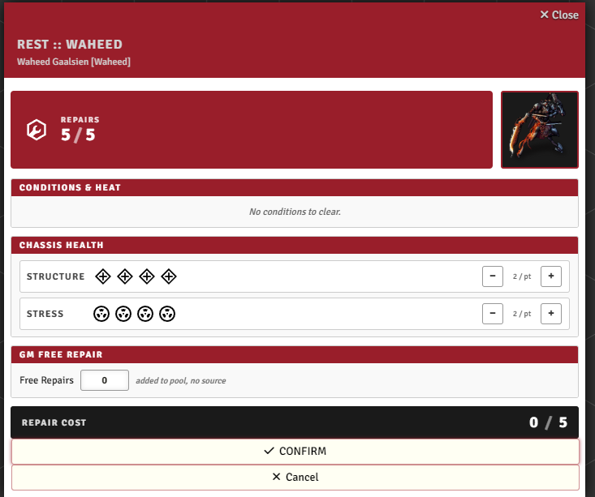

Pick a mech or pilot and open Rest to spend its repair pool. You can pull repairs from nearby allies or have the GM grant more, and at 0 structure or stress it switches to an emergency recovery. A rest report is posted to chat.

 

## Downtime

A guided downtime flow: pick the pilot, choose one of the nine downtime activities, set an objective, and roll its skill trigger (with manual-roll and accuracy/difficulty overrides for the GM). The result card shows the outcome and can be logged to a downtime journal, with activity names shown as either in-world or rulebook terms.

## Reserves

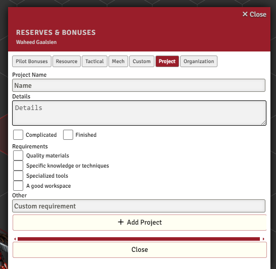

A faster way to add Lancer's pilot reserves and bonuses without digging through the compendium, including custom reserves, projects, and organizations. Search to filter, click to add it to the pilot.

 
