# Token Action HUD (TAH)

[← Back to the README](../../README.md) · Token bars: [TOKEN_DISPLAY.md](./TOKEN_DISPLAY.md)

Custom action menu attached to the token: actions, weapons, systems, frame abilities, talents, skills, statuses, scan glossary, and an action log. Beta. Enable in settings.

---

## Enabling and opening

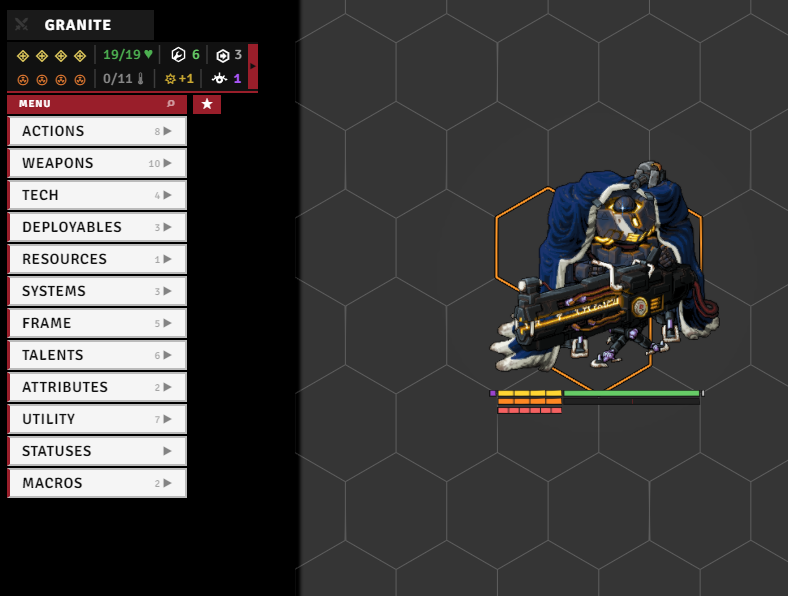

Enable it with the **`tahEnabled`** setting (needs a reload). It attaches near the top-left of the screen:

- **Move it** by dragging; the **lock** button locks the position, the **reset** button puts it back. Stays above open actor sheets (`aboveActorSheets`).
- Categories open on **hover** by default, or set **`clickToOpen`** to open them on click. `hoverCloseDelay` controls how long the menu lingers after the mouse leaves, and `maxColumnItems` makes long columns scroll.

 

## Settings

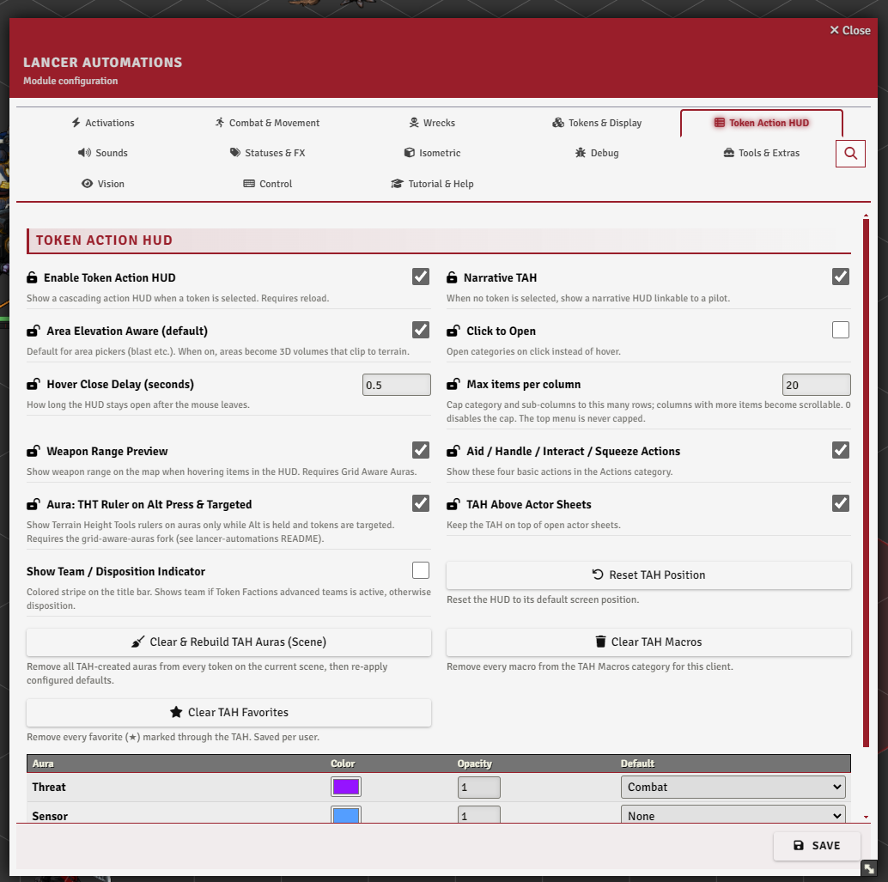

The **Token Action HUD** tab.

 

## The header

The bar at the top of the HUD shows:

- the **token name** - click it to open the actor sheet (shows "N TOKENS" when several are selected),
- a **combat toggle** (the swords icon) to add or remove the token from combat,
- an optional **team / disposition stripe** down the edge (`showDisposition`; uses Token Factions teams if installed, otherwise the disposition).

## Stats bar

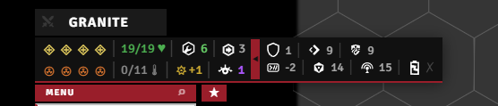

A compact readout under the header: **HP**, structure, overshield, repairs, and **movement** (used/cap in combat, or speed outside it); then **heat**, stress, pilot bond stress, burn, infection, overcharge, and reaction. A toggle slides out a **secondary row**: armor, evasion, e-defense, tech attack, save, sensor range, and core power.

 

## Combat bar

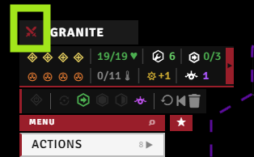

Appears while combat is running:

- **Activation pips** - click to spend one (start your turn), right-click to toggle availability by hand.
- An **end-turn** button (right-click to end the turn *and* give back one activation).
- **Action-status icons** (protocol / move / full / quick / reaction) you can toggle.
- Buttons to **reset actions**, **revert your last move**, and **clear movement history** (movement itself lives in [MOVEMENT.md](./MOVEMENT.md)).

 

## Action menus

The left column lists categories; opening one cascades its items out to the right. Which categories appear depends on the actor (mech / NPC / pilot / deployable).

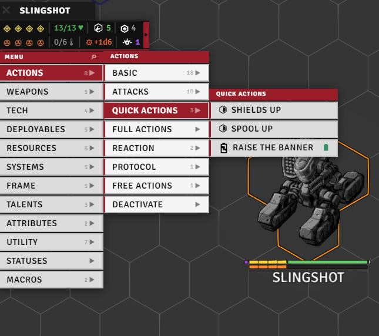

| Category | Holds |
|----------|-------|
| **Actions** | Basic quick and full actions, plus your quick / full / reaction / protocol / free actions, and a Deactivate group for active items |
| **Attacks** | Skirmish, Barrage, basic attack |
| **Weapons** | Equipped weapons, grouped by mount (mech) or listed flat (NPC / pilot) |
| **Tech** | Basic Tech, Scan, Lock On, Bolster, Invade |
| **Systems** | Equipped systems (mech) or system features (NPC) |
| **Frame** | Core system, traits, integrated systems, built-ins (mech); stats, traits, class features (NPC) |
| **Pilot / Pilot Gear** | Pilot stats, talents, gear, skills |
| **Talents / Skills** | Talent ranks and skill checks |
| **Deployables** | Deploy, recall, and link buttons, plus the actor's deployables |
| **Resources** | Counter cells for resources, extra trackables, and ammo |
| **Utility** | Combat (start/end turn, hide, reinforcement), gameplay (full repair, structure, overheat, resurrect, recharge, generate scan), movement (knockback, teleport, fall, revert), and the aura toggles |
| **Statuses** | Opens the status panel (below) |
| **Macros** | Your pinned macros (`macroList`); right-click a slot to edit it |

Toggle `showAidHandleInteractSqueeze` to show or hide the **Aid**, **Handle**, **Interact**, and **Squeeze** entries in the Actions category.

See also: movement actions → [MOVEMENT.md](./MOVEMENT.md), resurrect → [WRECK.md](./WRECK.md), reinforcement → [GAMEPLAY_AUTOMATION.md](./GAMEPLAY_AUTOMATION.md), scan → [GAMEPLAY_AUTOMATION.md](./GAMEPLAY_AUTOMATION.md).

## Item interaction

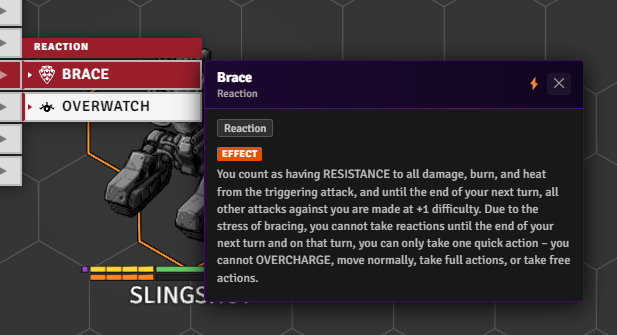

Right-click any item for a **detail popup** with its description, tags, range / activation, and action-type icon. Menu rows and popups also carry small markers.

 

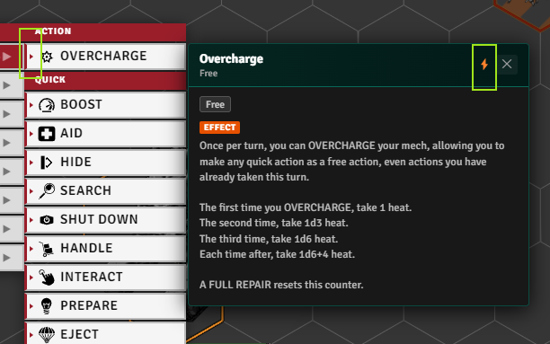

**Automation indicator** - a tiny triangle on the menu row, and ⚡ in the popup header, mean the item or action has automation.

 

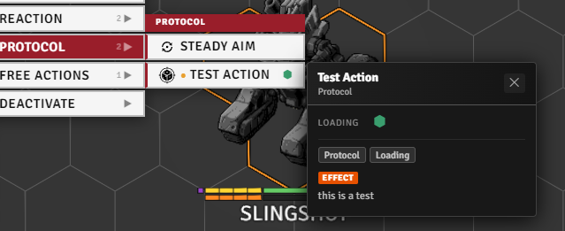

**Extra-action dot** - an orange ● before an action's name means it was added by extras-UI code (e.g. via `addExtraActions`, or attached to an item by a registered reaction) rather than by the system itself.

 

**Disable / destroy toggles** appear on items that support them (greyed when off, colored when on), and **status badges** show an item as available, active, destroyed (striped), or locked by a status (faded; clicking still fires it with a warning).

## Status panel

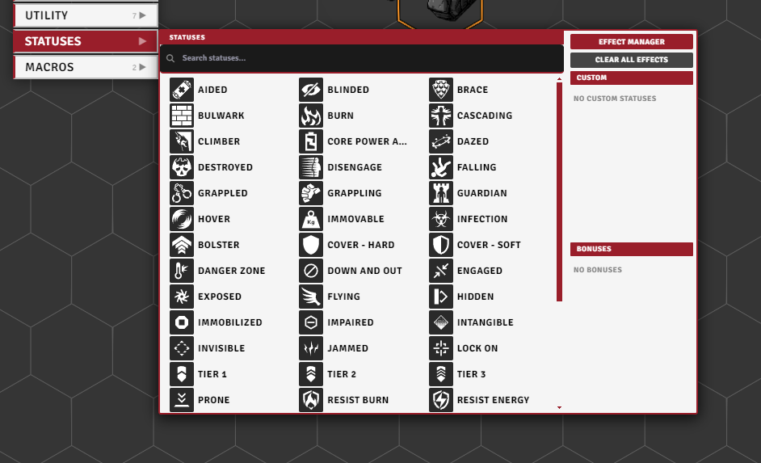

Search and toggle statuses on a grid: left-click adds or increments a stack, right-click removes one. When a status comes from several sources, a sub-manager lets you adjust each one. The panel also:

- lists the token's **bonuses** (with a trash button to remove them),
- links to the **Effect Manager** (see [EFFECTS_AND_BONUSES.md](./EFFECTS_AND_BONUSES.md)),
- has a **clear-all-effects** button,
- and shows your **custom statuses** when Temporary Custom Statuses is installed.

 

## Log panel

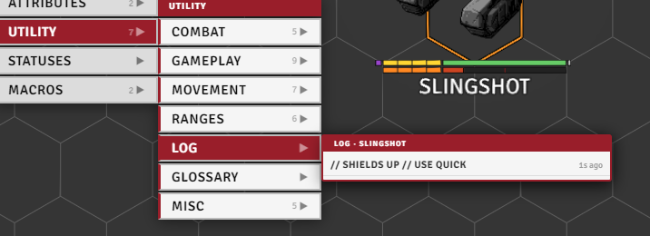

The token's last ~40 action cards, newest first. Click one to expand the full card again.

 

## Glossary panel

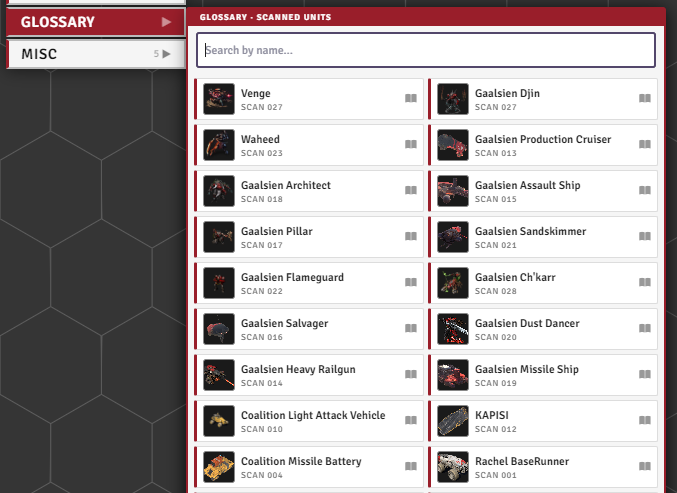

The scans you've run, shown with portraits and names and searchable by name. Click one to open its scan journal entry. (The scan tools themselves are in [GAMEPLAY_AUTOMATION.md](./GAMEPLAY_AUTOMATION.md).)

 

## Search, favorites, macros, and HUD position

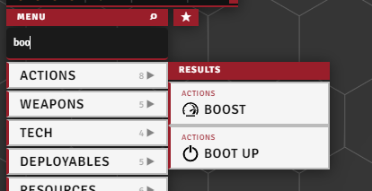

**Search** - press Alt+F (or click the search icon) to filter every category at once; matches gather into a single column as you type.

 

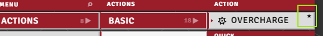

**Favorites** - Ctrl+right-click an item to star it; the star tab on the HUD's edge gathers your favorites in one place.

 

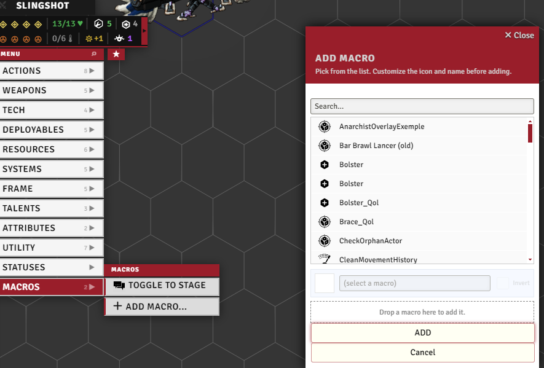

**Macro slots** - right-click a slot in the Macros row to open its edit dialog, then drop a macro from the hotbar onto the drop zone to assign it.

 

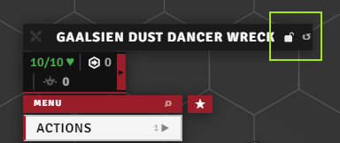

**HUD position** - the 🔒 icon on the title bar unlocks the HUD for dragging (cursor turns to grab, ↺ resets to default).

 

## Range and aura previews

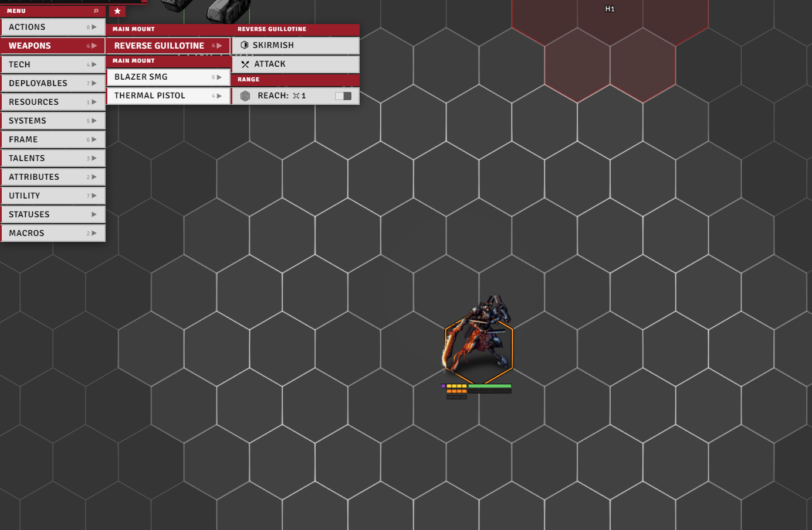

**Hover preview** - hovering a weapon or action pulses its range on the canvas (`rangePreview`); the attack card can pulse the attacker's range too (`rangePreviewOnAttackCard`). Works standalone, no extra module needed.

 

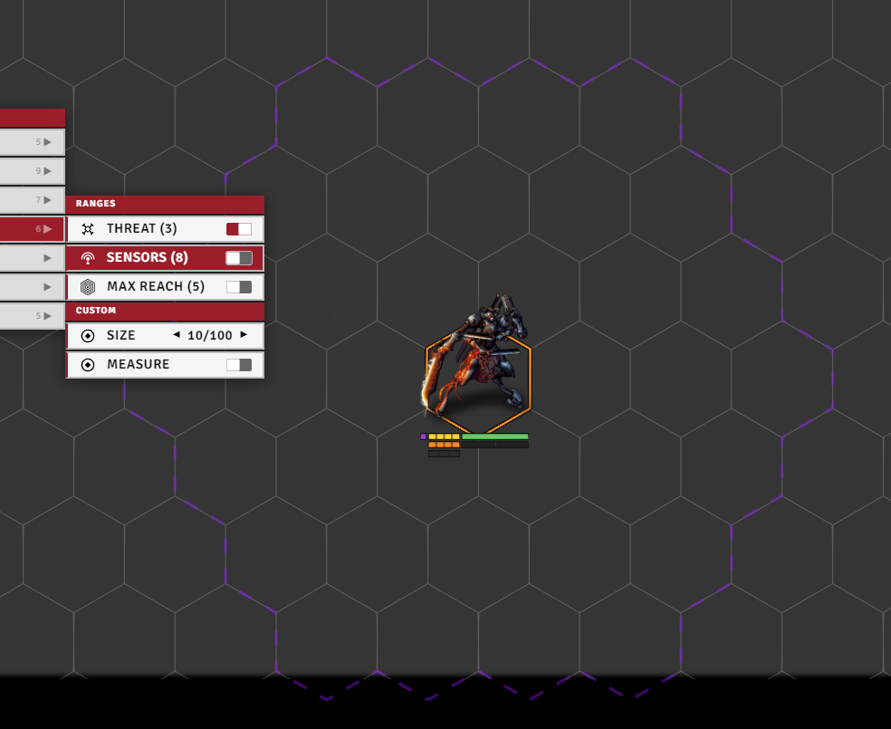

**Persistent auras** (requires [Grid-Aware Auras](../../README.md#optional-integrations)) - four you can toggle from the Utility menu: threat, sensor, max weapon range, and a custom measure. Each has its own color, opacity, and a default mode (off / in combat / always), and they're elevation-aware.

- With the auras fork plus Terrain Height Tools, `auraUseAltKey` shows THT rulers on the auras while you hold Alt on a targeted token.
- **Area Elevation Aware** (`areaElevationAware`, requires the auras fork) - default for area pickers (blast etc.); when on, areas become 3D volumes that clip to terrain.

 

## Narrative mode

With **`narrativeMode`** on, the HUD still shows when no token is selected, linked to one of your pilots (pick it from the header). Exposes the pilot-relevant categories: pilot, skills, resources, utility, macros.
