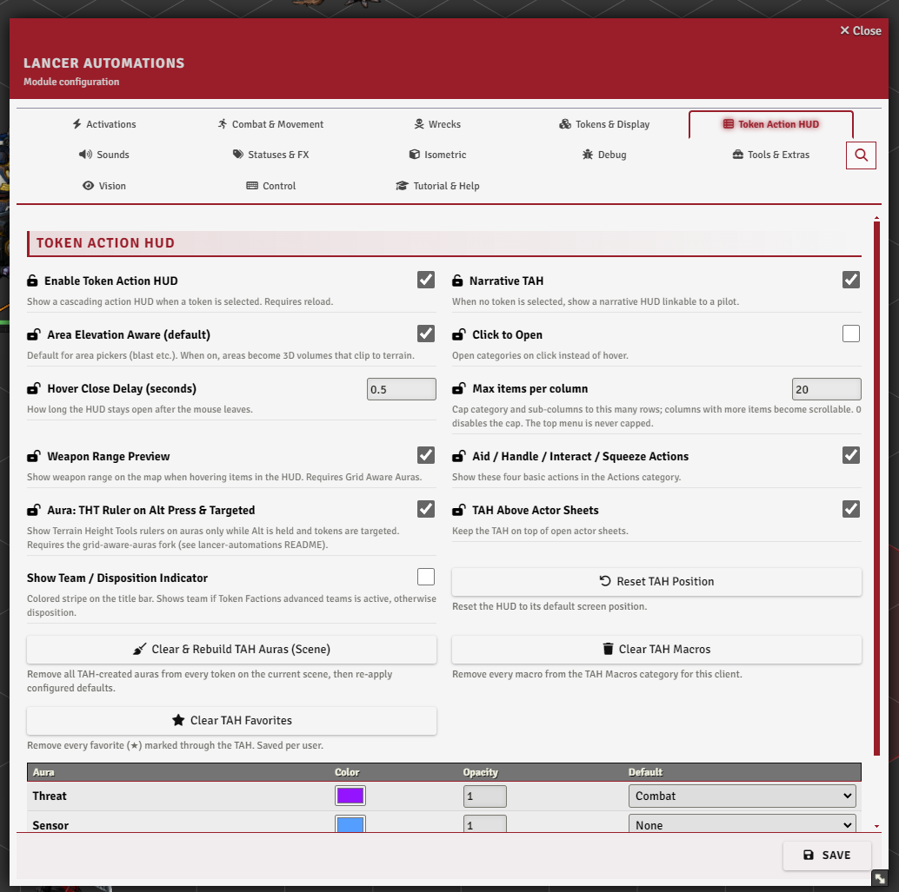
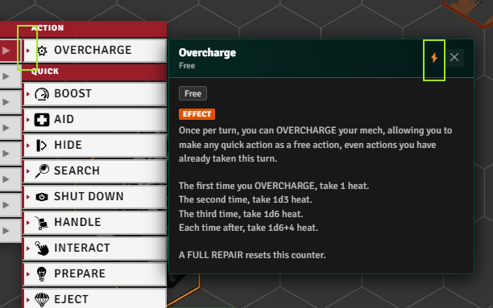
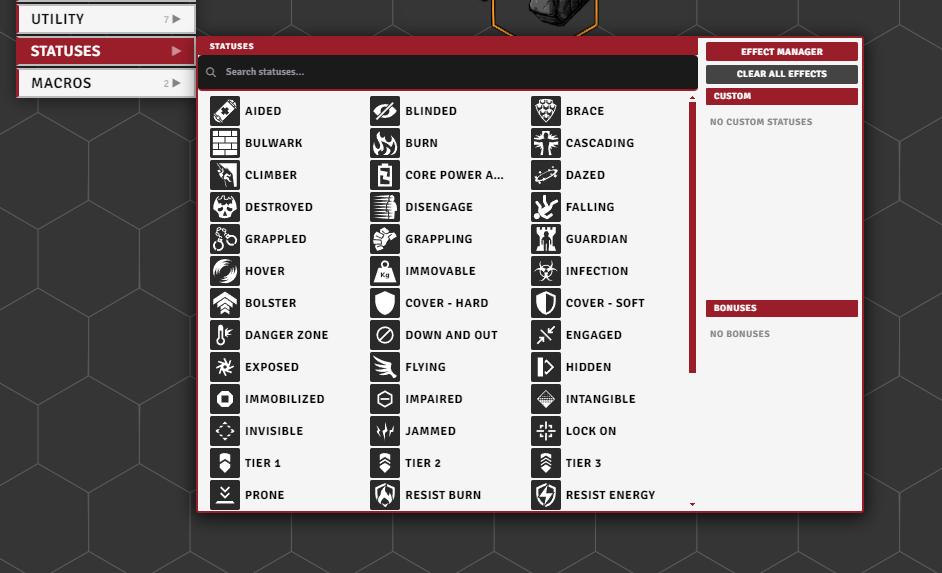
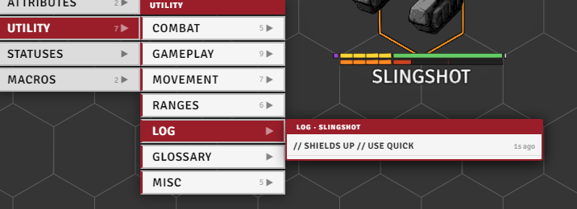
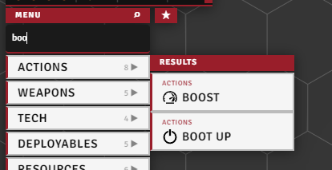
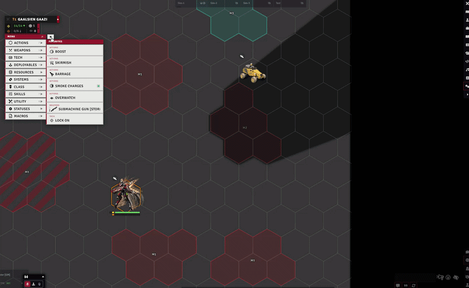
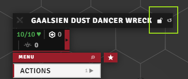
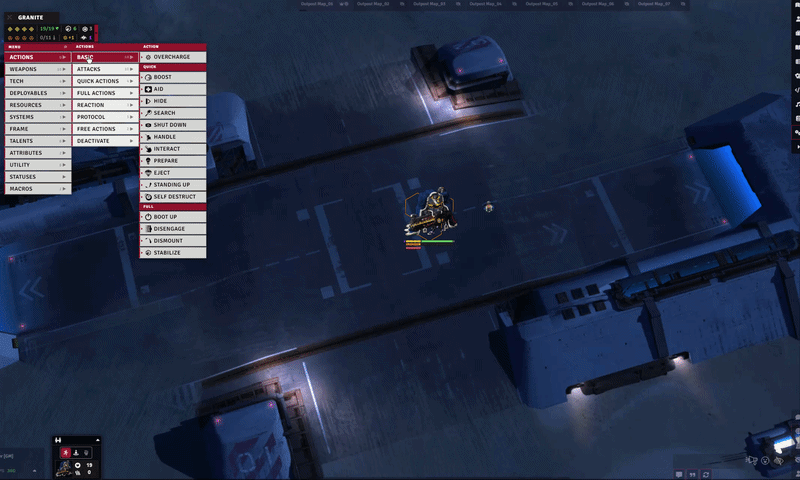

# Token Action HUD (TAH)

[← Back to Home](../index.md) · Token bars: [Token Display](./TOKEN_DISPLAY.md)

Custom action menu attached to the token: actions, weapons, systems, frame abilities, talents, skills, statuses, scan glossary, and an action log. Beta. On by default.

---

## Enabling and opening

It is on out of the box, from the **Enable Token Action HUD** setting (**`tahEnabled`**, needs a reload). It attaches near the top-left of the screen:

- **Move it** by dragging, after unlocking it: the HUD starts locked, so click the 🔒 on the title bar first. The **reset** button puts it back. Stays above open actor sheets (`tah.aboveActorSheets`).
- Categories open on **hover** by default, or set **`tah.clickToOpen`** to open them on click. `tah.hoverCloseDelay` controls how long the menu lingers after the mouse leaves, and `tah.maxColumnItems` makes long columns scroll.

Its settings live in the **Token Action HUD** tab.

 

---

## The header

The bar at the top of the HUD shows:

- the **token name** - click it to open the actor sheet (shows "N TOKENS" when several are selected),
- a **combat toggle** (the swords icon) to add or remove the token from combat,
- an optional **team / disposition stripe** down the edge (`tah.showDisposition`, uses Token Factions teams if installed, otherwise the disposition).

---

## Stats bar

A compact readout under the header: **HP**, structure, overshield, repairs, and **movement** (used/cap in combat, or speed outside it), then **heat**, stress, pilot bond stress, burn, infection, overcharge, and reaction. A toggle slides out a **secondary row**: armor, evasion, e-defense, tech attack, save, sensor range, and core power.

---

## Combat bar

Appears while combat is running:

- **Activation pips** - click to spend one (start your turn), right-click to toggle availability by hand.
- An **end-turn** button (right-click to end the turn *and* give back one activation).
- **Action-status icons** (protocol / move / full / quick / reaction) you can toggle.
- Buttons to **reset actions**, **revert your last move**, and **clear movement history** (movement itself lives in [Movement](./MOVEMENT.md)).

 

---

## Action menus

The left column lists categories. Opening one cascades its items out to the right. Which categories appear depends on the actor (mech / NPC / pilot / deployable).

| Category | Holds |
|----------|-------|
| **Actions** | Basic quick and full actions, an **Attacks** submenu (below), plus your quick / full / reaction / protocol / free actions, and a Deactivate group for active items |
| **Attacks** (in Actions) | Skirmish, Barrage, Ram, Grapple, Improvised Attack (mech / NPC), Fight (pilot), then a Tools group: Basic Attack, Damage, Throw Weapon, Pickup Weapon |
| **Weapons** | Equipped weapons, grouped by mount (mech) or listed flat (NPC / pilot) |
| **Tech** | Basic Tech, Scan, Lock On, Bolster, Invade |
| **Systems** | Equipped systems (mech) or system features (NPC) |
| **Frame** | Core system, traits, integrated systems, built-ins (mech). Stats, traits, class features (NPC) |
| **Pilot / Pilot Gear** | Pilot stats, talents, gear, skills |
| **Talents / Skills** | Talent ranks and skill checks |
| **Deployables** | Deploy, recall, and link buttons, plus the actor's deployables |
| **Resources** | Counter cells for resources, extra trackables, and ammo |
| **Utility** | Six submenus: **Gameplay** (full repair, structure, overheat, resurrect, recharge, reload, generate scan, Effect Manager, reinforcement, hide/reveal), **Movement** (knockback, teleport, fall, revert, reset history), **Measures** (see below), **Log**, **Glossary**, and **Misc** (Vote, Downtime, Reserve, Rest, Add Extra) |
| **Statuses** | Opens the status panel (below) |
| **Macros** | Your pinned macros (`tah.macroList`), right-click a slot to edit it |

Toggle `tah.showAidHandleInteractSqueeze` to show or hide the **Aid**, **Handle**, **Interact**, and **Squeeze** entries in the Actions category. These come from PPG (Prototype Pattern Group).

See also: movement actions → [Movement](./MOVEMENT.md), resurrect → [Wrecks](./WRECK.md), reinforcement → [Gameplay Automation](./GAMEPLAY_AUTOMATION.md), scan → [Gameplay Automation](./GAMEPLAY_AUTOMATION.md).

---

## Item interaction

Right-click any item for a **detail popup** with its description, tags, range / activation, and action-type icon. Menu rows and popups also carry the small markers below.

 

**Automation indicator** - a tiny triangle on the menu row, and ⚡ in the popup header, mean the item or action has automation.

 

**Extra-action dot** - an orange ● before an action's name means it was added by extras-UI code (e.g. via `addExtraActions`, or attached to an item by a registered activation) rather than by the system itself.

 

**Disable / destroy toggles** appear on items that support them (grayed when off, colored when on), and **status badges** show an item as available, active, destroyed (striped), or locked by a status (faded, clicking still fires it with a warning).

---

## Status panel

Press Shift+Z (or click the Statuses row) to open it. Search and toggle statuses on a grid: left-click adds or increments a stack, right-click removes one. When a status comes from several sources, a sub-manager lets you adjust each one. The panel also:

- lists the token's **bonuses** (with a trash button to remove them),
- links to the **Effect Manager** (see [Effects & Bonuses](./EFFECTS_AND_BONUSES.md)),
- has a **clear-all-effects** button,
- and shows your **custom statuses** when Temporary Custom Statuses is installed.

 

---

## Log panel

The token's last ~40 action cards, newest first. Click one to expand the full card again.

---

## Glossary panel

The scans you've run, shown with portraits and names and searchable by name. Click one to open its scan journal entry. (The scan tools themselves are in [Gameplay Automation](./GAMEPLAY_AUTOMATION.md).)

---

## Search, favorites, macros, and HUD position

**Search** - press Shift+F (or click the search icon) to filter every category at once. Matches gather into a single column as you type.

 

**Favorites** - Ctrl+right-click an item to pick its wheel. The star tab on the HUD's edge gathers your favorites in one place, and Shift+X opens or closes that column.

 

**Action Wheel** - press **F** on a selected token to get your favorites as a wheel around it. Click to use, right-click for details, hover for the range preview. **Tab** switches to the second wheel.

 

**Status Wheel** - press **G** for the token's statuses and your starred ones. Click to apply, right-click to remove.

 

**Wheel size** - *Wheel Radius Offset* under Radial Wheels moves the ring in or out.

 

**Macro slots** - right-click a slot in the Macros row to open its edit dialog, then drop a macro from the hotbar onto the drop zone to assign it.

 

**HUD position** - the 🔒 icon on the title bar unlocks the HUD for dragging (cursor turns to grab, ↺ resets to default).

 

---

## Keyboard control

With **`tah.keyboardNav`** on (default), you can drive the whole HUD from the keyboard:

- **Shift+WASD** moves a cursor through the menus: up/down within a column, left/right to step into a submenu or back out.
- **Shift+E** activates the focused row (left-click), **Shift+Q** opens its context action (right-click).
- The cursor clears after a spell of no input. **`tah.keyboardNavResetDelay`** sets how long it lingers.

The nav keys are rebindable under **TAH: Move / Activate / Context** in Foundry's Configure Controls. Bare W/A/S/D/Q/E nudge the selected token. Turn on **`tah.preventWasdMovement`** to block that during nav.

---

## Range previews and measures

**Hover preview** - hovering a weapon or action pulses its range on the canvas (`tah.rangePreview`). The attack card can pulse the attacker's range too (`tah.rangePreviewOnAttackCard`). Works standalone, no extra module needed.

 

**Range measures** - toggles in the Utility → Measures menu that drive the [Advanced Measure tool](./ATTACK_TARGETING.md) to pulse a range on the canvas: **Threat**, **Sensors**, **Max Reach**, and, when the Lancer ruler is on, **Movement**. A **Custom** measure lets you set a size and toggle it on.

 

**Area Elevation Aware** (`tah.areaElevationAware`) - not a measure, it is the default for the area pickers (blast, cone, and the like). When on, areas become 3D volumes that clip to terrain.

---

## Narrative mode

With **`tah.narrativeMode`** on, the HUD still shows when no token is selected, linked to one of your pilots (pick it from the header). Exposes the pilot-relevant categories: pilot, skills, resources, utility, macros.

## Notable options

| Option | What it does |
|:--|:--|
| **Token HUD buttons** | One toggle each for the buttons on Foundry's own token HUD: Status Effects, Combat State, Target State, and Revert Last Movement / Reset Movement History. |
| **Custom Status HUD Button** | Mirrors the Temporary Custom Statuses setting: adds its status button to Foundry's token HUD. |
| **Narrative TAH** | When no token is selected, show a narrative HUD linkable to a pilot. |
| **TAH Above Actor Sheets** | Keep the TAH on top of open actor sheets. |
| **Show Team / Disposition Indicator** | Colored stripe on the title bar: team if Token Factions advanced teams is active, otherwise disposition. |
| **Click to Open** | Open categories on click instead of hover. |
| **Hover Close Delay (seconds)** | How long the HUD stays open after the mouse leaves. |
| **Max items per column** | Rows per column before it scrolls (0 = no cap, top menu never capped). |
| **HUD Scale** | Size of the Token Action HUD and its popups. |
| **Weapon Range Preview** | Show weapon range on the map when hovering items in the HUD. Works standalone, no extra module needed. |
| **Aid / Handle / Interact / Squeeze Actions** | Show these actions in the Actions category. They come from PPG (Prototype Pattern Group). |
