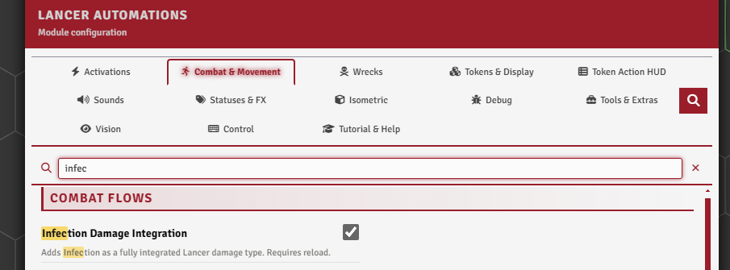
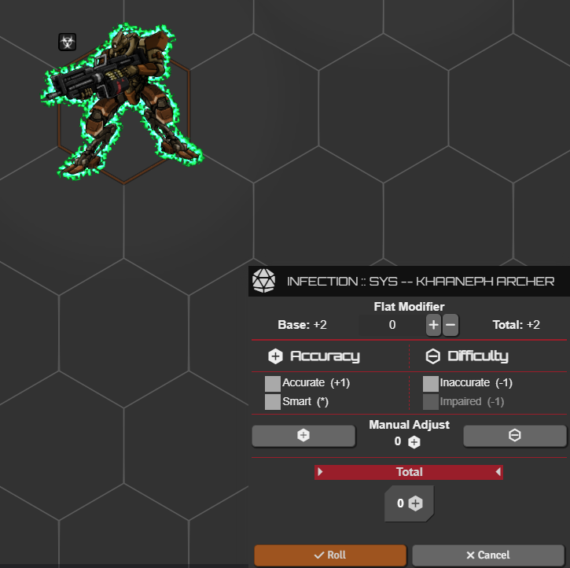
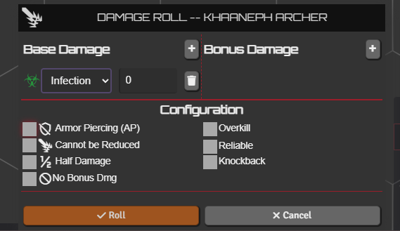
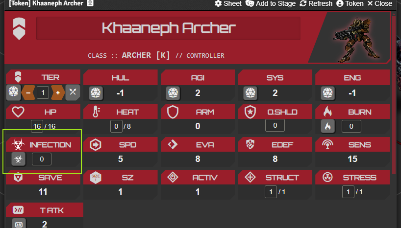

# Infection

[← Back to the README](../../README.md)

Infection is a damage type from [HORUS: Thy Hubris Manifest](https://cornylius.itch.io/thy-hubris-manifest) (by P.B. Cornylius), a heat-based cousin of Burn. Lancer Automations adds it as a damage type, with its end-of-turn check and sheet tracking.

---

## Settings

**Combat & Movement → Combat Flows** (the **`enableInfectionDamageIntegration`** toggle).

 

## How it works

Taking infection deals **Heat equal to the infection value** straight away, and stacks if the target already has some. At the end of its turn the token rolls a **Systems check**: on a success all infection clears, on a failure it takes Heat equal to its current infection. Anything that clears Burn, **Stabilize** or a **Full Repair**, clears infection too.

 

## Dealing it

**Infection** is a weapon damage type alongside Kinetic, Energy, and the rest, and it's resisted the same way. When an attack deals it, the damage card shows the infection amount with **Apply Heat** and **Undo** buttons.

 

## On the sheet

An **Infection** card sits next to Burn on the sheet, with a value field and a button to roll the end-of-turn check by hand. Infection is tracked on the actor, available as a token resource-bar option in the Token Config Resources tab.

 
