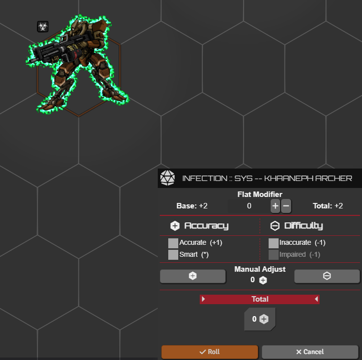
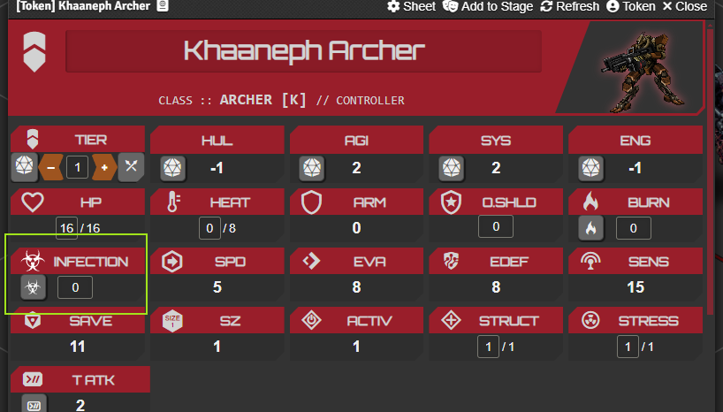

# Infection

[← Back to Home](../index.md)

Infection is a damage type from [HORUS: Thy Hubris Manifest](https://cornylius.itch.io/thy-hubris-manifest) (by P.B. Cornylius), a heat-based cousin of Burn. Lancer Automations adds it, with an end-of-turn check and sheet tracking.

---

## Settings

**Combat & Movement → Structure & Damage**, the **Infection Damage Integration** toggle (**`enableInfectionDamageIntegration`**).

 

---

## How it works

Taking infection deals **Heat equal to the infection value** straight away, and stacks if the target already has some.

At the end of its turn the token rolls a **Systems check**: on a success all infection clears, on a failure it takes Heat equal to its current infection.

Anything that clears Burn, **Stabilize** or a **Full Repair**, clears infection too.

 

---

## Dealing it

**Infection** is a weapon damage type alongside Kinetic, Energy, and the rest. Infection resistance halves it, though the Heat it deals can't be resisted.

When an attack deals it, the module appends the infection amount to the system's own "took X damage" message. There's no extra button: the system's **Apply damage** applies the infection too, and its **Undo** control is rewired to take the infection Heat back out along with the damage.

 

---

## On the sheet

An **Infection** card sits next to Burn on the sheet, with a value field and a button to roll the end-of-turn check by hand. On the alt sheet it's a bare **INFX** field next to Burn, with no roll button.

Infection is tracked on the actor, available as a token resource-bar option in the Token Config Resources tab for mechs and NPCs. Pilots don't get it.

 
