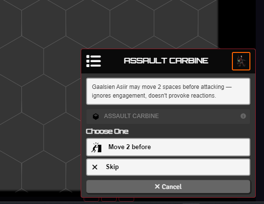
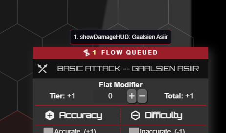
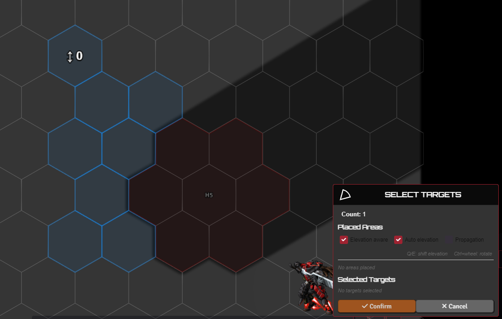
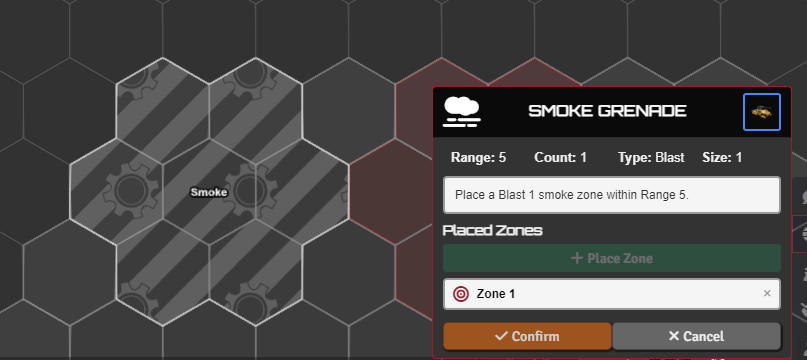
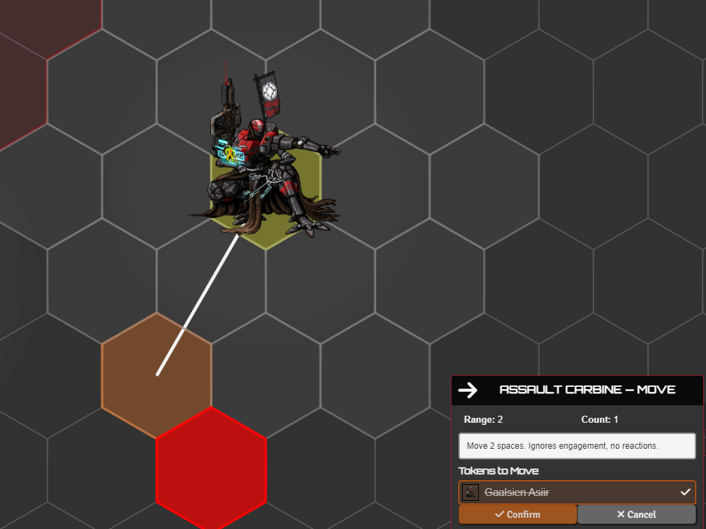
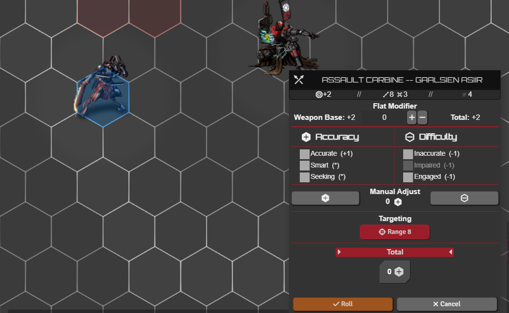
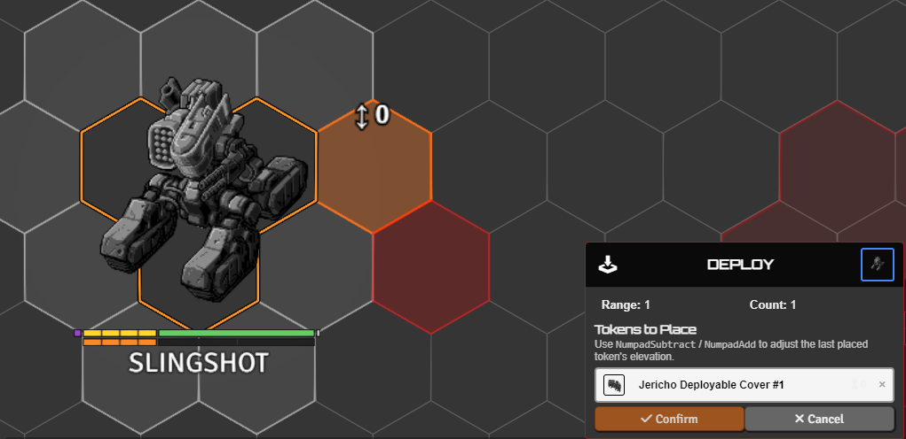
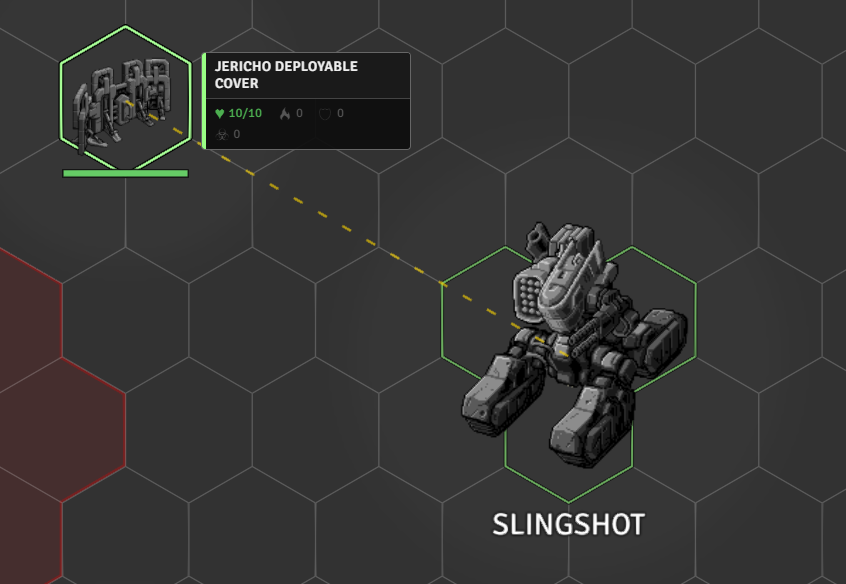
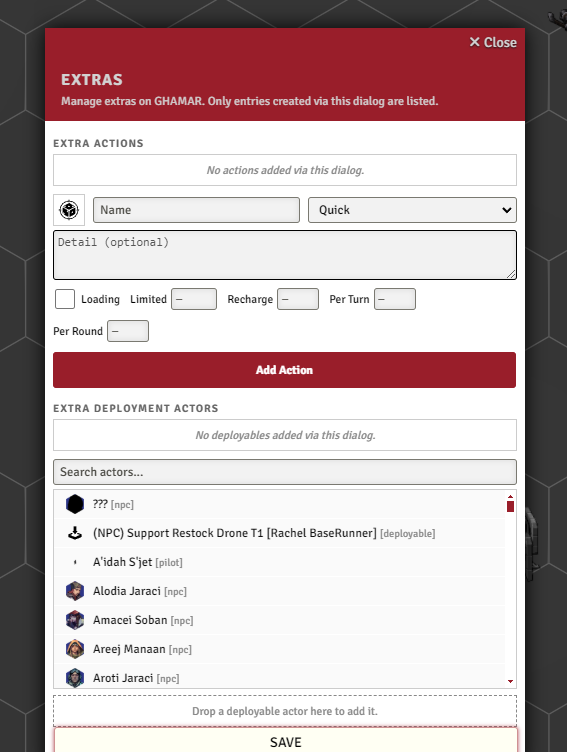
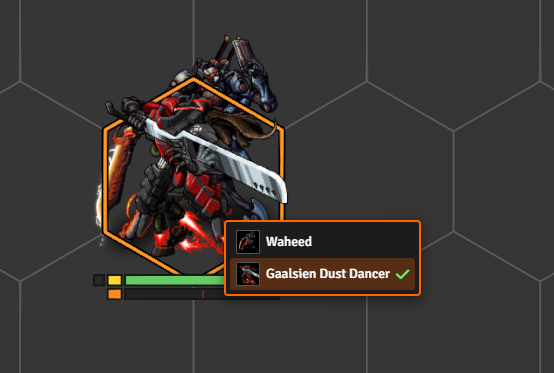

# Interactive Tools

[← Back to the README](../../README.md) · API: [API_INTERACTIVE.md](../API_INTERACTIVE.md)

Cards that ask players to choose or vote, and on-canvas tools to pick, place, and move tokens and zones. Automations and macros call these; the function signatures are in [API_INTERACTIVE.md](../API_INTERACTIVE.md).

---

## Choice cards

A choice card pauses and waits for a player to pick. `startChoiceCard` has four modes:

- **OR** - pick one option, the card closes.
- **AND** - every option must be clicked; each runs as soon as it's confirmed.
- **Vote** and **Hidden Vote** - the card is broadcast to its recipients; you watch a live tally and click **Confirm** to resolve (hidden keeps votes secret until then, ties are broken by you).

**`userIdControl`** routes a card to one player or a list (first to respond wins). A non-interactive **waiting card** (`startWaitCard`) shows "waiting for X" in the meantime. **openChoiceMenu** builds and sends a choice or vote card from a dialog, no code needed.

 

## Card and flow stacking

Lancer shows one roll card at a time, and so do these. When several fire at once (an area attack hitting five tokens, or a pile of reactions), they queue instead of overwriting each other: **attack, damage, and stat-roll** cards and the interactive cards above all wait their turn. A badge on the active card counts how many are still queued.

 

## Picking targets and areas

**chooseToken** highlights the valid tokens in range and asks you to pick one or more, with an optional **filter** (allies only, for example). For area effects it switches to **blast / cone / line / burst**: place the shape on the canvas, **Ctrl+wheel** to rotate, and toggle **elevation-aware**, **auto-elevation**, and **propagation** (flood-fill that terrain blocks). **pickSingleTargetToggle** skips the card: click a token to toggle it as your target.

 

## Placing zones

**placeZone** drops Blast / Cone / Line zones (through TemplateMacro). A zone can apply **status effects** to anyone inside, deal damage as a **dangerous zone**, or mark **difficult terrain** for the [ruler](./MOVEMENT.md). A zone can also follow a token.

 

## Moving and knocking back tokens

**knockBackToken** pushes or pulls tokens a set distance, one at a time, snapping to the grid and respecting obstacles. The **Knockback** checkbox in the damage dialog reads a weapon's Knockback tag and runs this after damage. **placeToken** drops tokens at grid-snapped spots, and **moveToken** moves or teleports a token while drawing a trace from start to destination.

 

## Targeting in attack and check flows

- **Target on an attack** - the attack HUD gets a full target / AoE picker; see [Attack Targeting](./ATTACK_TARGETING.md).
- **Target on a check** - with **`statRollTargeting`** on, a stat or skill roll (HULL / AGI / SYS / ENG) lets you pick a token to roll against, using its save or matching stat as the difficulty.
- **Range on the attack card** - **`rangePreviewOnAttackCard`** shows the attacker's range on the canvas when the attack card opens.

 

## Deployables

- **Place a deployable** - drop a drone, turret, or other deployable on the field (drones default to sensor range), and recall it when done. A deploy menu lists an actor's deployables.
- **Throw a weapon** - place a thrown weapon as a token on the ground (it's disabled in the sheet while it's out there) and pick it back up later.
- **Hard cover** - spawn a hard-cover token whose HP scales with its size.
- **Extra deployables** - attach extra deployables to an item that doesn't natively carry one.

 

With **`linkManualDeploy`**, a deployable you drag onto the scene yourself links to your token and fires its `onDeploy`, like the deploy menu does. **`showDeployableLines`** draws a line from an owner to its deployables on hover.

Delayed appearance / reinforcement is in [GAMEPLAY_AUTOMATION.md](./GAMEPLAY_AUTOMATION.md).

 

## Extras dialog

A GM dialog to attach **custom actions** (activation type, plus charges, recharge, and limited / per-turn / per-round uses) and **extra deployables** to an actor, without writing code. Open it from the TAH Utility menu.

 

## Overlap token picker

With **`overlapTokenPicker`** on, clicking a spot where tokens are stacked shows a small picker so you choose which one.

 

## Share Interactive Tools

With **`displayToolsToOthers`** on (the default), your in-progress tools, target picking, zone and token placement, and movement traces, show to other players as a faded ghost of the same shapes and highlights, so the table can follow what you're aiming. A hidden caster or hidden tokens are never broadcast.
