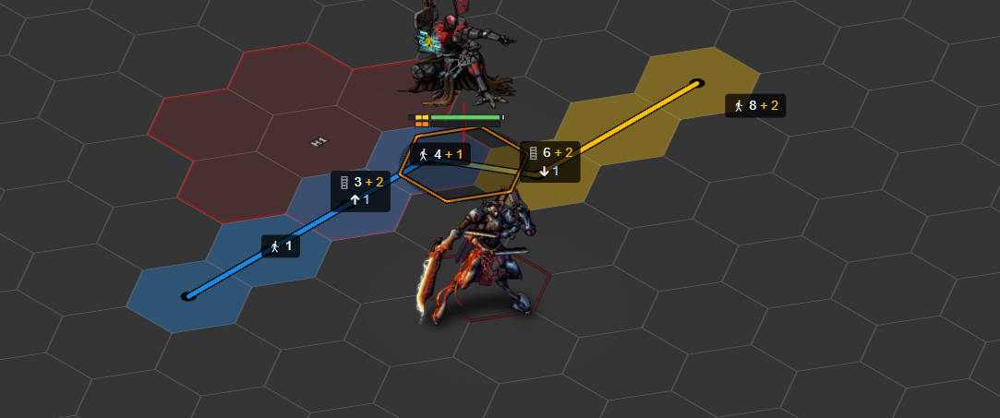
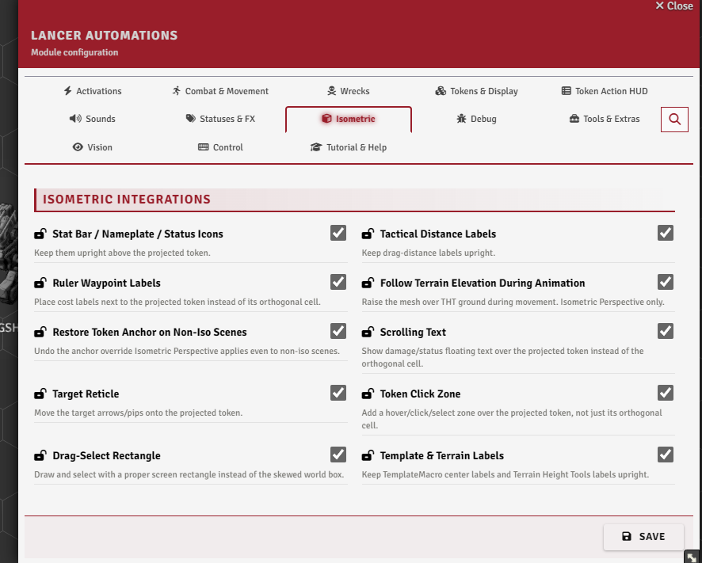

# Isometric Compatibility

[← Back to the README](../../README.md)

Lancer Automations works with the isometric modules, **isometric-perspective** and **grape_juice-isometrics**. It re-aligns its own overlays (stat bars, labels, the target reticle, and more) so they sit upright over the projected token instead of the flat grid cell, and on Isometric Perspective it animates a token's elevation over terrain.

---

## Settings

**Isometric → Isometric Integrations** (only appears when an isometric module is active).

## Terrain-follow elevation animation

**`iso.elevationAnimation`** - as a token moves over Terrain Height Tools terrain, its sprite rises and falls to follow the ground. **Isometric Perspective only** (not grape_juice-isometrics).

## Keeping the UI aligned

The rest of the toggles cancel the isometric skew on each overlay so it reads straight over the token. All are on by default; turn one off only if it clashes with something.

| Setting | Keeps aligned |
|---------|---------------|
| `iso.statBar` | Stat bars, nameplate, status icons |
| `iso.tacticalDistance` | Tactical distance drag labels |
| `iso.waypointLabel` | Ruler waypoint and cost labels |
| `iso.scrollingText` | Floating damage / heal / status text |
| `iso.targetReticle` | Target arrows and pips |
| `iso.clickZone` | The click and hover area (click the sprite, not the cell) |
| `iso.selectionMarquee` | The drag-select rectangle |
| `iso.moduleLabels` | TemplateMacro zone and THT terrain labels |
| `iso.restoreAnchor` | Fixes the token anchor on non-iso scenes (Isometric Perspective only) |
