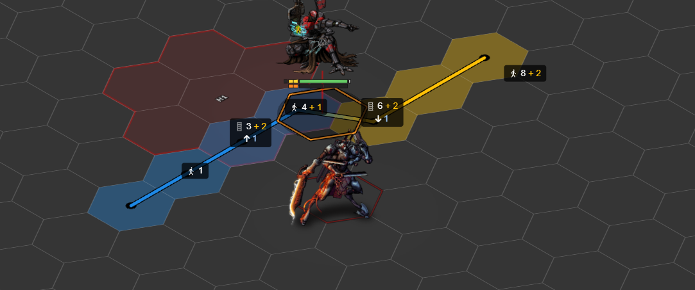
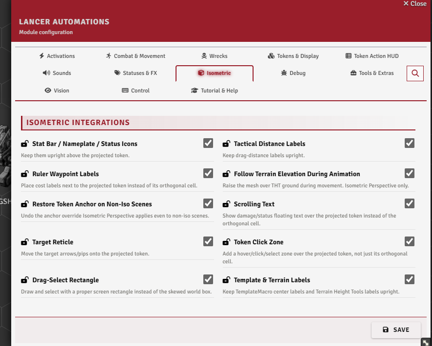

# Isometric Compatibility

[← Back to Home](../index.md)

Lancer Automations only supports **isometric-perspective**.

**grape_juice-isometrics** isn't supported and isn't tested. It may work, but issues specific to it won't be handled unless they're proven unrelated to it. Support may come later, it's not a priority right now.

It re-aligns its own overlays (stat bars, labels, target reticle, etc.) so they sit upright over the projected token instead of the flat grid cell, and on Isometric Perspective it animates a token's elevation over terrain.

---

## Settings

**Isometric → Isometric Integrations**. The tab is always there, but with neither isometric module active it renders greyed out with a tooltip naming what to install.

---

## Terrain-follow elevation animation

**Follow Terrain Elevation During Animation** (**`iso.elevationAnimation`**) - as a token moves over Terrain Height Tools terrain, its sprite rises and falls to follow the ground. **Isometric Perspective only** (not grape_juice-isometrics).

---

## Keeping the UI aligned

Each of the remaining toggles cancels the skew on one overlay. All are on by default. Turn one off only if it clashes.

| Setting | Keeps aligned |
|---------|---------------|
| **Stat Bar / Nameplate / Status Icons** (`iso.statBar`) | The bars, name and status icons drawn over the token |
| **Tactical Distance Labels** (`iso.tacticalDistance`) | The distance labels shown while dragging a token |
| **Ruler Waypoint Labels** (`iso.waypointLabel`) | Waypoint and movement-cost labels on the ruler |
| **Scrolling Text** (`iso.scrollingText`) | Floating damage / heal / status text |
| **Target Reticle** (`iso.targetReticle`) | Target arrows and pips |
| **Token Click Zone** (`iso.clickZone`) | The click and hover area (click the sprite, not the cell) |
| **Drag-Select Rectangle** (`iso.selectionMarquee`) | The marquee you drag to select, and what it catches |
| **Template & Terrain Labels** (`iso.moduleLabels`) | TemplateMacro zone and THT terrain labels |
| **Sequencer Effect Shape** (`iso.effectAspect`) | Sequencer effects: un-squashed on iso scenes, beams kept flat on non-iso scenes |
| **Restore Token Anchor on Non-Iso Scenes** (`iso.restoreAnchor`) | Fixes the token anchor on non-iso scenes (Isometric Perspective only) |

**Stat Bar / Nameplate / Status Icons**, **Target Reticle** and **Token Click Zone** are greyed out unless **Enable Custom Token Stat Bars** (**`tokenStatBar`**, Tokens & Display tab) is on. They realign what that system draws, so without it there's nothing to realign.
