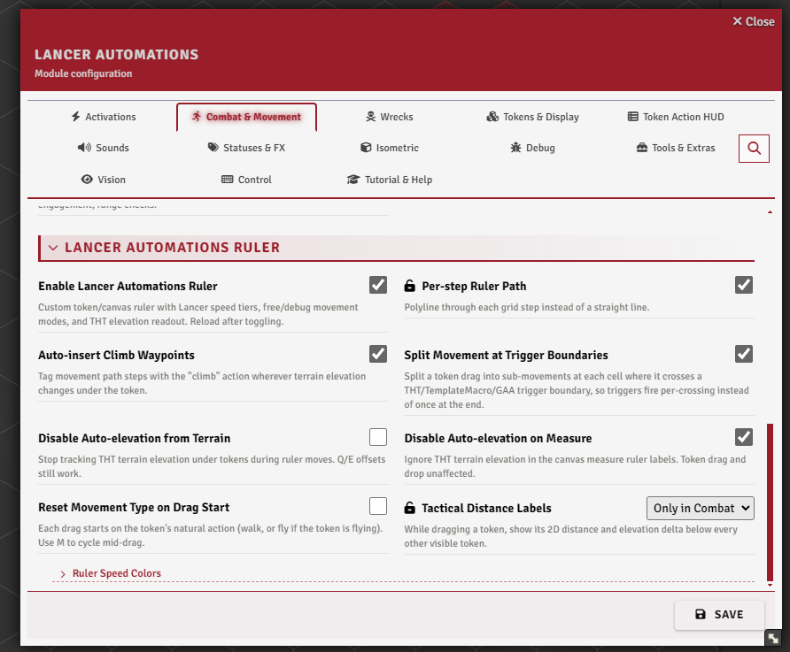
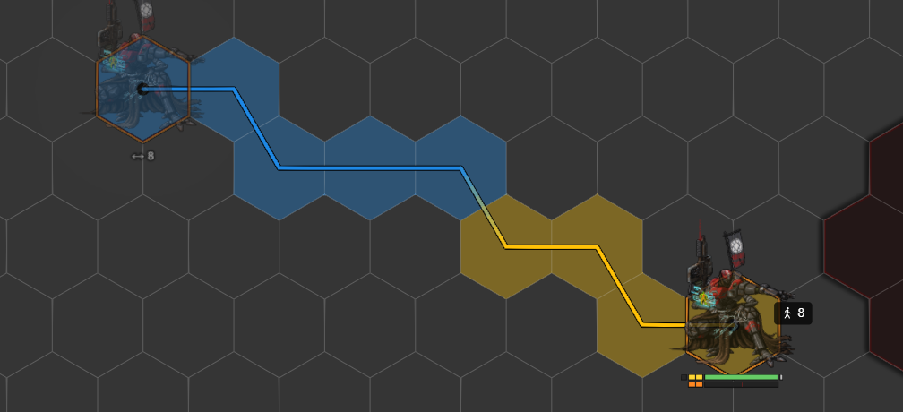
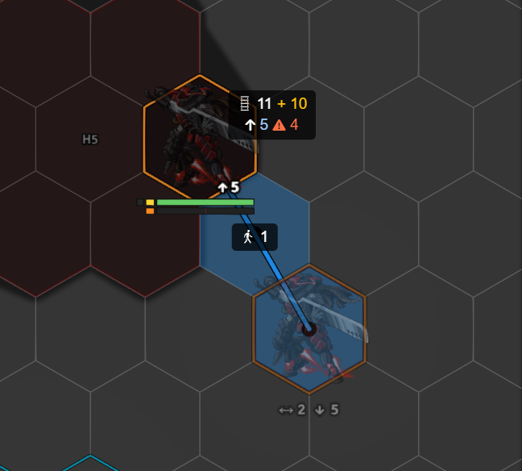
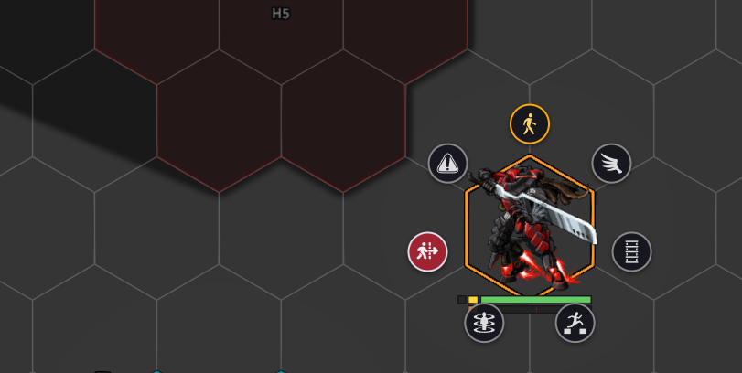
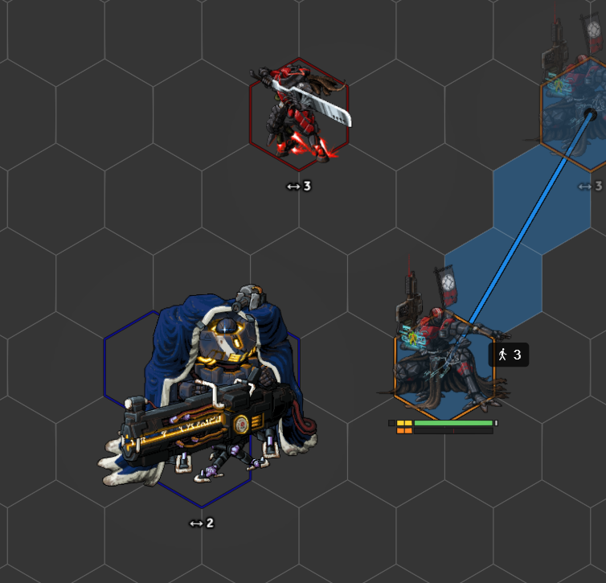
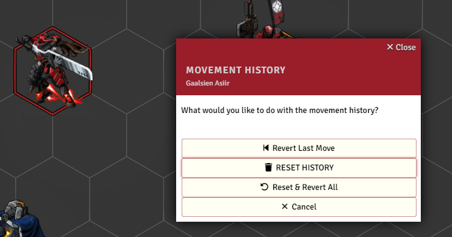

# Movement & the Lancer Ruler

[← Back to the README](../../README.md) · Advanced: [MOVEMENT_ADVANCED.md](./MOVEMENT_ADVANCED.md) · Isometric: [ISOMETRIC.md](./ISOMETRIC.md)

Lancer Automations ships its own token and canvas ruler, built around Lancer's speed tiers and elevation. Boost detection, the movement cap, and the debug toggles are in [MOVEMENT_ADVANCED.md](./MOVEMENT_ADVANCED.md).

---

## Settings

**Combat & Movement → Lancer Automations Ruler** (and its **Ruler Speed Colors** subsection).

 

## The Lancer ruler

Enable it with **`enableBuiltinSpeedProvider`** (reload after toggling; disable lancer-speed-provider if you have it). While you drag a token, the ruler shows the **movement cost** and colours the path by **speed tier**: standard, boost, and over-boost (mechs with Overcharge, or NPCs with Limitless). Free and forced moves get their own colours. All five colours are set in **Ruler Speed Colors**.

Each waypoint label shows the running cost, the delta from your last click, an ↑/↓ elevation change, and a ⚠ marker on cells that cross difficult terrain. Turn on **Per-step Ruler Path** (`rulerPerStepRender`) to draw the path through each grid cell instead of a straight line.

Status effects shape the tiers: **prone** halves speed, **slow** removes boost and over-boost, and **stunned / immobilized / shut down** stop movement entirely.

 

## How movement cost is figured

Cost is horizontal distance plus vertical climb plus any terrain penalties:

- **Difficult terrain** penalties are read from Terrain Height Tools, Grid-Aware Auras, TemplateMacro zones, and Foundry region *Modify Movement Cost* behaviours.
- **Climbing** costs a mech extra (the first grid unit is free, then one per unit), unless it's flying, has the climber status, or has an elevation-immunity bonus.
- **Flying** measures against the highest terrain it crosses rather than each step.
- Gridless scenes are supported, sampling penalties along the line.

Elevation also feeds combat range checks (overwatch, engagement, range) if you enable **`count3DDistance`** (in the Combat Flows settings).

## Elevation

During a drag, **Q** and **E** bump the token's elevation up and down by one grid unit per press (the offset resets when the drag starts).

With Terrain Height Tools, the token also **auto-elevates** to sit on the terrain under it, as you drag, on drop, and when you first place it. Your Q/E offset stacks on top. You can turn this off globally with **Disable Auto-elevation from Terrain** (`disableAutoTerrainElevation`), turn it off just for the measure ruler with **Disable Auto-elevation on Measure**, or opt a single token out with a flag.

**Auto-insert Climb Waypoints** (`enableClimbWaypoints`) splits the path with `climb` steps wherever terrain height changes, so the cost is billed at each climb.

 

## Movement types and the wheel

A token moves with a **movement type**: walk, fly, crawl (only while prone), forced, teleport, or ignore-elevation (skips auto-elevation). Gaining a **flying** or **hover** status switches the token to fly automatically, and back to walk when it's removed.

Press **M** for the **movement wheel**: outside a drag it opens a radial picker; during a drag it cycles the active type without moving the token. With **Reset Movement Type on Drag Start** (`resetMovementTypeOnDragStart`) on, each drag begins on the token's natural type (walk, or fly if it's flying), and you cycle from there with M.

 

## Keybinds

All four are rebindable under **Configure Controls → Lancer Automations**.

| Key | What it does |
|-----|--------------|
| **V** (hold) | **Free movement** - the next move doesn't spend the movement cap and ignores terrain penalties. |
| **B** (hold) | **Debug movement** - the next move is recorded by Foundry but skips automation (no `onMove`, no history, no engagement update). |
| **M** | **Movement wheel** - open the picker, or cycle the type mid-drag. |
| **Q / E** | During a drag, raise / lower elevation by one. |

## Tactical distance

While you drag a token, **Tactical Distance Labels** show the distance and elevation delta to every other visible token, right under each one. Set it to **off**, **only in combat**, or **always** (`enableTacticalDistance`).

 

## History and revert

Each token's moves are recorded during combat (distance, cost, whether dragged, free, or forced). From the [HUD](./HUD.md) combat bar you can **revert the last move** (teleport the token back) or **clear the history**.

History clears on combat start, and you can also clear it automatically at the end of each turn (`historyClearOnTurn`) or the start of each round (`historyClearOnRound`).

 
