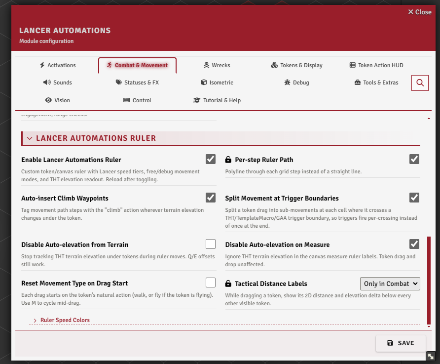
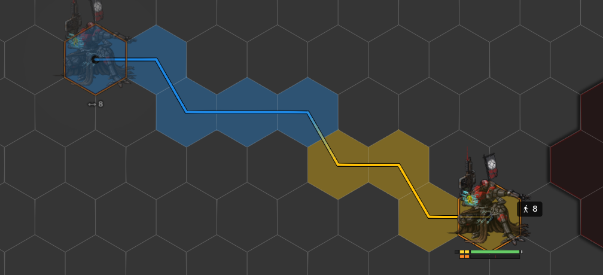
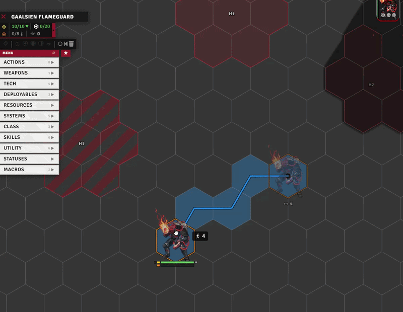
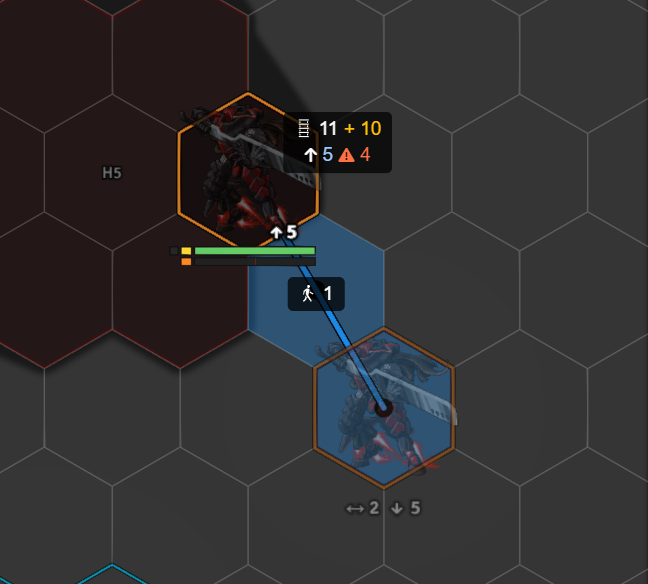
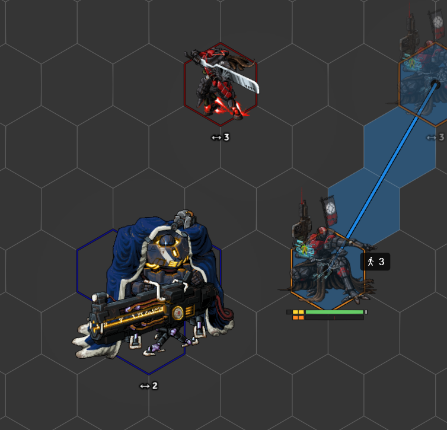

# Movement & the Lancer Ruler

[← Back to Home](../index.md) · Advanced: [Movement Advanced](./MOVEMENT_ADVANCED.md) · Isometric: [Isometric](./ISOMETRIC.md)

Lancer Automations ships its own token and canvas ruler, built around Lancer's speed tiers and elevation. Boost detection, the movement cap, and the debug toggles are in [Movement Advanced](./MOVEMENT_ADVANCED.md).

---

## Settings

**Combat & Movement → Lancer Automations Ruler**. The path colors live in the **Colors** tab, under **Ruler Colors**.

---

## The Lancer ruler

Turn on **Enable Lancer Automations Ruler** (`enableBuiltinSpeedProvider`) and reload. It conflicts with the standalone lancer-speed-provider module: with both active, the compatibility check offers to disable my ruler, so uninstall or disable lancer-speed-provider if you want to keep mine.

While you drag a token, the ruler shows the **movement cost** and colors the path by **speed tier**: standard, boost, and over-boost (mechs with Overcharge, or NPCs with Limitless). Free and forced moves get their own colors. All five colors are set in **Ruler Colors**, in the **Colors** tab.

Each waypoint label shows the running cost, the delta from your last click, an ↑/↓ elevation change, and a ⚠ marker on cells that cross difficult terrain. Turn on **Per-step Ruler Path** (`rulerPerStepRender`) to draw the path through each grid cell instead of a straight line.

Status effects shape the tiers: **prone** halves speed, **slow** removes boost and over-boost, and **stunned**, **immobilized**, **shut down**, **down and out** or **dazed** stop movement entirely.

 

---

## How movement cost is figured

**What you pay for.** Every step bills its horizontal distance plus its vertical distance, plus the worst difficult-terrain penalty on the cells it crosses. Climbing adds a surcharge on top of that vertical distance. **Difficult terrain** penalties are read from Terrain Height Tools, Grid-Aware Auras, TemplateMacro zones, and Foundry region *Modify Movement Cost* behaviors.

Then it depends on the movement type:

- **Walking** pays the climb surcharge: the first grid unit of a climb is free, every unit after it costs one extra. The vertical distance is billed either way, so a 3-unit climb costs 3 for the height and 2 for the surcharge, 5 in total. Flying, the climber status, and an elevation-immunity bonus all remove the surcharge.
- **Flying** measures against the highest terrain it crosses and holds altitude over dips. No climb surcharge.
- **Jumping** one cell across, rising no more than the token's SIZE (its Lancer size stat, in grid units), is a legal jump: it bills double the horizontal distance, the ascent is free, there is no climb surcharge, and only the landing cell's terrain penalty counts. A jump that goes further or higher is not legal and bills exactly like walking. Pathfinding and reach colors use the same pricing.
- **Obstructions** apply to tokens of SIZE 2 and larger: the token stands on the lowest hex under its body, and terrain under it rising less than its SIZE never lifts or bills it. Terrain SIZE or taller mounts as usual. SIZE 1 tokens always mount, as do pilots, humans, squads, specialists, and vehicles, and the `noObstructionPass` flag opts any token out.
- Gridless scenes are supported, sampling penalties along the line.

Elevation also feeds combat range checks (overwatch, engagement, range) if you enable **Count Elevation in Combat Distance** (`count3DDistance`), in **Combat & Movement → Movement & Boost**.

The ruler works with my forks of [Grid-Aware Auras](https://github.com/Agraael/FoundryVTT-Grid-Aware-Auras) and [Terrain Height Tools](https://github.com/Agraael/FoundryVTT-Terrain-Height-Tools), plus my [TemplateMacro](https://github.com/Agraael/templatemacro): set difficult terrain by painting it with THT, dropping a GAA aura, or placing a TemplateMacro zone, and the ruler bills the penalty as you cross it.

---

## Elevation

During a drag, **E** raises the token's elevation and **Q** lowers it, by one grid unit per press (the offset resets when the drag starts).

With Terrain Height Tools, the token also **auto-elevates** to sit on the terrain under it, as you drag, on drop, and when you first place it. Your E/Q offset stacks on top. You can turn that off three ways:

- **Globally** - **Disable Auto-elevation from Terrain** (`disableAutoTerrainElevation`).
- **Measure ruler only** - **Disable Auto-elevation on Measure**.
- **One token** - its own **`disableAutoTerrainElevation`** flag, or Terrain Height Tools' own `ignoreAutoElevation`.

**Auto-insert Climb Waypoints** (`enableClimbWaypoints`) splits the path with `climb` steps wherever terrain height changes, so the cost is billed at each climb. Fly only splits where it rises.

 

---

## Movement types and the wheel

A token moves with a **movement type**: walk, fly, jump, crawl (only while prone), forced, teleport, or ignore-elevation (skips auto-elevation). Gaining a **flying** or **hover** status switches the token to fly automatically, and back to walk when it's removed.

Press **M** for the **movement wheel**: outside a drag it opens a radial picker. During a drag it cycles the active type without moving the token.

 

---

## Keybinds

V, B, M and X are rebindable under **Configure Controls → Lancer Automations**. E and Q are Foundry's own zoom-in / zoom-out keys, so you rebind them under **Core**.

| Key | What it does |
|-----|--------------|
| **V** (hold) | **Free movement** - the next move doesn't spend the movement cap and ignores terrain penalties. |
| **B** (hold) | **Debug movement** - the next move is recorded by Foundry but skips automation (no `onMove`, no history, no engagement update). |
| **M** | **Movement wheel** - open the picker, or cycle the type mid-drag. |
| **X** | **Toggle Pathfinding** - flips drag pathfinding on or off for this session, over whatever the setting says. |
| **E / Q** | During a drag, raise / lower elevation by one. |

---

## Tactical distance

While you drag a token, **Tactical Distance Labels** (`enableTacticalDistance`) show the distance and elevation delta to every other visible token, right under each one. Set it to **off**, **only in combat**, or **always**.

 

---

## History and revert

Each token's moves are recorded during combat (distance, cost, whether dragged, free, or forced). From the [HUD](./HUD.md) combat bar you can **revert the last move** (retraces the token back along the path it took) or **clear the history**.

History clears on combat start. Two extra world settings clear it at the end of each turn (`historyClearOnTurn`) or the start of each round (`historyClearOnRound`). Neither has a UI row, so set them from the console with `game.settings.set('lancer-automations', 'historyClearOnTurn', true)`.

 

## Notable options

| Option | What it does |
|:--|:--|
| **Split Movement at Speed Tiers** | Split a drag into sub-movements where the ruler speed tier changes. |
| **Tactical Label Position** | Draws the distance label above or below the token. Defaults to below. |
| **Minimum Label Zoom Scale** | Below this zoom level the label keeps a constant screen size. 0 = disabled. |
| **Elevation Step (label)** | Round the label elevation delta to the nearest multiple of this. Ignored on gridless scenes. |
