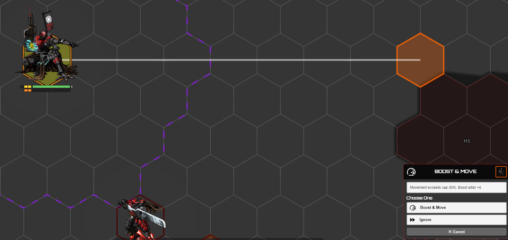

# Movement: Advanced & Beta

[← Back to the README](../../README.md) · Main guide: [MOVEMENT.md](./MOVEMENT.md)

The toggles here are advanced, and several are beta or work-in-progress. In the **Combat & Movement** tab: boost detection, the movement cap, the boost offer, path-hex, and 3D distance under **Combat Flows**, and trigger-boundary splits under **Lancer Automations Ruler**; the debug ones are in the **Debug** tab.

> [!WARNING]
> Boost detection and the movement cap are **beta**. They change how dragging a token behaves in combat, so test them yourself before using them at the table.

---

## Boost detection

**`experimentalBoostDetection`** tracks the cumulative cost of a token's intentional (dragged) movement and works out when it crosses a boost threshold. Boost N is counted once the running cost passes N times the token's speed.

When it fires, the `onMove` trigger data carries `moveInfo.isBoost` (this move crossed a threshold) and `moveInfo.boostSet` (which boost numbers were crossed). Cumulative movement resets when the move history clears (combat start, or per turn/round if you enabled those). **`debugBoostDetection`** shows a notification with the numbers each time it triggers.

## Movement cap and the offer cards

**`enableMovementCapDetection`** sets a movement cap from the token's speed when combat starts and cancels a drag that would exceed it. With **`enableBoostOffer`** also on, instead of cancelling it offers a card:

- **Boost & Move** - when one Boost would cover the overage. It moves up to the cap, fires the Boost action, then moves the rest.
- **Overcharge & Boost & Move** - for mechs (or NPCs with an Overcharge feature) when one Boost isn't enough but two are. It moves, Boosts, Overcharges, Boosts again, then finishes the move.

If neither is enough, the move is rejected with a reminder to hold the free-movement key. Choosing **Ignore** on a card runs the full move without the cap check.

 

## Split movement at trigger boundaries

**`splitMovementAtTriggerBoundaries`** (also in the Lancer Automations Ruler settings) splits a drag into sub-moves at each cell where the token crosses a trigger boundary - Terrain Height Tools, TemplateMacro, Grid-Aware Auras, or a Foundry region. The triggers then fire as the token visually reaches each boundary, instead of all at once at the end of the move. The visible path is unchanged.

## Path hex calculation

**`enablePathHexCalculation`** (default on) records the exact grid cells a move passes through, which interception and trigger logic use to know what the token crossed. **`debugPathHexCalculation`** draws those cells on the canvas for a few seconds.

## Debug

- **`debugMovement`** logs the per-cell cost calculation and draws terrain/climb/penalty overlays on the canvas during a move.
- **`debugBoostDetection`** notifies on each boost detection (see above).
- **`debugPathHexCalculation`** highlights the calculated path cells.
