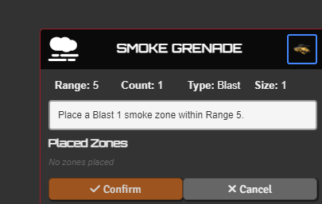
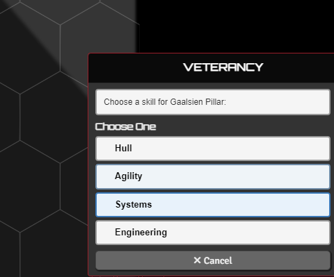
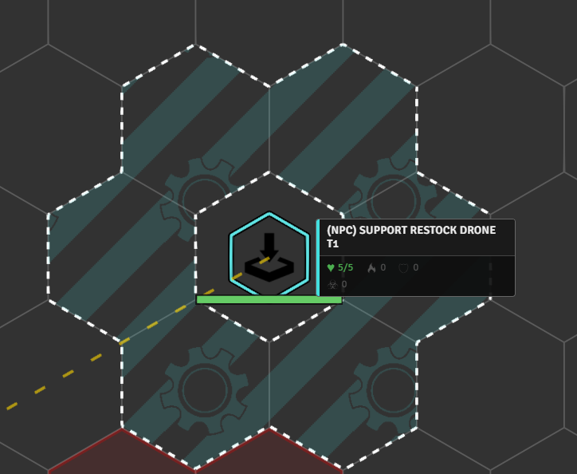

# Building NPC Automations - Worked Examples

[← Back to the README](../../README.md) · Engine guide: [AUTOMATION_ENGINE.md](./AUTOMATION_ENGINE.md) · API: [API_REFERENCE.md](../API_REFERENCE.md)

> [!WARNING]
> **These come from my personal NPC set** - teaching material, not a supported content pack. The LIDs, numbers, and balance are tuned for my own games, and **some are old and may not run as-is anymore** (the engine and API move on). Copy the patterns, not the literal code. See [the personal activation set](./AUTOMATION_ENGINE.md#the-personal-activation-set).

Each example teaches one engine concept, simplest first. Read [AUTOMATION_ENGINE.md](./AUTOMATION_ENGINE.md) first for the basics.

---

## 1. Insulated - a passive that runs on token creation

**What it does.** Makes the NPC immune to Burn (both the Burn status and Burn damage), set up automatically the moment the token is placed.

**Triggers:** none (`onInit` only)  ·  **Level:** simple

```js
const npcInsulatedBonus = {
    category: "NPC",
    itemType: "npc_feature",
    reactions: [{
        triggers: [],
        activationType: "none",
        onInit: async function (token, item, api) {
            if (!api || !token.actor) return;
            const bonusId = `insulated_${item.id}`;
            const bonuses = api.getConstantBonuses(token.actor);
            // Guard against adding it twice (onInit can run on every refresh).
            if (!bonuses.some(b => b.id === bonusId)) {
                await api.addConstantBonus(token.actor, {
                    id: bonusId,
                    name: "Insulated",
                    type: "multi",
                    bonuses: [
                        { type: "immunity", subtype: "effect", effects: ["burn"] },
                        { type: "immunity", subtype: "damage", damageTypes: ["Burn"] }
                    ]
                });
            }
        }
    }]
};
```

> [!TIP]
> `onInit` runs once on token creation, no trigger needed - ideal for passive setup. Check `getConstantBonuses` first so it isn't added twice. Constant bonuses are invisible and persistent (see [EFFECTS_AND_BONUSES.md](./EFFECTS_AND_BONUSES.md)).

---

## 2. Sapper Smoke Grenade - an action that drops a zone



**What it does.** A quick action that places a Blast 1 soft-cover smoke zone within Range 5.

**Triggers:** `onActivation`  ·  **Level:** simple

```js
"nrfaw-npc_npcf_sapper_kit_smoke_grenade_strider": {
    category: "NPC",
    itemType: "npc_feature",
    reactions: [{
        triggers: ["onActivation"],
        triggerSelf: true,
        actionType: "Quick Action",
        usesPerRound: 1,
        onlyOnSourceMatch: true,   // only fire for THIS feature
        autoActivate: true,
        activationType: "code",
        activationMode: "instead",
        activationCode: async function (triggerType, triggerData, reactorToken, item, activationName, api) {
            await api.placeZone(reactorToken, {
                range: 5, size: 1, type: "Blast",
                fillColor: "#808080", borderColor: "#ffffff",
                statusEffects: ["cover_soft"],   // anyone inside gets soft cover
                title: "SMOKE GRENADE", icon: "fas fa-smog", centerLabel: "Smoke"
            });
        }
    }]
}
```

> [!TIP]
> The simplest active automation: `onActivation` + `onlyOnSourceMatch` (so it fires only when *this* feature is used) + `autoActivate`, then one call to `placeZone`. The `statusEffects` array applies those effects to any token inside the zone automatically.

<br clear="right"/>

---

## 3. Veterancy - a combat-lifecycle pair with a choice card



**What it does.** On entering combat the NPC picks a skill (Hull / Agility / Systems / Engineering) and gains +1 accuracy on that kind of check; on leaving combat the bonus is removed.

**Triggers:** `onEnterCombat`, `onExitCombat`  ·  **Level:** simple

```js
const veterancyVeteranReaction = {
    category: "NPC",
    itemType: "npc_feature",
    reactions: [{
        triggers: ["onEnterCombat"],
        triggerSelf: true,
        autoActivate: true,
        activationType: "code",
        activationMode: "instead",
        evaluate: function (triggerType, triggerData, reactorToken, item, activationName, api) {
            const bonuses = api.getConstantBonuses(reactorToken.actor);
            return !bonuses.some(b => b.id === `veterancy_${reactorToken.actor.id}`);
        },
        activationCode: async function (triggerType, triggerData, reactorToken, item, activationName, api) {
            const skills = [
                { text: "Hull", icon: "cci cci-hull", tag: "hull" },
                { text: "Agility", icon: "cci cci-agility", tag: "agility" },
                { text: "Systems", icon: "cci cci-systems", tag: "systems" },
                { text: "Engineering", icon: "cci cci-engineering", tag: "engineering" }
            ];
            const choices = skills.map(s => ({
                text: s.text, icon: s.icon,
                callback: async () => {
                    await api.addConstantBonus(reactorToken.actor, {
                        id: `veterancy_${reactorToken.actor.id}`,
                        name: `Veterancy (${s.text})`,
                        val: 1, type: "accuracy", rollTypes: [s.tag]
                    });
                }
            }));
            await api.startChoiceCard({ title: "VETERANCY", description: `Choose a skill for ${reactorToken.name}:`, choices });
        }
    }, {
        triggers: ["onExitCombat"],
        triggerSelf: true,
        autoActivate: true,
        activationType: "code",
        activationMode: "instead",
        activationCode: async function (triggerType, triggerData, reactorToken, item, activationName, api) {
            await api.removeConstantBonus(reactorToken.actor, `veterancy_${reactorToken.actor.id}`);
        }
    }]
};
```

> [!TIP]
> Two reactions tied to the combat lifecycle. The `evaluate` gate stops it re-firing, `startChoiceCard` shows the buttons (each with a `callback`), and pairing add-on-enter with remove-on-exit keeps the bonus from lingering.

<br clear="right"/>

---

## 4. Dispersal Shield - target selection, a roll, and consumable stacks

**What it does.** Grants a friendly target in sensor range resistance to all damage for the next `1d3` attacks.

**Triggers:** `onActivation`  ·  **Level:** medium  ·  *(also in the [README](../../README.md))*

```js
"npcf_dispersal_shield_priest": {
    itemType: "npc_feature",
    reactions: [{
        triggers: ["onActivation"],
        triggerSelf: true,
        actionType: "Quick Action",
        onlyOnSourceMatch: true,
        autoActivate: true,
        activationType: "code",
        activationMode: "instead",
        activationCode: async function (triggerType, triggerData, reactorToken, item, activationName, api) {
            const targets = await api.chooseToken(reactorToken, {
                count: 1,
                range: reactorToken.actor.system.sensor_range,
                includeSelf: true,
                filter: (t) => api.isFriendly(reactorToken, t)
            });
            const target = targets?.[0] || reactorToken;
            const roll = await new Roll("1d3").evaluate();
            await roll.toMessage({ speaker: ChatMessage.getSpeaker({ token: reactorToken.document }), flavor: `${activationName} - Resistance charges` });
            const charges = roll.total;
            const resistances = [
                "lancer.statusIconsNames.resistance_heat",
                "lancer.statusIconsNames.resistance_kinetic",
                "lancer.statusIconsNames.resistance_explosive",
                "lancer.statusIconsNames.resistance_burn",
                "lancer.statusIconsNames.resistance_energy"
            ];
            await api.applyFlaggedEffectToTokens({
                tokens: [target],
                effectNames: resistances,
                note: `Dispersal Shield (${charges} charges)`,
                duration: { label: 'indefinite', turns: null, rounds: null, overrideTurnOriginId: reactorToken.id },
            }, {
                stack: charges,
                consumption: { trigger: "onDamage", originId: target.id, grouped: true }
            });
        }
    }]
}
```

> [!TIP]
> `chooseToken` highlights valid targets in `range` and runs a `filter` (here, friendlies only). The `stack` is set from a `1d3` roll, and `consumption: { trigger: "onDamage", grouped: true }` burns one charge each time the target takes damage. When the stack hits zero the effects clear themselves.

---

## 5. Smoke Launchers - tracking state with actor flags

**What it does.** Places a Blast 2 smoke zone that persists until the start of the NPC's next turn, then cleans itself up.

**Triggers:** `onActivation`, `onTurnStart`  ·  **Level:** medium  ·  *(also in the [README](../../README.md))*

```js
"nrfaw-npc_carrier_SmokeLaunchers": {
    itemType: "npc_feature",
    reactions: [{
        triggers: ["onActivation"],
        triggerSelf: true,
        actionType: "Quick Action",
        usesPerRound: 1,
        onlyOnSourceMatch: true,
        autoActivate: true,
        activationType: "code",
        activationMode: "instead",
        activationCode: async function (triggerType, triggerData, reactorToken, item, activationName, api) {
            const result = await api.placeZone(reactorToken, {
                range: 5, size: 2, type: "Blast",
                fillColor: "#808080", borderColor: "#ffffff",
                statusEffects: ["cover_soft"]
            }, 2);
            // Remember the template so we can delete it next turn.
            if (result?.template) {
                const existing = reactorToken.actor.getFlag("lancer-automations", "smokeTemplates") || [];
                existing.push(result.template.id);
                await reactorToken.actor.setFlag("lancer-automations", "smokeTemplates", existing);
            }
        }
    }, {
        triggers: ["onTurnStart"],
        triggerSelf: true,
        autoActivate: true,
        activationType: "code",
        activationMode: "instead",
        activationCode: async function (triggerType, triggerData, reactorToken, item, activationName) {
            const templates = reactorToken.actor.getFlag("lancer-automations", "smokeTemplates") || [];
            if (!templates.length) return;
            for (const id of templates) {
                const template = canvas.scene.templates.get(id);
                if (template) await template.delete();
            }
            await reactorToken.actor.unsetFlag("lancer-automations", "smokeTemplates");
        }
    }]
}
```

> [!TIP]
> The **place-and-clean-up** idiom: one reaction places something and stores its id in an actor flag, a second reaction reads that flag on a later trigger and tears it down. Flags are how you carry state between separate reactions and across turns.

---

## 6. Moving Target - interrupting movement with `onPreMove`

**What it does.** When an enemy moves within 20 of the sniper, it can interrupt that movement and fire its Anti-materiel Rifle.

**Triggers:** `onPreMove`  ·  **Level:** advanced

```js
const movingTargetSniperReaction = {
    category: "NPC",
    itemType: "npc_feature",
    reactions: [{
        triggers: ["onPreMove"],
        triggerOther: true,            // react to OTHERS moving, not ourselves
        actionType: "Reaction",
        frequency: "1/Round",
        autoActivate: true,
        awaitActivationCompletion: true,  // required: this cancels a move
        requireCanProvoke: true,
        checkReaction: true,
        activationType: "code",
        activationMode: "instead",
        evaluate: function (triggerType, triggerData, reactorToken, item, activationName, api) {
            const mover = triggerData.triggeringToken;
            if (triggerData.moveInfo?.isInvoluntary) return false;
            if (triggerData.distanceToTrigger > 20) return false;
            if (api.isFriendly(reactorToken, mover)) return false;
            return true;
        },
        activationCode: async function (triggerType, triggerData, reactorToken, item, activationName, api) {
            const mover = triggerData.triggeringToken;
            let responderIds = [];
            // preConfirm: ask the sniper's owner whether to interrupt, BEFORE the move is cancelled.
            const preConfirm = async () => {
                const result = await api.startChoiceCard({
                    title: "INTERRUPT MOVEMENT?",
                    description: `${mover.name} is moving into ${reactorToken.name}'s sights.`,
                    item, originToken: mover, relatedToken: reactorToken,
                    userIdControl: api.getTokenOwnerUserId(reactorToken),
                    choices: [
                        { text: "Interrupt", icon: "fas fa-crosshairs", callback: async () => {} },
                        { text: "Let pass", icon: "fas fa-times", callback: async () => {} }
                    ]
                });
                responderIds = result?.responderIds ?? [];
                if (result?.choiceIdx === 0) triggerData.startRelatedFlowToReactor(responderIds[0]);
                return result?.choiceIdx === 0;   // true cancels the move
            };
            triggerData.cancelTriggeredMove?.(
                `${reactorToken.name} is interrupting ${mover.name}'s movement.`,
                true, api.getTokenOwnerUserId(mover), preConfirm, /* postChoice */ undefined,
                { item, originToken: reactorToken, relatedToken: mover }
            );
        },
        // onMessage runs on the sniper owner's client, to actually fire the weapon.
        onMessage: async function (triggerType, data, reactorToken, item, activationName, api) {
            const mover = canvas.tokens.get(data.moverTokenId) ?? null;
            const rifle = api.findItemByLid(reactorToken.actor, "npcf_anti_materiel_rifle_sniper");
            if (!rifle) return;
            if (rifle.system?.loaded === false) { await api.reloadOneWeapon(reactorToken); return; }
            if (mover) canvas.tokens.setTargets([mover.id]);
            await api.beginWeaponAttackFlow(rifle, {});
        }
    }]
};
```

> [!TIP]
> The canonical interrupt. `onPreMove` fires before the move runs, so the cancel code can't be async - hence `awaitActivationCompletion`. `cancelTriggeredMove` takes a `preConfirm` (a choice card) deciding whether to stop the move; firing the weapon is handed to the reactor's client via `onMessage`. Cancel rules: [AUTOMATION_SYSTEM.md](../AUTOMATION_SYSTEM.md).

---

## 7. Restock Drone - a deployable on an NPC



**What it does.** A support feature that can deploy a Restock Drone. When the drone lands it gets a healing aura; allies that enter the aura can spend it to heal (or reload, in the rebake variant).

**Triggers:** `onDeploy` (+ `onInit` to register the deployable)  ·  **Level:** advanced

```js
const restockDroneSupportReaction = {
    category: "NPC",
    itemType: "npc_feature",
    reactions: [{
        // React when WE deploy this feature's drone.
        triggers: ["onDeploy"],
        triggerSelf: true,
        onlyOnSourceMatch: true,
        outOfCombat: true,
        autoActivate: true,
        activationType: "code",
        activationMode: "instead",
        activationCode: async function (triggerType, triggerData, reactorToken, item, activationName, api) {
            const deployedToken = triggerData.deployedTokens?.[0];
            if (!deployedToken) return;
            const tier = reactorToken.actor.system.tier;
            const healAmount = tier === 3 ? 15 : tier === 2 ? 10 : 5;
            // Build the aura ON THE DEPLOYED DRONE, not on us.
            await api.createAura(deployedToken, {
                name: "Restock Drone Zone",
                radius: 1, elevationAware: true, disposition: 1,
                shape: { type: "cylinder", radius: 1 },
                macros: [{
                    mode: "ENTER",
                    function: async (token, parent, aura, options) => {
                        const lancerApi = game.modules.get('lancer-automations')?.api;
                        if (!lancerApi || !options.hasEntered) return;
                        if (!lancerApi.isFriendly(token, parent)) return;
                        await lancerApi.startChoiceCard({
                            title: "RESTOCK DRONE",
                            description: `${token.name} entered the Restock Drone's zone.`,
                            icon: "fas fa-battery-full",
                            choices: [{
                                text: `Regain ${healAmount} HP`, icon: "fas fa-heart",
                                callback: async () => {
                                    const hp = token.actor.system.hp;
                                    await token.actor.update({ "system.hp.value": Math.min(hp.max, hp.value + healAmount) });
                                    await parent.delete();   // consume the drone
                                }
                            }]
                        });
                    }
                }]
            });
        }
    }, {
        // Register the deployable(s) on this feature so the deploy macro can place them.
        triggers: [],
        activationType: "none",
        onInit: async function (token, item, api) {
            await api.addItemFlags(item, { deployRange: 5 });
            // These drone LIDs are from a custom LCP - point them at any deployable LID you want.
            await api.addExtraDeploymentLids(item, [
                "dep_(npc)_support_restock_drone_t1",
                "dep_(npc)_support_restock_drone_t2",
                "dep_(npc)_support_restock_drone_t3"
            ]);
        }
    }]
};
```

> [!TIP]
> Both halves of "a deployable on an NPC": `onInit` uses `addExtraDeploymentLids` to attach the deployable, and `onDeploy` (with `triggerSelf` + `onlyOnSourceMatch`) reads `deployedTokens[0]` and builds a `createAura` on the deployed drone. See [self-deploy in AUTOMATION_SYSTEM.md](../AUTOMATION_SYSTEM.md#self-deployable-reacting-to-your-own-deploy).

<br clear="right"/>

---

## 8. Defense Net - a self-deploying aura (capstone)

**What it does.** A Full Action that immobilizes the NPC and projects a Defense Net aura granting bonuses to nearby allies. It collapses if the NPC is stunned or jammed, and (in the rebake variant) reacts to overheating and to enemies' tech misses.

**Triggers:** `onActivation`, `onStatusApplied` (+ `onHeatGain`, `onTechMiss` in the variant)  ·  **Level:** advanced

```js
function buildDefenseNetReaction(radius, isRebake = false) {
    const reactions = [
        {
            triggers: ["onActivation"],
            actionType: "Full Action",
            onlyOnSourceMatch: true,
            triggerSelf: true,
            autoActivate: true,
            outOfCombat: true,
            activationType: "code",
            activationMode: "instead",
            activationCode: async function (triggerType, triggerData, reactorToken, item, activationName, api) {
                if (triggerData.endActivation) {                 // toggled off via End Activation
                    await teardownDefenseNet(reactorToken, item, api, false);
                    return;
                }
                await api.setItemAsActivated(item, reactorToken, "Protocol", "Collapse the Defense Net");
                await api.applyEffectsToTokens(
                    { tokens: [reactorToken], effectNames: ['immobilized'], duration: { label: 'unlimited' } },
                    { defenseNetSource: reactorToken.id }
                );
                await api.createAura(reactorToken, {
                    name: 'Defense Net', radius, elevationAware: true,
                    macros: [{ function: buildDefenseNetAuraCallback() }]   // applies bonuses to allies inside
                });
                // ... optional Sequencer shield VFX ...
            }
        },
        {
            // Collapse if we get stunned or jammed while it's up.
            triggers: ["onStatusApplied"],
            triggerSelf: true,
            autoActivate: true,
            activationType: "code",
            activationMode: "instead",
            evaluate: function (triggerType, triggerData, reactorToken, item, activationName, api) {
                if (!api.getActivatedItems(reactorToken)?.some(i => i.id === item.id)) return false;
                return ['stunned', 'jammed'].includes(triggerData.statusId);
            },
            activationCode: async function (triggerType, triggerData, reactorToken, item, activationName, api) {
                await teardownDefenseNet(reactorToken, item, api, true);
            }
        }
    ];

    if (isRebake) {
        // The variant LAYERS two more reactions onto the same base.
        reactions.push(
            { triggers: ["onHeatGain"], /* ... collapse when heat hits the cap ... */ },
            { triggers: ["onTechMiss"], /* ... retaliate with Heat damage on a tech miss ... */ }
        );
    }
    return { category: "NPC", itemType: "npc_feature", reactions };
}

const defenseNetReaction       = buildDefenseNetReaction(3);
const defenseNetRebakeReaction = buildDefenseNetReaction(2, true);
```

> [!TIP]
> A self-deploying aura on the reactor. `setItemAsActivated` makes it a toggle (End Activation arrives as `triggerData.endActivation`); a second reaction tears it down on stun/jam. The whole thing is a `buildDefenseNetReaction(radius, isRebake)` factory, so the variant just *layers* extra reactions (`onHeatGain`, `onTechMiss`) onto the same base - that's how you build tiered or variant abilities without copy-pasting.

---

## Where to go next

These eight cover the core toolbox. Patterns they don't touch, with an example to study for each (find them by name in `startups/itemActivations.js`):

- **Prevent death** (`onPreHpChange` + `modifyHpChange`) - *True Grit*
- **Intercept destruction / clone a token** (`onDestroyed`) - *Feign Death*
- **Inject a bonus into someone else's check** (`injectBonus`, opposed checks) - *Squad Leader*, *Voice of Authority*
- **Add or remove extra actions** on effect gain/loss (`addExtraActions`) - *Sniper's Mark*
- **Lock or replace an action** (`lockActorAction`) - *Limited Melee*, *Bulky Construction*
- **Cancel a status or an action** (`cancelChange` / `cancelAction`) - *Marker Rifle*
- **Reply to a hit asynchronously** (`onMessage`) - *Lightning Reflexes*
- **Sequencer VFX** in a reaction - *Volley - Rainmaker*
- **Reroll auras** (`onRoll`) - *Nano-Repair Cloud*, *Voice of Authority*
- **General (item-less) reactions** registered for everyone - *Guardian*, *Fall Prone*, *Break Free*

That is only a slice. My personal set has many more abilities than these, so browse `startups/itemActivations.js` (or enable the set in settings) to learn from the rest.
