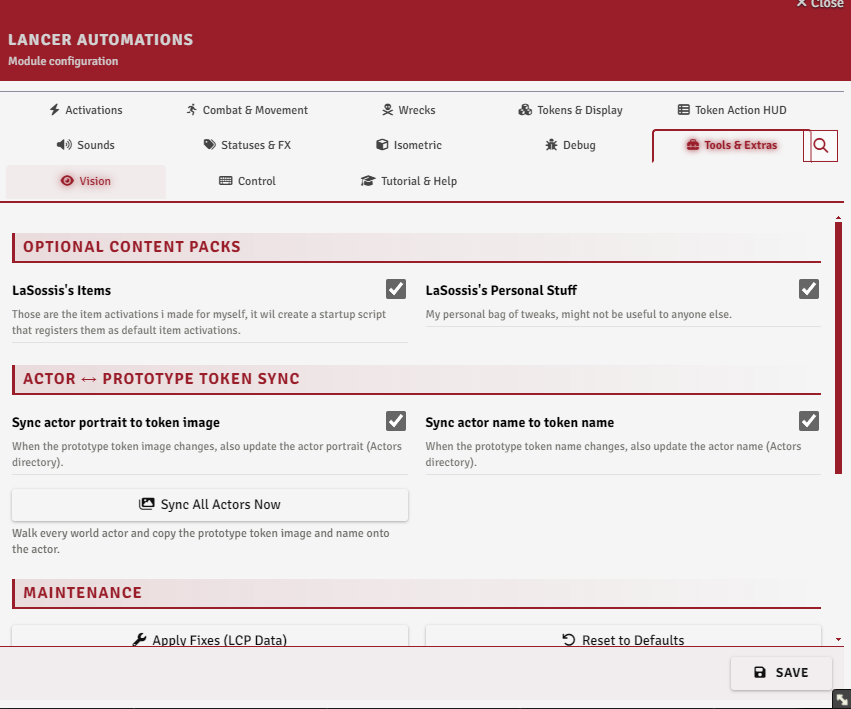
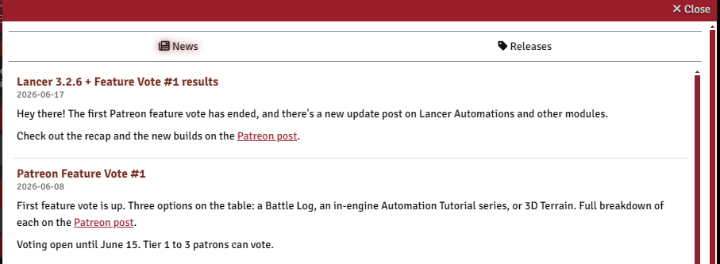
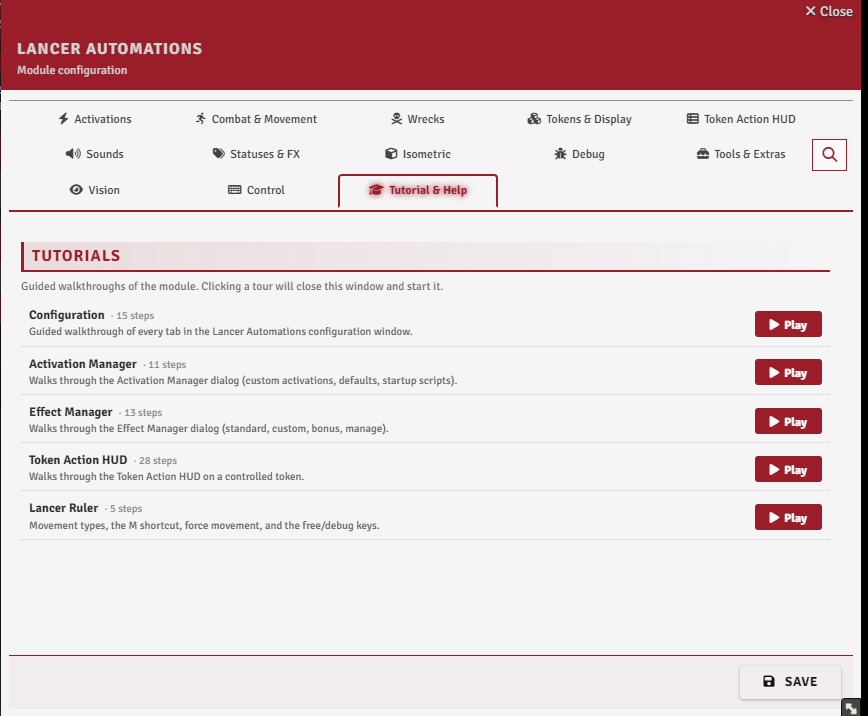
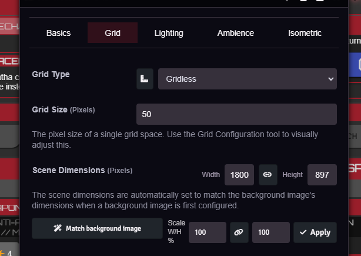

# Setup & Tools

[← Back to the README](../../README.md)

The setup and housekeeping side of the module: optional content, actor and data cleanup, news, the guided tours, and a couple of scene helpers.

---

## Settings

The **Tools & Extras** tab, with the tours under **Tutorial & Help**.

 

## Optional content packs

**`enableLaSossisItems`** loads a shared set of item and NPC automations; **`enablePersonalStuff`** loads the author's own personal set. Both load as startup scripts, so toggling either needs a reload.

## Actor ↔ token sync

**`syncActorImgToToken`** and **`syncActorNameToToken`** copy a prototype token's image and name onto the actor whenever they change, and **Sync All Actors Now** does it across every world actor at once.

## Maintenance & data repair

**Apply Fixes (LCP Data)** rebuilds compendium and actor item data with the module's patches: ammo metadata, merged multi-profile weapon text, and blank action names. **Reset to Defaults** clears all module settings and automations. (Export and Import are in the [Automation Engine](./AUTOMATION_ENGINE.md) guide.)

## News & releases

On load, the GM gets a popup for new module news and pending updates. The **News & Releases** button reopens it any time, with the news log and the GitHub release notes.

 

## Guided tours

Five in-app walkthroughs, config, the activation manager, the effect manager, the HUD, and the ruler, run from the **Tutorial & Help** tab. A welcome dialog offers them on first install.

 

## Scene dimensions

In a scene's configuration, **Match background image** sets the scene's width and height to the background's pixel size, and a **Scale W/H %** row scales the current dimensions by a percentage, linked or separate.

 
