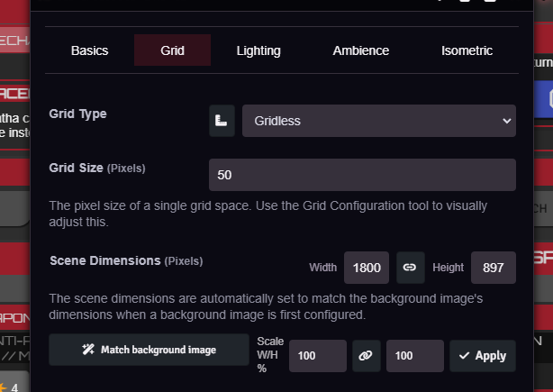

# Setup & Tools

[← Back to Home](../index.md)

Setup and housekeeping: optional content, actor and data cleanup, news, guided tours, and scene helpers.

---

## Settings

The **Tools & Extras** tab, with the tours under **Tutorial & Help**.

---

## Optional content packs

**LaSossis's Items** (**`enableLaSossisItems`**) loads my prebuilt item activations. It's greyed out unless **LaSossis Additional statuses and effects** (**`additionalStatuses`**, Statuses & FX tab) is on, since the activations use those statuses. Some of them also want the personal NPC Deployables LCP: the **Get the Deployables LCP** button right below downloads it, then import it through the Lancer Compendium Manager.

**LaSossis's Personal Stuff** (**`enablePersonalStuff`**) loads my personal tweaks, probably not useful to anyone else. Both load as startup scripts, so toggling either needs a reload.

---

## Actor ↔ token sync

**`syncActorImgToToken`** and **`syncActorNameToToken`** copy a prototype token's image and name onto the actor whenever they change. Video token images are skipped there, since an actor portrait only takes stills.

**Sync All Actors Now** does the same pass over every world actor at once, behind a confirmation. It ignores both toggles, writes image and name together, and does not skip videos.

---

## Maintenance & data repair

**Apply Fixes (LCP Data)** rebuilds compendium and actor item data with the module's patches: ammo metadata, merged multi-profile weapon text, and blank action names.

**Reset to Defaults** clears all module settings and automations. **Export to JSON** and **Import from JSON** sit next to it in the same Maintenance section, and are covered in the [Automation Engine](./AUTOMATION_ENGINE.md) guide.

---

## News & releases

On load, the GM gets a popup for new module news and pending updates. The **News & Releases** button reopens it any time, with the news log and the GitHub release notes.

 

---

## Guided tours

Guided in-app tours explain the main systems. A welcome dialog offers them on first install, along with a **Setup Wizard** for the main settings.

---

## Scene dimensions

In a scene's configuration, **Match background image** sets the scene's width and height to the background's pixel size, and a **Scale W/H %** row scales the current dimensions by a percentage, linked or separate.

