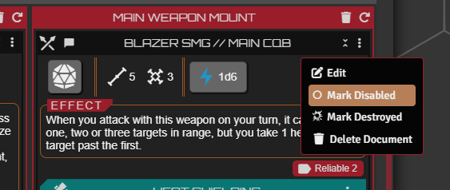
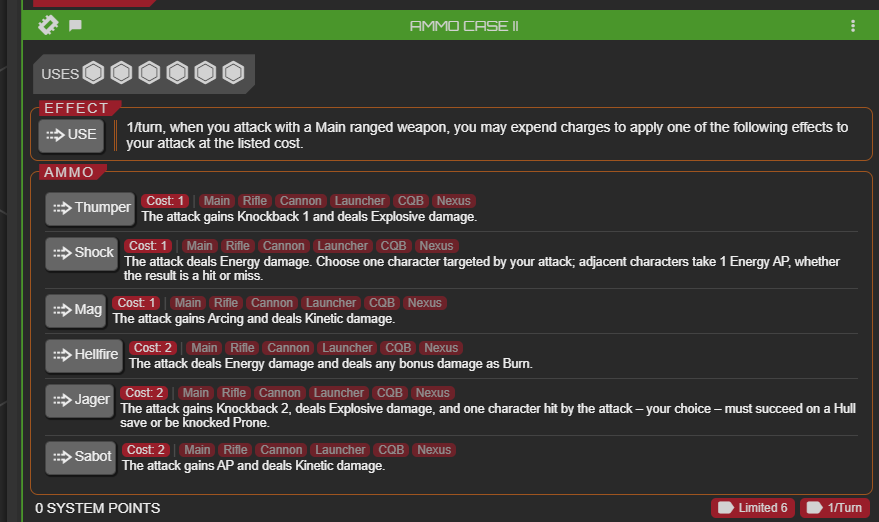
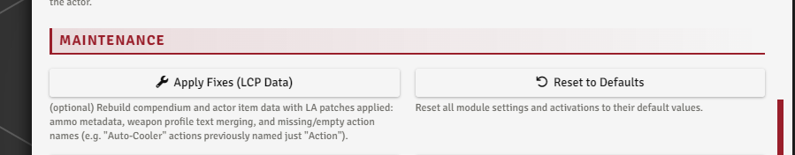
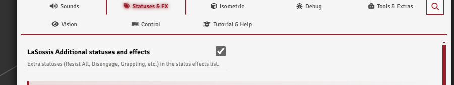

# System Additions

[← Back to the README](../../README.md)

A few changes Lancer Automations makes to the Lancer system and its sheets.

---

## Item Disabled

Right-click a mech weapon, mech system, NPC feature, or weapon mod on its sheet to **disable** it. A disabled item dims with a power-off icon and is blocked from every attack and activation flow; a Full Repair clears the flag. The throw-weapon automation uses it to disable a weapon while it's out on the field.

 

## Ammo

The module handles a system's **ammo** a bit better, surfacing each entry on the system's sheet with a one-click **USE**.

 

A system's ammo is set up on its item sheet. The **Apply Fixes (LCP Data)** tool backfills official ammo descriptions and restriction data onto items that ship without them.

 

## Extra status effects

**Guardian**, **Bulwark**, and **Infection** are always registered. The **`additionalStatuses`** toggle (Statuses & FX tab) adds around seventeen more beyond Lancer's defaults, like Immovable, Throttled, Climber, Brace, Dazed, Resist All, and Aided.

 

## Permanent statuses

A status whose duration is set to **permanent** (in the [Effect Manager](./EFFECTS_AND_BONUSES.md)) survives a Full Repair.

## Extra trackable attributes

The module exposes **move** and **reaction** from the action tracker, plus **infection**, as token resource-bar options in the Token Config Resources tab.
