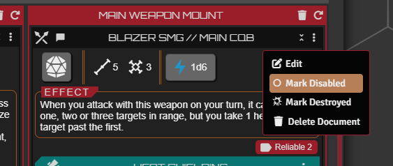
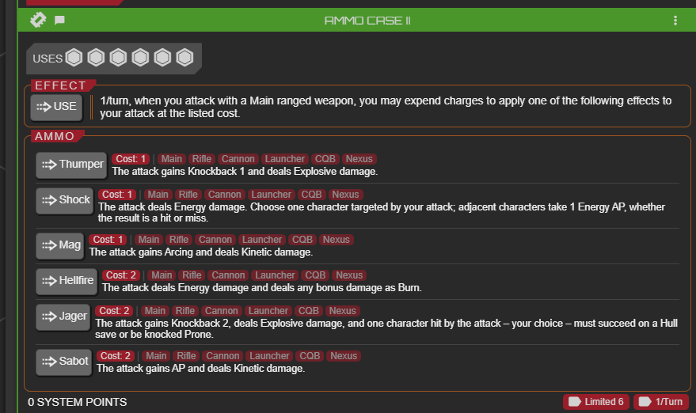
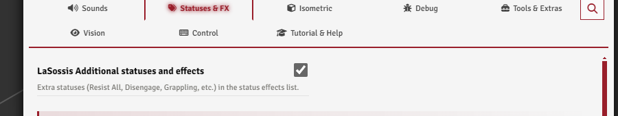
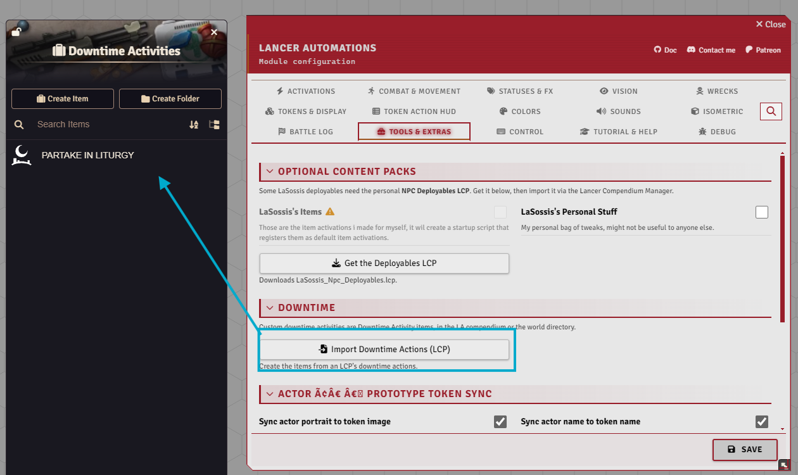

# System Additions

[← Back to Home](../index.md)

A few changes Lancer Automations makes to the Lancer system and its sheets.

---

## Item Disabled

Right-click a mech weapon, mech system, NPC feature, or weapon mod on its sheet to **disable** it. A disabled item dims with a power-off icon and is blocked from every attack and activation flow. A Full Repair clears the flag.

The throw-weapon automation uses it to disable a weapon while it's out on the field.

 

---

## Ammo

The module surfaces each of a system's **ammo** entries on its sheet with a one-click **USE**.

 

A system's ammo is set up on its item sheet. The **Apply Fixes (LCP Data)** tool backfills official ammo descriptions and restriction data onto items that ship without them.

 

---

## Extra status effects

Nothing here is registered unconditionally. The **LaSossis Additional statuses and effects** toggle (**`additionalStatuses`**, Statuses & FX tab) registers **Guardian**, **Bulwark** and **Phasing**, plus 19 more beyond Lancer's defaults, like Immovable, Throttled, Climber, Brace, Dazed, Resist All, and Aided. **Infection** is registered on its own, by the [Infection Damage Integration](./INFECTION.md) setting.

These are mine and predate the module by years: states LCPs and alternate structure tables describe but never register as statuses. Safe to leave off, automations that use them just skip.

Some carry mechanics:

- **Resist All** sets every resistance
- **Throttled** pre-checks Half Damage on the damage card
- **Phasing** moves through other characters in pathfinding and knockback, but can't end its movement on them

Three more the module never registers. It only adds mechanics to them when the system or an LCP already provides them:

- **Shredded** zeroes armor and resistances
- **Stripped** (Dead Rings LCP) zeroes armor
- **Staggered** (Dead Rings LCP) locks actions

 

---

## Custom Downtime Activities

A **Downtime Activity** item type: description, rollable toggle, roll-range result bands. The [downtime flow](./GAMEPLAY_AUTOMATION.md#downtime) lists the core nine plus every such item in the **LA - Downtime Activities** compendium or the world directory. Same-name items override core ones, and **hidden** removes one.

**Import Downtime Actions (LCP)** (Settings, Tools tab) creates these items from an `.lcp` file. Re-importing updates them.

---

## Permanent statuses

A status whose duration is set to **permanent** (in the [Effect Manager](./EFFECTS_AND_BONUSES.md)) survives a Full Repair.

---

## Extra trackable attributes

The module exposes **move** and **reaction** from the action tracker, plus **infection**, as token resource-bar options in the Token Config Resources tab. That's for mechs and NPCs. Pilots get **move** only.

---

## Self-heat resistance

With **Resist Self-Inflicted Heat** (**`resistSelfHeat`**, Combat & Movement → Structure & Damage, off by default) on, a mech that resists Heat takes half of its own self-inflicted heat.

With **Heat as Energy on heatless targets** (**`convertHeatToEnergyOnHeatless`**, same section, on by default), Heat damage becomes Energy against targets with no heat capacity (pilots, biological NPCs), the way Lancer already does for pilots.

## Notable options

| Option | What it does |
|:--|:--|
| **Apply Token Heights to All Actors** | Walk every world actor and write prototypeToken.flags.wall-height.tokenHeight using the rules above. |
