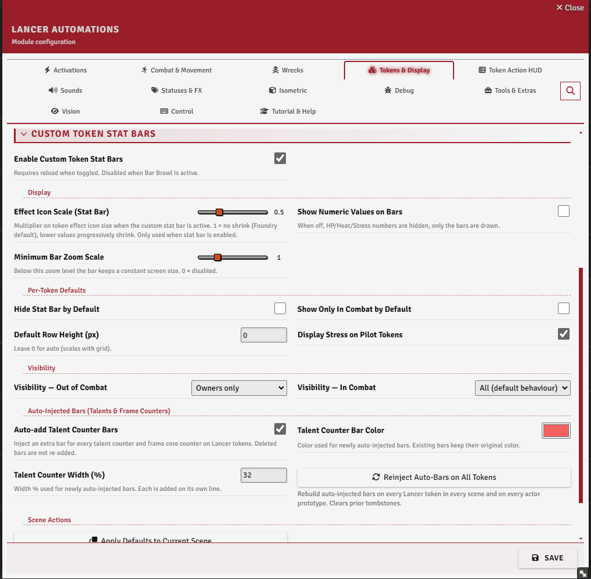
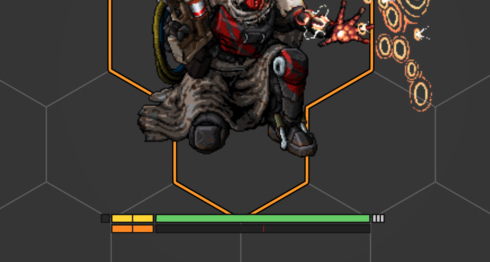
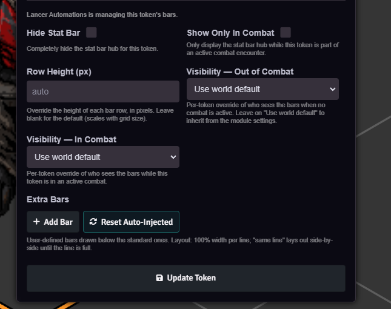
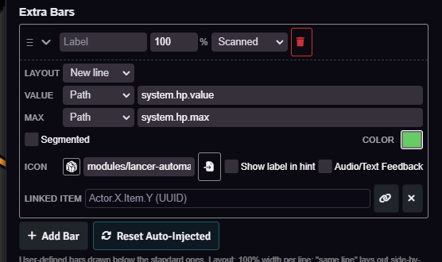
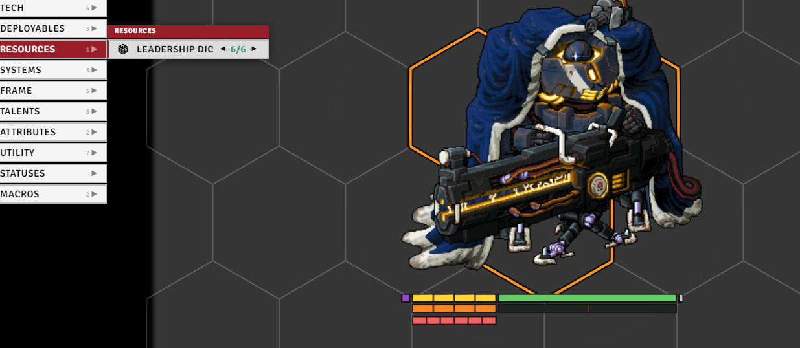
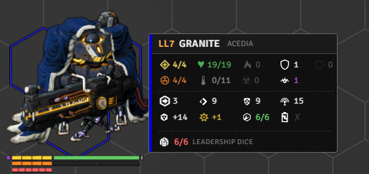
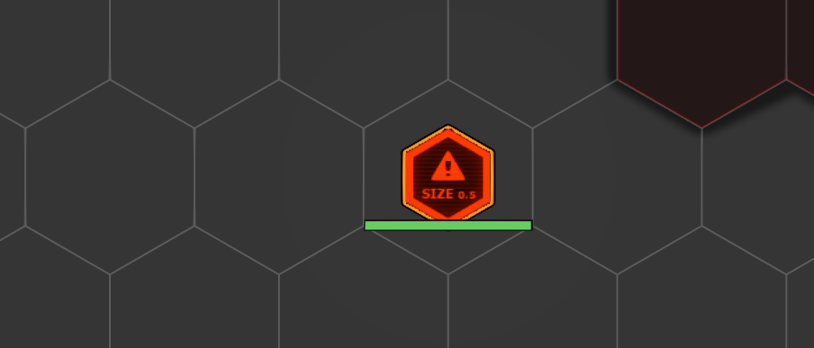

# Custom Token Stat Bars

[← Back to the README](../../README.md) · The action HUD: [HUD.md](./HUD.md)

Lancer Automations draws its own bars and labels directly on the token, as a replacement for Bar Brawl. It also adds a hover popup (the token stat hint) with a token's full stats. Both are separate from the [Token Action HUD](./HUD.md) and work whether or not the HUD menu is enabled.

---

## Settings

Everything here lives in the **Tokens & Display** tab, under the **Custom Token Stat Bars** and **Token Stat Hint** sections.

Turn the bars on with **`tokenStatBar`** (Enable Custom Token Stat Bars). It needs a reload, and it's disabled while **Bar Brawl** is active, so turn Bar Brawl off first.

 

## What the bars show

Under the token, depending on the actor type:

- **HP** and **heat** bars (heat on mechs, NPCs, and deployables).
- **Structure** and **stress** as discrete pips (mechs and NPCs).
- **Overshield** as a pulsing overlay on the HP bar, **burn** and **infection** as stripes when above zero.
- **Pilot bond stress** on pilot tokens (when enabled).
- A **reaction** pip on the edge (solid when available, dim when spent), and **armor** ticks beside HP (GM and owners only).

Elevation also gets a small badge at the token's corner (up/down arrow with the value) instead of Foundry's default tooltip. Numeric values next to the bars can be turned off with **Show Numeric Values on Bars**, and the status-effect icons on the token are scaled by **Effect Icon Scale** to make room.

 

## Visibility and defaults

The settings hold the **world defaults**; each token can override them from **Token Config → Resources tab**:

- **Visibility mode**, set separately for **in combat** and **out of combat**: *all* (anyone who can see the token), *owners only*, or *none* (only when the token is selected).
- **Show only in combat** - bars appear only during an encounter.
- **Hide stat bar** - suppress the bars on this token.
- **Row height** - fixed pixels, or 0 to scale with the grid.
- **Display stress** - show the pilot bond-stress bar (pilot tokens).

**Minimum Bar Zoom Scale** keeps the bars a constant screen size below a given zoom so they don't shrink away on a zoomed-out map.

Hold **Alt** to peek: while held, the bars show on every visible token regardless of its visibility mode, then revert when you let go.

 

## Extra bars

The **Extra Bars** section of Token Config → Resources adds your own bars below the standard ones. Each bar has:

- a **value** and **max** that are either typed in (manual) or read from an actor data path,
- **segmented** (a settable number of pips) or continuous fill,
- a **label**, **width %**, **new line / same line** layout, **color**, and **icon**,
- a **visibility** (owner / scanned / all), a **show-label-in-hint** toggle (whether the label shows next to the icon in the hover hint), optional **floating-text + sound** on change, and an optional **linked item** (right-click the bar in the HUD's Resources to open its sheet).

Manual bars can be driven from code (`updateExtraBarValue`, `addExtraBar`, `removeExtraBar`); see [API_REFERENCE.md](../API_REFERENCE.md).

 

## Auto talent counters

With **Auto-add Talent Counter Bars** (`statBarAutoInjectTalents`) on, the module adds an extra bar for every talent rank counter and frame core counter on Lancer tokens. The **color** and **width %** of new auto-bars are set in the same section. A bar you delete stays deleted (it isn't re-added), and a token's **Reset Auto-Injected** button rebuilds them from its current talents and frame.

 

## Maintenance buttons

In the Custom Token Stat Bars settings:

- **Apply Defaults to Current Scene** - push the world default flags (hidden, combat-only, row height, visibility) onto every Lancer token on the active scene, clearing per-token overrides.
- **Reinject Auto-Bars on All Tokens** - wipe and rebuild the auto-injected talent/frame bars across every scene token and actor prototype in the world.

## Token stat hint

A hover popup with a token's full stats, enabled with **`tokenStatHintEnabled`**. Settings cover the hover **delay**, the popup **scale**, whether it shows for the token you control, and whether it's **combat only**.

For enemy tokens, the **label mode** decides what the header shows: the real name, or a scan-gated name that stays **UNKNOWN** until you scan the token (with options for the placeholder text and for hiding class/tier until scanned). A scanned token (or the GM view) shows the full stat block; an unscanned enemy shows only the damage taken, never its max values. A disposition color stripe runs down the edge.

 

## Half-size tokens

With **`allowHalfSizeTokens`** on, a size-0.5 actor's token takes up half a grid space instead of being forced to a full 1×1.

 
