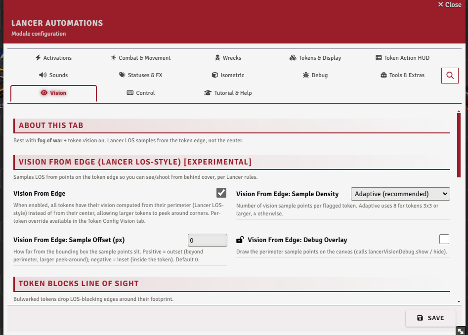
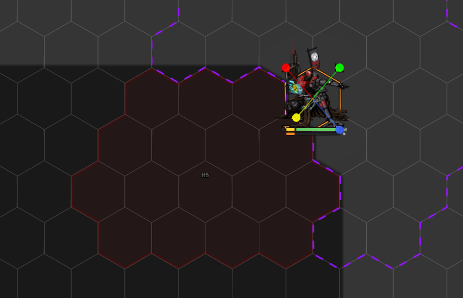
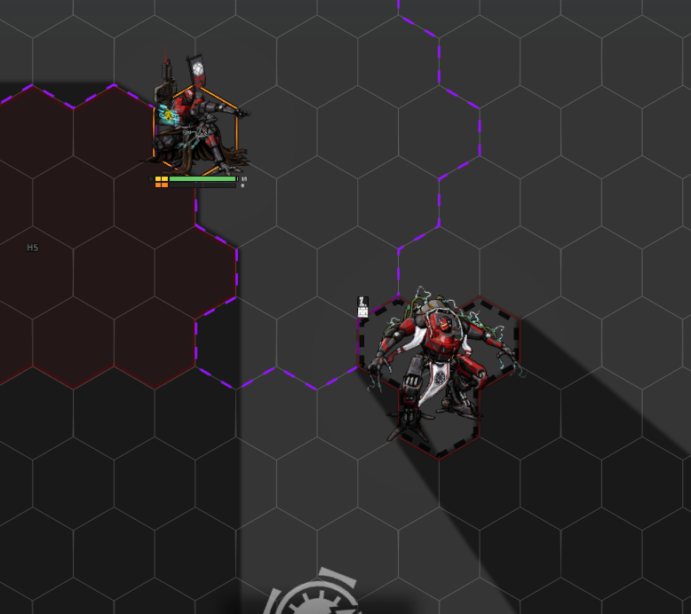
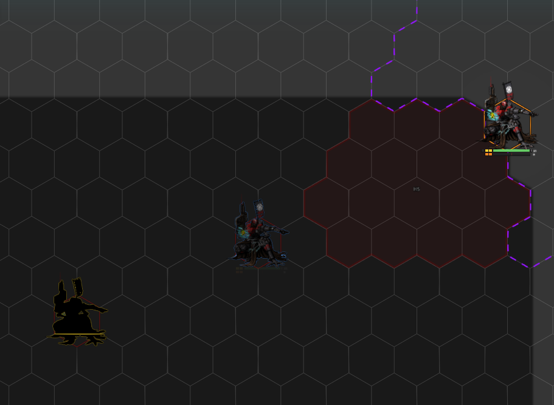

# Vision

[← Back to the README](../../README.md)

Lancer doesn't really have fog of war or vision, but if you like playing with light for immersion, these tools bring it closer to Lancer's rules: line of sight sampled from the token's edge, tokens that block sight, and Sensor / Battlefield Awareness detection modes. They work best with fog of war and token vision turned on.

---

## Settings

The **Vision** tab.

 

## Vision from edge

Experimental. Vanilla Foundry checks line of sight from a token's centre; **`visionFromEdgeEnabled`** instead samples it from points around the token's perimeter, so a large token can see and be seen around a corner the way Lancer means it to. A per-token override lives in the Token Config Vision tab.

Tune it with the **sample density** (`visionFromEdgeSampleMode`: 4 corners, 8 perimeter, or adaptive) and the **sample offset** (`visionFromEdgeSampleOffset`, how far outside the token the points sit). **`visionFromEdgeDebug`** draws the sample points on the canvas. With Wall Height, the samples respect elevation barriers.

 

## Token blocks line of sight

A token can be set to **block line of sight** through its footprint, from a checkbox in its Token Config Vision tab. The **Bulwark** status turns this on automatically (`bulwarkBlocksLineOfSight`).

With **Wall Height** installed it's elevation-aware: the blocking edge sits just below the token's own height, so a token can see over another of the **same height** but not over a taller one.

 

## Token height (Wall Height)

For the elevation-aware blocking above to work, tokens need a height. **Auto Token Height** (`autoTokenHeight`, in the Token Display settings) sets each token's Wall-Height height to its size, so it peeks over walls and tokens of its own size. **`autoTokenHeightVehicleSquad`** lowers that for vehicles and squads (my own interpretation of their heights, not an official rule), and a **Sync All Token Heights** button writes it onto every existing actor and token at once.

## Lancer vision modes

Two detection modes, auto-added to tokens on creation (`lancerVisionAutoAdd`):

- **Sensors** - blue scanlines, ranged to the actor's `sensor_range`, a precise read of who's on sensors.
- **Battlefield Awareness** - a fuzzy yellow silhouette at infinite range, for "you know something's there."

When both would see a target, **Sensors win**. Each can be limited to combat (`lancerSensorCombatOnly` / `lancerAwarenessCombatOnly`) or made to read its range from the token's detection-mode entry instead of the actor (`...UseModeRange`). A per-token **Detection Visual** dropdown (Token Config) sets how a token shows: **Default** (silhouette + scan), **Simple Object** (a rotating outline), **Visible** (no overlay), or **Ignore** (not detected); any non-default choice also turns Sensors off for that token. **`basicSightTo999`** gives auto-created tokens full basic sight, and a **Refresh Tokens** button re-applies the modes across all scenes and actors (run it after enabling auto-add, or if the highlights go missing).

 

## Drag vision

While a token is dragged, its vision can be shrunk so you don't reveal new map as you move. **`dragVisionMultiplier`** sets how much (1 = full, 0 = none), read as a ratio of the current radius or a flat range depending on **`dragVisionMode`**.

## Performance

Recomputing vision is expensive. Two toggles ease that on busy scenes:

- **`visionAnimationThrottleFps`** caps how often vision and light refresh while a token is moving (0 = vanilla), to ease the load on busy scenes.
- **`disableVisionAboveControlled`** turns token vision off while more than N tokens are selected at once (0 = never), so batch-selecting doesn't recompute every token's sight.
