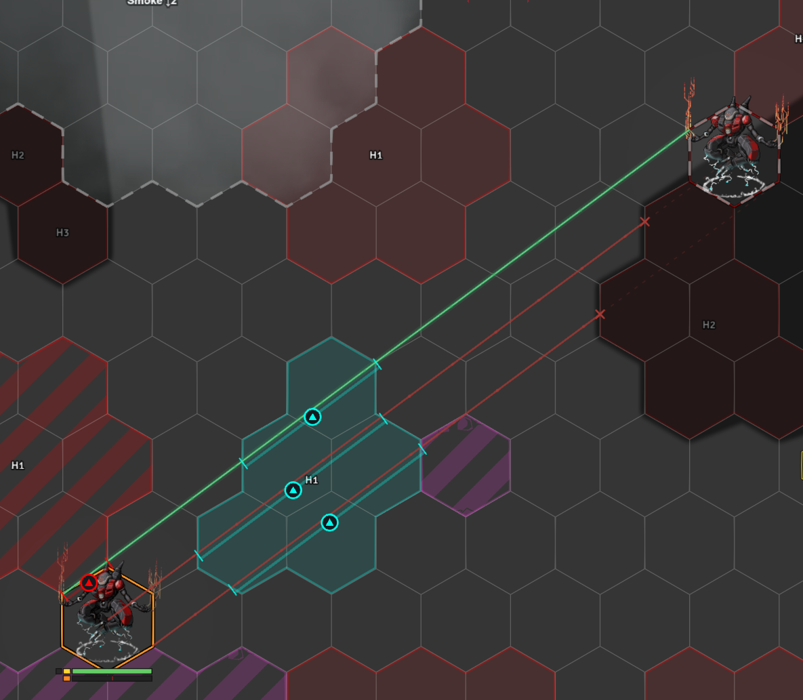
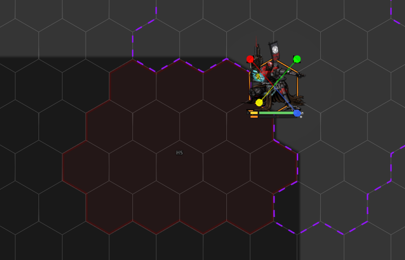

# Vision

[← Back to Home](../index.md)

Lancer has no fog of war or vision, but these tools bring it closer to its rules: line of sight sampled from the token's edge, tokens that block sight, and Sensor / Battlefield Awareness detection modes. Line of sight is blocked by walls. They work best with fog of war and token vision turned on, though sight-blocking tokens work fine without it.

---

## Settings

The **Vision** tab.

---

## Lancer line of sight

**`lancerLos`** emulates Lancer's line-of-sight rules in full: a token behind a wall stays visible if another token can see it. It's more accurate than Terrain Height Tools' (THT) own line of sight. It feeds the rest of the module too, [range previews](#range-pulse-line-of-sight) and automation included.

It reads Foundry walls, never THT terrain directly. Walls are cheaper to test and more flexible, and they let [tokens that block sight](#token-blocks-line-of-sight), Bulwark included, count here: they act as walls of their own.

From code, [`hasLineOfSight`](../API_SPATIAL.md#line-of-sight) runs the same test.

 

### Setup

1. Turn on **`lancerLos`** in the Vision tab. Nothing below applies without it.
2. Give the scene walls. No walls, nothing blocks. Place them by hand, generate them with [Terrain Height Tools](https://github.com/Wibble199/FoundryVTT-Terrain-Height-Tools), or use the auto wall generation in [my fork](https://github.com/Agraael/FoundryVTT-Terrain-Height-Tools).
3. Decide which walls count. By default LA reads walls that block Sight **and** any wall flagged **Blocks LA Line of Sight**. **`lancerLosFlagOnly`** narrows that to flagged walls only, so you can wall a map for gameplay without blocking vision and light. See [LA-only walls](#la-only-walls).
4. Pick a height rule. **`lancerLosHeightRule`** is either **Discrete**, which follows the size rules, or **Trigonometric**, which follows the real sightline so peeks over walls fade with distance. It changes results more than anything else here.
5. Check the result with **`lancerLosDebug`**, which draws every tested sightline from the controlled tokens. It's heavy, leave it off in play.

---

## LA-only walls

A wall can be flagged **Blocks LA Line of Sight** in its Wall Config. It then blocks Lancer line of sight, targeting and range previews without blocking Foundry vision, light or fog, whatever its Sight setting. **`lancerLosFlagOnly`** goes further: LA line of sight uses only flagged walls and ignores every other wall.

Together they let you wall a map for Lancer play without the vision and light blocking regular walls bring. The easiest setup is [my THT fork](https://github.com/Agraael/FoundryVTT-Terrain-Height-Tools): terrain types get an **LA line of sight only** option on their auto walls, and shape conversion can set the flag on the walls it creates. Tokens have the same option, **Blocks LA Line of Sight Only** in their Token Config Vision tab.

---

## Where line of sight shows

- **Attack cards** - **`lancerLosAttackHover`** draws Lancer line of sight when you hover a target, in place of THT's own ruler.
- **[Advanced Measure](./ATTACK_TARGETING.md#advanced-measure-tool)** - the eye tool, on your marks or on your targets when nothing is marked.
- **Range pulses** - see [range pulse line of sight](#range-pulse-line-of-sight).

---

## Reading the sightlines

| Line | Meaning |
|:--|:--|
| **Green** | A clear line from viewer to target. |
| **Red** | Blocked, cut at the point that blocks it. |
| **Yellow** | Valid, but the three main rays all failed and it took a denser sweep of sample points to find a clear one. |

Icons along a line mark what it crosses: terrain (THT), auras (Grid Aware Auras) and templates (Template Macro).

---

## Range pulse line of sight

**`rangePulseLos`** clips every range pulse (targeting, pickers, deploy, zones, Advanced Measure, hover previews) to what its origin token can see, with the same wall rules as Lancer line of sight. Arcing / Seeking weapons stay unclipped. Each pulse gets a **Line of sight** toggle, and the interactive tools take a `los` option.

---

## Vision from edge

Experimental. Vanilla Foundry checks line of sight from a token's center. **`visionFromEdgeEnabled`** instead samples it from points around the token's perimeter, so a large token can see and be seen around a corner. A per-token override lives in the Token Config Vision tab.

Tune it with the **Sample Density** (`visionFromEdgeSampleMode`), which has six choices: 4 (corners only), 8 (corners + edge midpoints), 16 (dense perimeter), **Token shape corners (recommended)** (the default), Token shape corners x2, and Adaptive. The **Sample Offset (px)** (`visionFromEdgeSampleOffset`) moves the points off the token edge, from -50 to 50, positive outsets and negative insets. **`visionFromEdgeDebug`** draws the sample points on the canvas. With Wall Height, the samples respect elevation barriers.

 

---

## Token blocks line of sight

A token can be set to **block line of sight** around its bounding box, from a checkbox in its Token Config Vision tab. The **Bulwark** status turns this on automatically (`bulwarkBlocksLineOfSight`). It blocks even with token vision off.

With **Wall Height** installed it's elevation-aware: the blocking edge sits slightly below the token's own height, so a token can see over another of the **same height** but not over a taller one.

 

---

## Token height (Wall Height)

For the elevation-aware blocking above to work, tokens need a height. **Auto Token Height (Wall Height)** (`autoTokenHeight`, in the Vision tab under **Token Height (Wall Height)**) sets each token's Wall-Height height to its size, so it peeks over walls and tokens of its own size.

**Vehicle & Squad Height Adjustments** (`autoTokenHeightVehicleSquad`) lowers that for vehicles and squads (my own interpretation of their heights, not an official rule), and the **Apply Token Heights to All Actors** button writes it onto every existing actor and token at once.

---

## Lancer vision modes

Two detection modes, auto-added to tokens on creation (`lancerVisionAutoAdd`):

- **Sensors** - blue scanlines, ranged to the actor's `sensor_range`, a precise read of who's on sensors.
- **Battlefield Awareness** - a fuzzy yellow silhouette at infinite range, for "you know something's there."

When both could see a target, **Sensors win**. Both are limited to combat out of the box (**Sensor: Combat Only** / **Awareness: Combat Only**, `lancerSensorCombatOnly` / `lancerAwarenessCombatOnly`, on by default), and either can read its range from the token's detection-mode entry (`...UseModeRange`).

A per-token **Detection Visual** (Token Config **L.A** tab) sets how a token reads: **Default**, **Simple Object**, **Visible**, or **Ignore** - any non-default also turns Sensors off for it.

**`basicSightTo999`** gives new tokens full basic sight, and **Refresh Tokens** re-applies the modes across scenes and actors.

 

---

## Drag vision

While a token is dragged, its vision can be shrunk so you don't reveal new map as you move. **`dragVisionMultiplier`** sets how much (1 = full, 0 = none), read as a ratio of the current radius or a flat range depending on **`dragVisionMode`**.

---

## Performance

Recomputing vision is expensive. Two toggles ease that on busy scenes:

- **`visionAnimationThrottleFps`** caps how often vision and light refresh while a token is moving (0 = vanilla).
- **Disable Vision Above N Controlled Tokens** (**`disableVisionAboveControlled`**) turns token vision off while more than N tokens are selected at once (0 = never), so batch-selecting doesn't recompute every token's sight. It defaults to 5, so it's already doing that.

## Notable options

| Option | What it does |
|:--|:--|
| **Sensor: Use Mode Range** | Use the per-token detection-mode range instead of the actor sensor range. |
| **Awareness: Use Mode Range** | Use the per-token detection-mode range instead of infinite. |
| **Blinded reduces vision** | While Blinded, a token sees only one space. |
