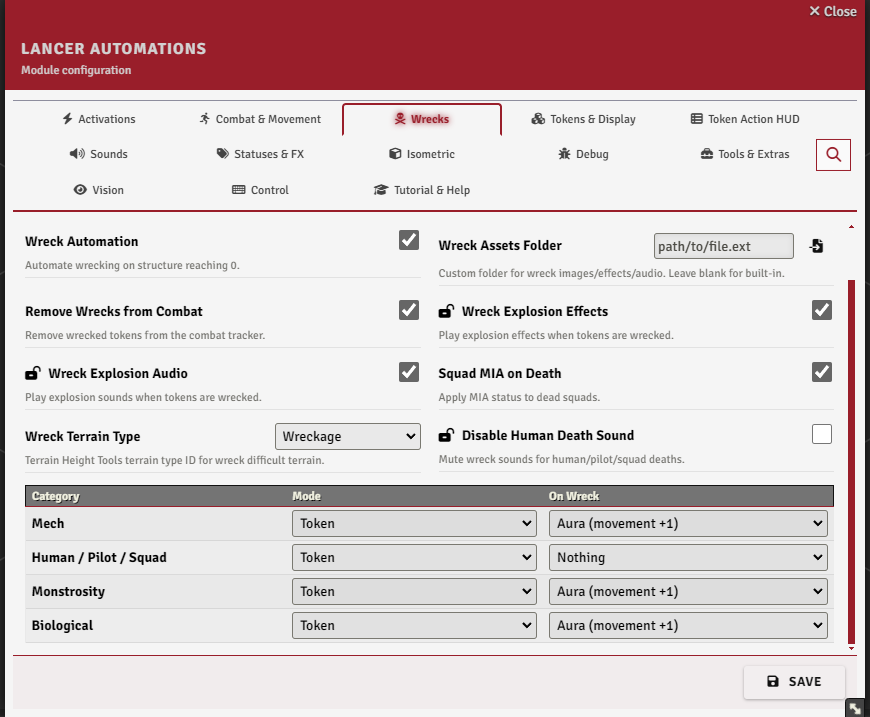
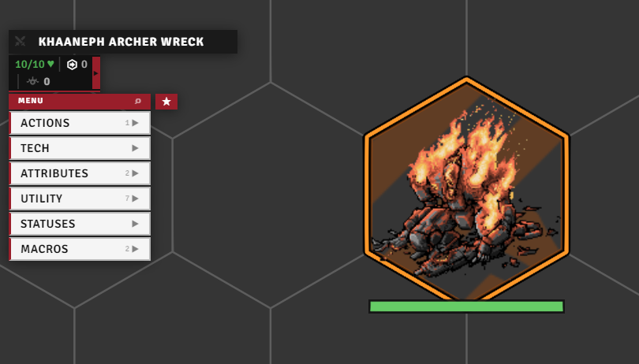
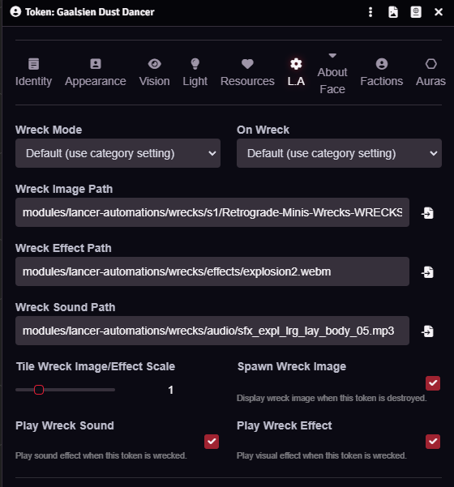

# Wrecks

[← Back to the README](../../README.md)

When a token dies, the module leaves a wreck where it stood instead of just clearing it off the board. What that wreck is, a token or a flat tile, whether it blocks the field, and how it looks and sounds, is set per category and per token, and a wreck can be resurrected back into the original.

---

## Settings



The **Wrecks** tab.

<br clear="right"/>

## On death



When a token's structure hits 0, the module drops its wreck in place and clears the original. The dead token leaves the combat tracker (**`enableRemoveFromCombat`**), and a destroyed squad is marked **MIA** (**`squadLostOnDeath`**).

<br clear="right"/>

## Per-category behaviour

The dead token is sorted into an auto-detected category, **Mech**, **Human / Pilot / Squad**, **Monstrosity**, or **Biological**. Each one's wreck can be a **Token** (a wreck actor with its own HP), a flat **Tile**, or **Skip**ped, set in the per-category table along with its on-wreck terrain.

## Wreck terrain

A wreck can leave something on its footprint: **THT difficult terrain** (needs Terrain Height Tools, painting the type set by **`wreckTerrainType`**) or a **movement +1 aura** (needs the GAA fork). It's set per category, so mech hulls can clog the field while corpses don't.

## Per-token config



A single token can override its category in the Token Config **L.A** tab: its wreck mode and terrain, a custom wreck image, effect, and sound, the tile scale, and whether the image, sound, and effect play at all.

<br clear="right"/>

## Resurrect

Wreck **tiles** get a **Resurrect** button in their token HUD that brings the original token back, fully restored, and deletes the tile. Token wrecks are resurrected from a macro or the API.

## FX & sound

The explosion animation and sound are **`enableWreckAnimation`** and **`enableWreckAudio`**, with **`wreckMasterVolume`** over the top and **`disableHumanDeathSound`** to keep corpses quiet.

## Custom wreck assets

**`wreckAssetsPath`** points the system at a folder of your own wreck images, effects, and sounds; left blank it falls back to `modules/lancer-automations/wrecks`. Lay the folder out like this:

```
<wreckAssetsPath>/
├── s1/                 # wreck images for size-1 tokens
│   ├── mech/
│   ├── human/
│   ├── squad/
│   ├── monstrosity/
│   └── biological/
├── s2/                 # size-2 tokens (same five subfolders)
├── s3/                 # size-3 tokens (same five subfolders)
├── effects/            # explosion animations
│   ├── mech/
│   ├── human/
│   ├── squad/
│   ├── monstrosity/
│   └── biological/
└── audio/              # explosion sounds
    ├── mech/
    ├── human/
    ├── squad/
    ├── monstrosity/
    └── biological/
```

On a wreck, the module picks a random file from the folder that matches the token's category (and size, for images). Empty folders fall back, squad → human → biological, monstrosity → biological, and mech images fall back to the bare `s{size}` folder. A per-token image, effect, or sound set in the Token Config L.A tab overrides all of it.
