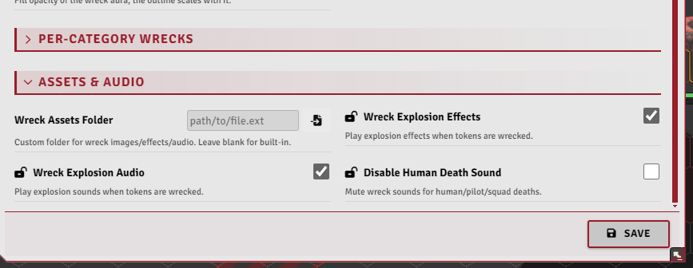

# Wrecks

[← Back to Home](../index.md)

When a token dies, the module leaves a wreck where it stood. Per category and per token you set what it is (token or flat tile), whether it blocks the field, and how it looks and sounds. Wrecks can be resurrected back into the original.

---

## Settings

The **Wrecks** tab.


---

## On death


When a token's structure hits 0, the module drops its wreck in place and clears the original. The dead token leaves the combat tracker (**`enableRemoveFromCombat`**), and a destroyed squad is marked **MIA** (**`squadLostOnDeath`**).

<br clear="right"/>

---

## Per-category behaviour

The dead token is sorted into an auto-detected category, **Mech**, **Vehicle** (any NPC carrying a VEHICLE template), **Human / Pilot / Squad**, **Monstrosity**, or **Biological**. Each one's wreck can be a **Token** (a wreck actor with its own HP), a flat **Tile**, or **Skip**ped, set in the per-category table along with its on-wreck terrain.

**Token** mode uses a world actor named **Template Wreck**, a deployable the module creates by itself the first time it needs one. Nothing to set up.

---

## Wreck terrain

A wreck can leave something on its footprint: **THT difficult terrain** (needs Terrain Height Tools, painting the type set by **`wreckTerrainType`**) or a **movement +1 aura**. The aura itself draws on stock Grid-Aware Auras, only its movement penalty needs the GAA fork. It's set per category, so mech hulls can clog the field while corpses don't.

---

## Per-token config

A single token can override its category in the Token Config **L.A** tab: its wreck mode and terrain, a custom wreck image, effect, and sound, the tile scale, and whether the image, sound, and effect play at all.

The image, effect, and sound fields also accept a **folder** path: a random file from it is picked on each death.


---

## Resurrect

Wreck **tiles** get a **Resurrect** button in the **Tile HUD** that brings the original token back, fully restored, and deletes the tile. Wreck **tokens** get a **Resurrect** entry in the LA token HUD, under **Utility → Gameplay**, which does the same. No macro needed either way.

---

## FX & sound

The explosion animation and sound are **`enableWreckAnimation`** and **`enableWreckAudio`**, with **`wreckMasterVolume`** over the top and **`disableHumanDeathSound`** to keep corpses quiet.

---

## Custom wreck assets

**`wreckAssetsPath`** points the system at a folder of your own wreck images, effects, and sounds. Left blank, it falls back to `modules/lancer-automations/wrecks`. Lay the folder out like this:

```
<wreckAssetsPath>/
├── s1/
│   ├── vehicle/
│   ├── human/
│   ├── squad/
│   ├── monstrosity/
│   └── biological/
├── s2/
│   └── ... same subfolders
├── s3/
│   └── ... same subfolders
├── effects/
│   └── ... same subfolders
└── audio/
    └── ... same subfolders
```

`s1`, `s2` and `s3` hold the wreck images for size-1, size-2 and size-3 tokens, and size 4+ falls back to `s3`. `effects` holds the explosion animations and `audio` the explosion sounds, both with the same category subfolders.

**Mech assets go directly in the parent folder, not in a subfolder**: mech images in `s1` / `s2` / `s3`, mech effects in `effects`, mech sounds in `audio`.



On a wreck, the module picks a random file from the folder that matches the token's category (and size, for images). Pilot uses the human folder. Empty folders fall back, squad → human → biological, monstrosity → biological, vehicle → the bare `s{size}` mech pool.

A per-token image, effect, or sound set in the Token Config L.A tab overrides all of it.

## Notable options

| Option | What it does |
|:--|:--|
| **Wreck Automation** | Automate wrecking on structure reaching 0. |
| **Wreck Aura Color** | Line and fill color of the aura left on a wreck. Applies to new wrecks. |
| **Wreck Aura Opacity** | Fill opacity of the wreck aura, the outline scales with it. |
